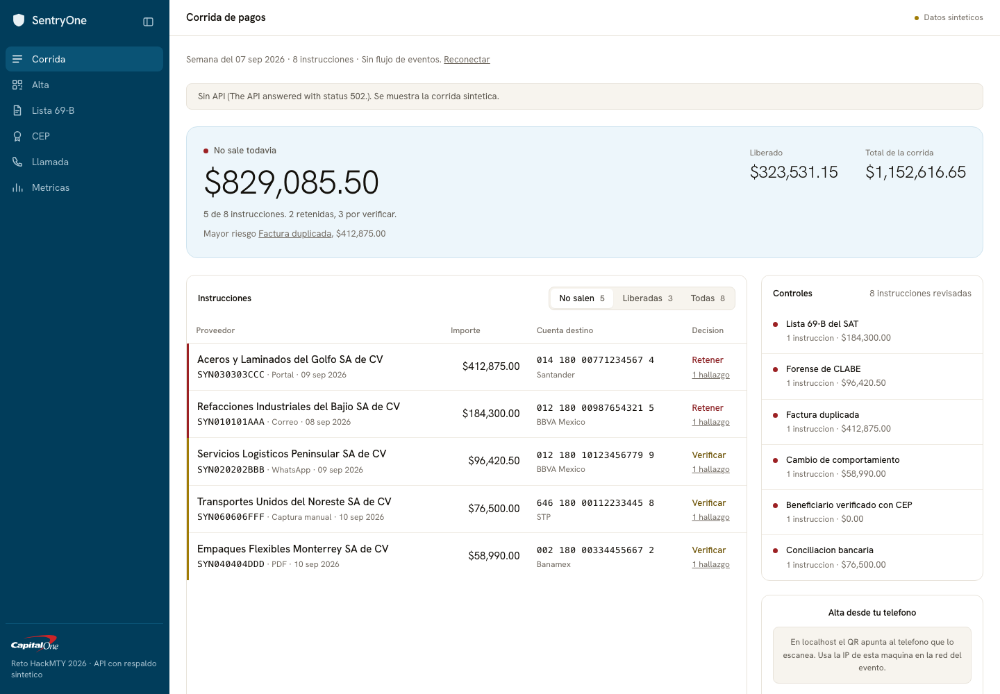
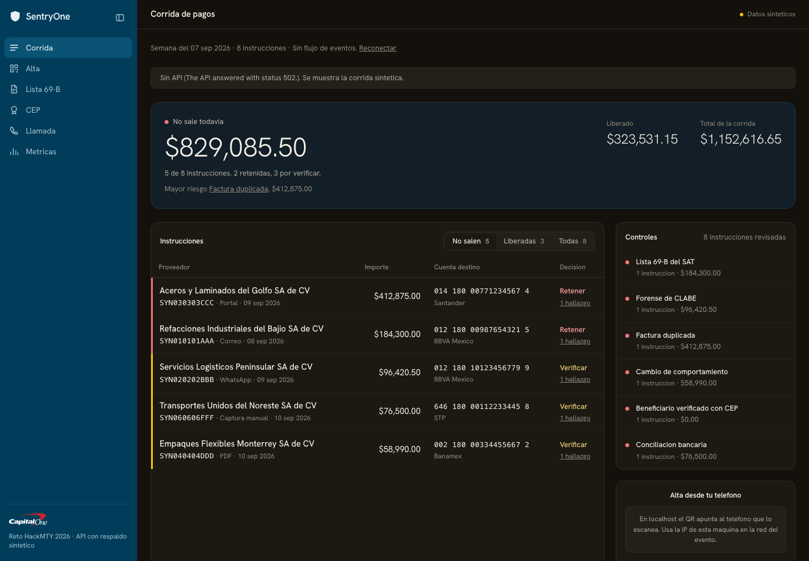

# SentryOne, the last control before an irrevocable SPEI

<!-- TODO(garzario) assets/demo.gif here: under 6 MB, looping, 10 to 15 seconds, no cursor jitter. Issue #73 -->

**Demo video:** TODO(garzario), issue #73 | **Live:** <https://sentryone-one.vercel.app> |
**API:** <https://api.104.238.147.69.sslip.io/health> |
HackMTY 2026, Capital One track 3, Real-Time Anomaly & Security Sentinel

The live URL serves the seeded synthetic company out of Tiger Data through the API on Vultr. Add
`?data=api` to prove the deployed backend is answering rather than the offline fallback, or
`?data=mock` to see the same screens with no network at all. `sentryone.tech` is not registered yet
(issue #59, and the MLH .Tech offer is how it will be): the Vercel project already carries both
`sentryone.tech` and `www.sentryone.tech`, so the domain is a registration and two DNS records away
from being the URL above.

## The problem

A Mexican SMB pays its suppliers by SPEI, which is instant and irrevocable: an accepted transfer
order is firme, irrevocable, exigible y oponible frente a terceros by law, so a payment run is a
one-way door. If the supplier sits on the SAT's Article 69-B list, the invoices it issued no
producen ni produjeron efecto fiscal alguno, retroactively, and the buyer has thirty days from the
publication to prove the operation was real or file a corrective return. For every MXN 100,000 of
subtotal already deducted from a supplier later declared definitivo, MXN 46,000 of tax effect
reverses: 30 percent ISR plus 16 percent IVA, before surcharges. The frequency is set by the SAT
and not by the payer, and in the twelve months to 31 July 2026 that list moved 973 taxpayers to
definitivo across 33 publication dates, roughly one change every eleven days. Every figure in this
paragraph is cited to its primary source in [`docs/04-market.md`](docs/04-market.md#sources).

The person who absorbs that is Lupita Elizondo, the sole administrative clerk at a 28-employee
metalmecanica in Apodaca, Nuevo Leon, who runs the supplier payment run every Thursday. She is not
a fraud analyst and not a corporate treasurer: she is the one person who turns invoices and payment
instructions into correct transfers, and she has no tool that looks at a payment and at a fiscal
status at the same time. She is in [`docs/02-persona.md`](docs/02-persona.md), quantified, with the
two venue interviews we still owe listed as open rather than invented.

SentryOne runs six explainable controls over the company's own CFDI ledger, the official SAT list
and the Banxico-signed CEP at the moment of payment, and holds the transfer with the evidence on
screen.

## What it does

- Stops a payment to a supplier the SAT has listed, and quantifies the ISR and IVA already exposed.
- Catches a CLABE that differs from the supplier's history, fails its check digit or changed bank without a payment complement behind it.
- Proves who owns the destination account with a Banxico-signed CEP and keeps it as evidence. One
  cent travels inside the same payment run, the clave de rastreo comes back from the bank instead of
  from a keyboard, and the large payment is released or blocked by the engine when the signed CEP
  arrives. Nobody types anything.
- Flags duplicate invoices and suppliers whose billing behaviour changed.
- Decides hold, verify or release by expected loss, and always leaves the final call to a person.

## Why it is different

The three facts that decide whether a payment is safe are all public and all current, and they are
never read together at the moment that matters: the 69-B list belongs to a compliance product, the
CFDI belongs to the accountant, and the CEP belongs to a post-mortem, because Banxico publishes it
only after the transfer is already irrevocable. The gap stays open because that window, the few
minutes between approving a payment run and sending it, is nobody's product surface. SentryOne is
built to sit in exactly that window.

What the alternatives structurally cannot do: the Mexican 69-B checkers run on a list rather than
on a payment, so they never see the account the money is about to leave for; the international
payee-verification platforms verify the account and ignore the counterparty's fiscal status, which
is the larger Mexican loss, and none of them mentions CFDI, SAT, SPEI or CLABE anywhere in their
public material. The competitor map, with published prices and access dates, is in
[`docs/04-market.md`](docs/04-market.md#competitor-map).

## How it works

Four lanes, and one rule that makes the architecture true: **the intelligence lane has no network
and no database access.** It takes values and returns values, which is why it is unit-testable,
why the retroactive sweep is a replay rather than a migration, and why a judge can run it in front
of us with the Wi-Fi off. The diagrams are in
[`docs/07-architecture.md`](docs/07-architecture.md).

Three sentences on the algorithm. An instruction arrives with an amount and a CLABE, and one read
assembles its context: the supplier, the accounts it has actually been paid on and the document
that established each one, every CFDI and complement the company holds, the 69-B rows in force for
that RFC, the CEP already verified for that account, and the bank mirror. `runControls` puts that
one object through all six controls and accounts for every one of them in either `ran` or `skipped`
with a named reason, so a control that cannot run says so instead of leaving an empty screen, and
`decide` weighs the pesos at risk against what delaying this payment costs with this supplier.
The controls themselves are a 3-7-1 check digit and OCR-aware Damerau-Levenshtein against the
supplier's paid accounts, XMLDSig verification of a Banxico seal, and a fold over `LedgerEvent[]`
that prices what a new publication did to invoices already paid and already deducted.

It is pure, dependency-free TypeScript in `packages/core`, with its tests next to it, so it can be
read and run in under a minute.

## Run it in four commands

Requires bun 1.3.11 (the version in `.bun-version`) and a reachable Postgres.

```bash
bun install --frozen-lockfile   # also wires the git hooks
bun run migrate                 # 0001 always, 0002 only if timescaledb is available
bun run seed                    # idempotent, prints the demo account IDs
bun run dev                     # web and API together
```

Optional preflight before the first run and before every rehearsal: `bun run doctor` checks the bun
version, every variable in `.env.example` with the files that read it and one clause saying what
stops working without it, the committed SAT list snapshot, the CEP fixture, which database path is
live and how much of it is migrated and seeded, and closes on whether this laptop can still demo with
the network unplugged, naming the command that fixes whatever is in the way; `--strict` turns any
warning into exit 1 for a release gate. Copy `.env.example` to `.env` first.

Three commands worth knowing about. `bun test` runs 1,670 tests across 97 files with no network, no
database and no API key, which is the fastest way to check that the intelligence is real. The 109
database cases skip themselves unless `TEST_DATABASE_URL` names a database they may empty, and they
share one, so run them a workspace at a time rather than all at once. `bun run eval` scores the six
controls against 30 labelled holdout cases and prints precision, recall and the false positive rate
per control. `bun run demo` drives the demo path headless and must be green
before any rehearsal or judge visit.

The consortium network is opt-in, because it is the only part of the product that talks to a second
vendor. It stays behind `ALLOW_CONSORTIUM=1`, and with the flag unset every control still runs and the
beneficiary finding says the network was not consulted.

```bash
bun run consortium:seed             # Snowflake database, schema, table and view, then the synthetic network of other tenants
bun run consortium:push             # this company's registry outcomes, as salted hashes and nothing else
bun run consortium:pull             # fills the local snapshot the engine reads
bun run consortium:pull --offline   # fills the same snapshot from the generator, with no Snowflake account at all
```

[`docs/adr/0006-consortium-snowflake.md`](docs/adr/0006-consortium-snowflake.md) is why the decision
reads a snapshot and never the warehouse, and
[`docs/06-regulatory-privacy.md`](docs/06-regulatory-privacy.md) section 8 lists what leaves a company
and what never does. There is one real tenant: the other tenants are generated from the committed seed
and every row carries `synthetic: true`. `--offline` is how the demo runs with no account and no
uplink, and `consortium_pull.source` records `snowflake` or `synthetic` so no screen can confuse the
two.

## Screenshots

The payment run, captured reproducibly by `apps/web/brand/shoot.ts`:

| | |
|---|---|
|  |  |

Narrow viewport, the way a clerk opens it from a phone:
[`run-narrow-light.png`](assets/screenshots/run-narrow-light.png) and
[`run-narrow-dark.png`](assets/screenshots/run-narrow-dark.png).

## Stack, and why

Fit for purpose is graded, so each row ties a tool to this problem rather than to taste.

| Choice | Pin | Why this, for this problem |
|---|---|---|
| bun | 1.3.11 | One runtime for the API, the tests, the seeder, the migrations and the scripts. Native TypeScript with no build step, and a cold start fast enough for a streaming endpoint. |
| TypeScript, strict | 5.9.3 | The money types and the ledger directions are checked at compile time, not in review. |
| `packages/core`, zero dependencies | n/a | The intelligence is pure functions with unit tests and no mocks and no network, so a judge can read it and run it. This is the answer to "is it really working". |
| `packages/engine` | n/a | The six controls behind one call, `runControls`. It exists for a dependency direction and not for taste: `packages/sat` and `packages/cep` already depend on `core`, so `core` cannot import them back without a cycle. Adapters only, no algorithm. |
| `packages/sat` with a committed snapshot | n/a | The complete official Article 69-B listing, 4.5 MB, dated and committed with its provenance, so `GET /api/v1/sat/lookup` answers an RFC a judge picks themselves with no network and no conference Wi-Fi. |
| `packages/cep` | n/a | XMLDSig against the Banxico certificate, byte-exact, reporting `unconfirmed_scheme` rather than claiming a seal it cannot prove. |
| `packages/rail` | n/a | The only place that sends money, and it sends one amount, 0.01 MXN. Mexico has no confirmation-of-payee API, so the one document that names an account holder is the CEP Banxico signs for a SPEI, and the cent is what makes one exist. `NessieRail` writes it to the company's bank mirror and has run live; `StpRail` is the SPEI participant that would produce a real CEP, written out with its cadena original and its RSA signature and refusing to run without `STP_*`, so nothing here can pretend to be contracted; `FakeRail` is the in-process one, and every event it produces carries `simulated: true`. |
| Hono | 4.13.7 | Small, standards-based HTTP. The API stays thin transport with no business logic in it. |
| zod plus `@hono/zod-validator` | 4.5.4 / 0.9.1 | One schema per endpoint, validated at the edge, typed on both sides of the wire. |
| Postgres via `postgres` | 3.4.9 | Raw SQL, no ORM. When a judge asks how the forecast works, the answer is the query. |
| Timescale hypertables, conditional | n/a | A transaction ledger genuinely is a time series, so hypertables and continuous aggregates are the honest fit. `0002_timescale.sql` applies only where the extension exists, so a plain local Postgres 18 is the offline fallback on the same dialect. |
| Snowflake, in `packages/consortium` only | no dependency, key-pair JWT and `fetch` | The cross-tenant beneficiary network, and the MLH Best Use of Snowflake API category. A supplier's first payment from this company has no history here and months of history in every other company that already pays it, which is the one signal our own ledger cannot hold. What leaves a company is a salted hash of the supplier and the account, a bank code and one of four outcomes: no name, no amount, no account number. The engine reads a local snapshot and never the warehouse, so the decision stays deterministic and works offline. The network of other tenants is synthetic and labelled as such. ADR-0006. |
| Vite, React, Tailwind | 8.2.2 / 19.2.8 / 4.3.3 | The judge-facing surface is a URL they open on their own phone, which is the cleanest rebuttal to a staged prototype. |
| motion | 13.2.0 | Motion is first-class here, not a polish task, because the experience criteria are 20 points. |
| recharts | 3.10.1 | Charts over our own ledger, not over screenshots. |
| Gemini, in `packages/extract` only | `gemini-3.6-flash`, `GEMINI_MODEL` overrides | The only place that reaches a language model, and it may only transcribe: read the CLABE off a photo, transcribe a voice note. ADR-0004 keeps inference out of the per-transaction decision path, and `packages/extract/src/boundary.test.ts` enforces it by reading the package's own source. |
| ElevenLabs, in `packages/voice` | zero dependencies, plus `convai-widget-embed` 0.18.1 loaded on press in the browser fallback | The verification call to the supplier when the decision is `verify`. The outcome parser is deterministic and not a model, for the same ADR-0004 reason, and the endpoint answers 422 with the exact script when the keys are absent so the clerk reads it on their own telephone. |
| Nessie (optional) | n/a | System-of-record mirror for accounts and transactions. It has dates with no times, so anything intraday comes from our own ledger. See [`docs/09-api.md`](docs/09-api.md). |

Every dependency is pinned exactly and must be more than three days old, enforced by
`minimumReleaseAge` in `bunfig.toml`. See [`CONTRIBUTING.md`](CONTRIBUTING.md).

## How we worked

36 hours, four people, a branch and a pull request for every change and zero direct pushes to
`main` or `dev`. [`docs/14-process.md`](docs/14-process.md) has the board and its nine views, the
five epics, three pull requests worth reading with what each one argues, the review rotation, what
build night mode cost us, the ADR index, and the list of work we consciously cut.

## Team

| Person | Handle | Owns |
|---|---|---|
| Patricio Garza | [@garzario](https://github.com/garzario) | Lead, engine (detectors, CEP, SAT sweep, synthetic company), Gemini extraction, ElevenLabs verification, architecture, CI, release |
| Fabian | [@fabbyyyy](https://github.com/fabbyyyy) | Data platform (Tiger Data ledger), API and SSE, Nessie mirror, deploy (Vercel, Vultr), accounts, offline mode |
| Fabricio | [@FabriBanda](https://github.com/FabriBanda) | UI/UX: brand and design system, screen designs, payment run and finding panel, persona and journey, demo script, judge card |
| Adan | [@Apanawa](https://github.com/Apanawa) | Frontend with Fabricio (QR intake, SAT replay, CEP viewer, metrics, motion and accessibility), blind holdout and metrics harness, constancia PDF, regulatory doc |

## Docs

| # | Doc | What is in it |
|---|---|---|
| 00 | [challenge](docs/00-challenge.md) | The challenge prompt, the three tracks, the one we chose and why |
| 01 | [rubric mapping](docs/01-rubric-mapping.md) | One row per sub-criterion, with the evidence path for each |
| 02 | [persona](docs/02-persona.md) | One named, quantified persona, plus the anti-persona |
| 03 | [user journey](docs/03-user-journey.md) | The journey map, stage by stage, with friction and intervention |
| 04 | [market](docs/04-market.md) | Competitor map, the gap, bottom-up TAM, SAM and SOM with sources |
| 05 | [business model](docs/05-business-model.md) | Pricing, unit economics, CAC, LTV, go to market |
| 06 | [regulatory and privacy](docs/06-regulatory-privacy.md) | Our legal position, the framework map, the LLM boundary and its cost |
| 07 | [architecture](docs/07-architecture.md) | Diagrams, and a decision table with the alternatives we rejected |
| 08 | [data model](docs/08-data-model.md) | ERD, the DDL, and the synthetic-data methodology |
| 09 | [API](docs/09-api.md) | Our HTTP contract, plus the verified Nessie quirks |
| 10 | [demo script](docs/10-demo-script.md) | The four-minute beat sheet, the seeded IDs, the fallbacks |
| 11 | [pitch](docs/11-pitch.md) | Slide by slide, with 60-second, 90-second and 4-minute variants |
| 12 | [judge Q and A](docs/12-judge-qa.md) | The walk-up answer sheet, per person and shared |
| 13 | [Devpost](docs/13-devpost.md) | The exact submission copy |
| 14 | [process](docs/14-process.md) | How we worked: board, PRs, reviews, ADR index, what we cut |
| adr | [decisions](docs/adr/) | Stack, track, datastore, LLM boundary, deploy target, consortium |

Plus [`AGENTS.md`](AGENTS.md), the contract every person and every assistant in this repository
works under, and [`docs/design.md`](docs/design.md) for the reasoning behind the design system.

## Disclaimer

Prototype built in 36 hours on synthetic data. Not a financial institution, not a regulated
entity, and not financial advice. No real customer data is used anywhere in this repository. Every
supplier, invoice, CLABE and RFC generated by `packages/seed` carries a `synthetic: true` flag that
the UI renders as a visible watermark, and the only real data in the tree is public: the SAT's own
Article 69-B listing, which the SAT publishes and declares de caracter publico in its first line.

## License

MIT. See [`LICENSE`](LICENSE).
