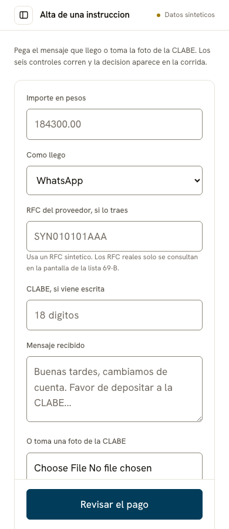
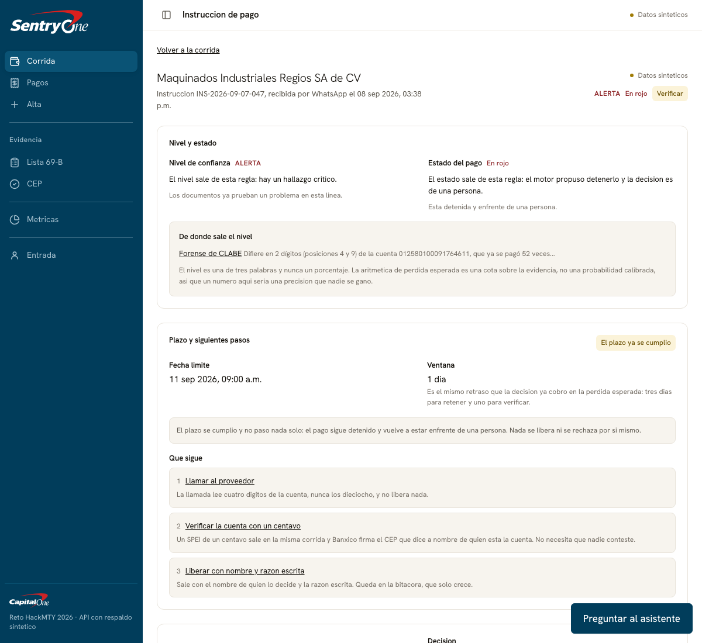
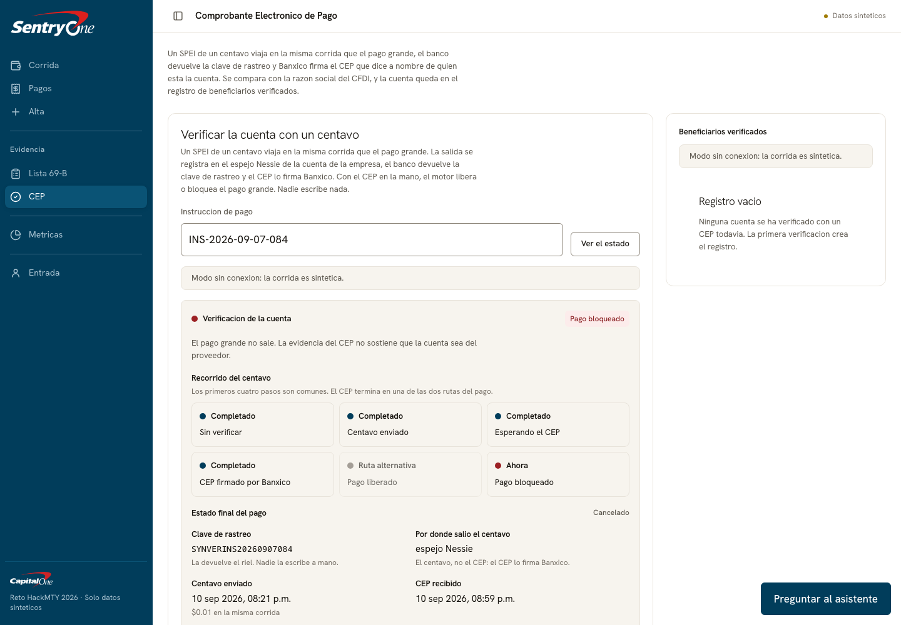
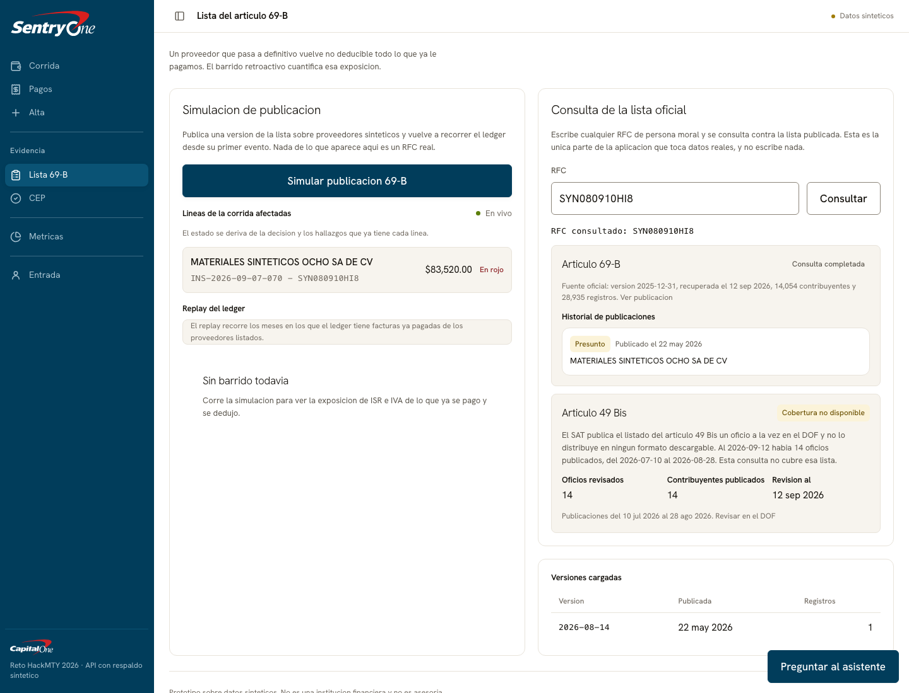
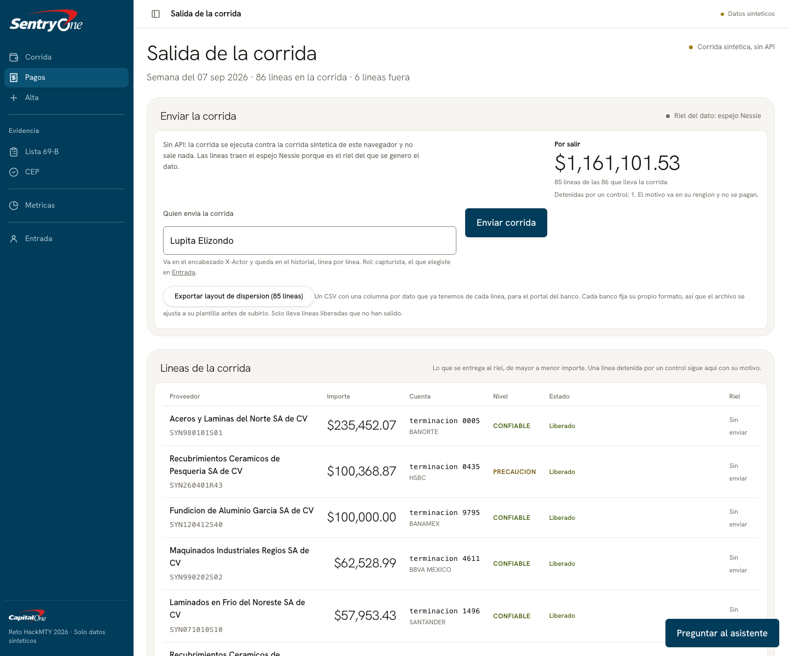
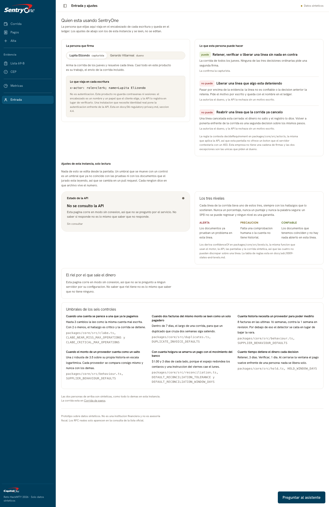
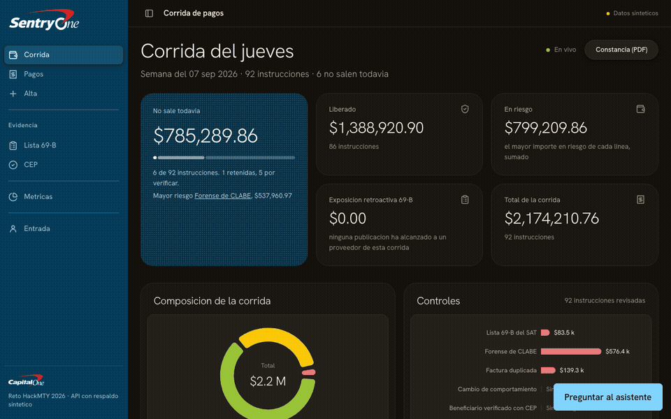
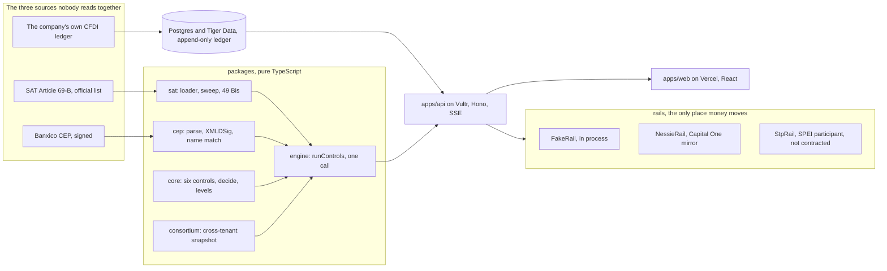

<div align="center">

<picture>
  <source media="(prefers-color-scheme: dark)" srcset="assets/brand/sentryone-lockup-dark.png">
  
</picture>

**The last control before a supplier payment becomes irrevocable**

Capital One track 3, Real-Time Anomaly and Security Sentinel. HackMTY 2026

[](https://github.com/garzario/CapitalOneHackMTY/actions/workflows/ci.yml)
[](https://github.com/garzario/CapitalOneHackMTY/releases/tag/v1.0.0)
[](LICENSE)
[](.bun-version)
[](tsconfig.base.json)

</div>

**[Open the live app](https://sentryone-one.vercel.app)** |
**[Take the recorrido](https://sentryone-one.vercel.app/#/run?tour=1)**, 9 steps, about two minutes,
and at the end SentryOne calls you as the owner |
**Video: (YouTube link)**, TODO(garzario), issue #73

## The Thursday

Lupita Elizondo is the only administrative person at a 28-employee metalmecanica in Apodaca, Nuevo
Leon, and Thursday is the day the suppliers get paid.

This Thursday the run is 92 payment instructions settling 129 CFDIs, MXN 2,174,210.76, with a
spreadsheet, WhatsApp and the bank portal. There is no ERP above her, no treasury, and no second
pair of eyes.

One of those instructions arrived as a photo: MXN 537,960.97 to a CLABE whose check digit cannot
exist, `INS-2026-09-07-029`.

If the account is wrong there is nothing to reverse. An accepted transfer order is firme,
irrevocable, exigible y oponible frente a terceros, and of every 100 pesos claimed for fraud in the
first quarter of 2026 the banks returned 24.

If the SAT publishes that supplier on the Article 69-B list, the invoices she already deducted stop
producing fiscal effect backwards: for every MXN 100 of subtotal already deducted, MXN 46 of tax
effect reverses between ISR and IVA, and the publication happens after the money is gone.

Both losses are decided in the same minute, and nothing on her desk reads the two together.
**SentryOne lives in the minute before sending.**

Every figure above is cited to its primary source in
[`docs/04-market.md`](docs/04-market.md#sources), and the run itself is synthetic and labelled
synthetic on every screen that shows it.

## What it does

Six explainable controls run over one payment before it leaves. Each one is a pure function, each
one is accounted for in either `ran` or `skipped` with a named reason, and each one puts its
evidence on the screen next to the number it moved.

| # | Control | What it answers | The source it reads | Where to see it |
|---|---|---|---|---|
| 1 | **SAT 69-B cross-check and retroactive sweep** | Is this supplier on the official list, and what did the last publication do to invoices already paid and already deducted | The SAT's own Article 69-B listing, 14,234 rows committed in `packages/sat/src/snapshot/`, plus article 49 Bis beside it | [`sat.png`](assets/screenshots/sat.png) |
| 2 | **CLABE forensics** | Can this account exist, has this supplier ever been paid on it, did the bank or the plaza change | The company's own ledger of accounts actually paid and the payment complements behind them, in `packages/core/src/clabe.ts` | [`finding-light.png`](assets/screenshots/finding-light.png) |
| 3 | **Duplicate invoices** | Is this invoice about to be paid twice | The company's CFDI ledger, same issuer, amount, date window, folio or UUID collision | [`run-light.png`](assets/screenshots/run-light.png) |
| 4 | **Supplier behaviour change** | Did this supplier's issuance rate, amount or concentration drift away from its own history | The same CFDI ledger over time, gated on sample size so a thin history says so instead of scoring | [`run-light.png`](assets/screenshots/run-light.png) |
| 5 | **Beneficiary verification with the CEP** | Who actually owns the destination account | One cent of SPEI inside the same run, the CEP Banxico signs for it, XMLDSig against the Banxico certificate in `packages/cep/src/signature.ts`, holder name against the CFDI legal name, plus a cross-tenant corroboration snapshot | [`cep.png`](assets/screenshots/cep.png) |
| 6 | **Bank reconciliation** | Did money leave with no document behind it | The company's bank mirror on Capital One Nessie, reconciled against every CFDI and complement the company holds | [`payments-light.png`](assets/screenshots/payments-light.png) |

Then one function decides. `decide` weighs the pesos at risk against what delaying this payment
costs with this supplier, and proposes hold, verify or release. A person makes the call, and the
ledger records their name and their role.

Every line carries one of three levels, `confiable`, `precaucion` or `alerta`, always shown with the
findings that produced it, and one of three states, `rojo`, `cancelado` or `enviado`. Both are
derived on every read by `packages/core/src/levels.ts` and neither is stored. There is no
probability, no score and no percentage next to a payment, and the word "seguro" is not a verdict
this product is able to print: a SPEI cannot be recalled, so no level is a guarantee
([ADR-0009](docs/adr/0009-states-and-levels.md)).

There is an assistant, and it reads and proposes over nine read-only tools. It never executes:
a person presses the button and the ordinary endpoint appends the ordinary event with their name on
it ([ADR-0007](docs/adr/0007-assistant-boundary.md)).

## The moments

Captured by `bun run shoot:web`, which drives a headless browser at fixed widths in both themes with
reduced motion on, so a capture is a fact about a build rather than a good moment.

| | |
|---|---|
| **The run, `#/run`.** 92 instructions, the pesos that are not leaving, the level on every line<br> | **The intake.** The photo the supplier sent on WhatsApp, read on a phone through the QR page<br> |
| **The account and its plaza.** Two digits off the account paid 52 times, `580 (APODACA, NL)` against `180 (DISTRITO FEDERAL, DF)`<br> | **The cent and the CEP.** One cent sent, the clave de rastreo the rail answered, the holder name beside the CFDI legal name<br> |
| **The SAT publishes, `#/sat`.** The sweep prices what the publication did to invoices already paid, and the lookup box answers a real RFC a judge picks<br> | **The run leaving, `#/payments`.** 86 lines answered by the rail with a clave de rastreo each, and the six that did not move with the reason the engine wrote<br> |
| **Who signs, `#/entrada`.** The person every write will carry, and what that person may do. A selector and not a login, and the screen says so<br> | **The whole product in a loop**, and the recorrido ends with SentryOne calling you as the owner<br> |

The blind evaluation is [`metrics.png`](assets/screenshots/metrics.png), and the narrow viewports a
clerk actually opens are [`run-phone.png`](assets/screenshots/run-phone.png),
[`payments-phone.png`](assets/screenshots/payments-phone.png),
[`run-tablet.png`](assets/screenshots/run-tablet.png) and
[`entry-phone.png`](assets/screenshots/entry-phone.png). Dark variants exist for the run, the
findings and the payments.

## How it is built



One rule makes the architecture true: **the intelligence lane has no network and no database
access.** It takes values and returns values, which is why it is unit-testable, why the retroactive
sweep is a replay rather than a migration, and why the whole engine can be run in front of a judge
with the Wi-Fi off. The diagrams and the rejected alternatives are in
[`docs/07-architecture.md`](docs/07-architecture.md).

### Sponsor technology, what we do with it, where in the code

| Technology | What we do with it | Where in the code |
|---|---|---|
| **Capital One Nessie** | The company's bank mirror, so control 6 has a statement to reconcile against, and the rail that writes the one-cent probe and one withdrawal per line of the run. It is a sandbox and not a bank: no pesos move and no CEP is produced. 86 lines for MXN 1,388,920.90 went out against it on 2026-09-13 | `packages/nessie`, `packages/rail/src/nessie.ts`, verified section of `packages/rail/README.md` |
| **Gemini API** | The assistant, with function calling over our own API and nine read-only tools, plus OCR of the CLABE in the WhatsApp photo and transcription of a voice note. It may only transcribe and propose: the response schema has six fields and none of them is a verdict | `packages/extract`, `apps/api/src/assistant/`, boundary enforced by `packages/extract/src/boundary.test.ts` |
| **ElevenLabs, two agents** | The verification call to the supplier when the decision is `verify`, in Mexican Spanish over the Twilio integration, and the owner call that closes the recorrido. The script is derived from the instruction, speaks four digits of the account one by one and never the eighteen, and the transcript is read by a deterministic parser rather than by a model | `packages/voice/src/script.ts`, `packages/voice/src/outcome.ts` |
| **Tiger Data** | The append-only payment ledger becomes a hypertable and the daily rollup the timeline reads becomes a continuous aggregate, in a conditional migration so a plain Postgres 18 runs the identical SQL against the base table | `packages/db/migrations/0002_timescale.sql`, `0004_timescale_sentryone.sql`, `0008_timescale_supplier_outflow.sql` |
| **Snowflake API** | The cross-company beneficiary network, reached over the SQL REST API and nothing else: `POST /api/v2/statements` with a key-pair JWT signed by `node:crypto`. Seven columns leave a company, all hashed or public, and the engine reads a local snapshot so the warehouse is never on the path of a decision | `packages/consortium/src/client.ts`, `packages/consortium/src/jwt.ts`, [ADR-0006](docs/adr/0006-consortium-snowflake.md) |
| **Vultr** | `apps/api` and the database, because the Server-Sent Events stream that keeps the run live needs a long-lived process. Caddy terminates TLS on an sslip.io name with `flush_interval -1`, so `event: ready` arrives immediately instead of when the connection closes | `deploy/Caddyfile`, `deploy/docker-compose.yml`, [ADR-0005](docs/adr/0005-deploy-target.md) and its amendment |
| **Vercel** | The judge-facing surface, a URL opened on their own phone. The browser only ever talks to the Vercel origin: `vercel.json` rewrites `/api` and `/health` to the instance, which is why the bundle carries no base URL and there is no CORS configuration anywhere in `apps/api` | `vercel.json`, `scripts/vercel-rewrites.test.ts` |

## Prize categories and the evidence

One evidence sentence each, and one way to falsify it in thirty seconds. A category we did not
genuinely use is not selected, because a claim a judge can break costs more than the prize is worth.

**Best Use of Gemini API.** The assistant calls Gemini with function calling over our own API and
all nine tools are reads, with `readOnly` as the literal `true` rather than a boolean, so a tool call
that writes cannot be constructed; beside it Gemini reads the CLABE off a photo and transcribes a
voice note, and nothing else. No level, no action and no number comes from the model.
*Verify:* `bun test packages/extract/src/boundary.test.ts`, which reads the package source and fails
if a shipped module so much as names `decide`, `score` or `recommend`.

**Best Use of ElevenLabs.** When an account needs confirming, SentryOne calls the supplier with a
Conversational AI agent in Mexican Spanish, on a script derived from the instruction that speaks four
digits one by one and never the eighteen, and the transcript is read by a deterministic parser that
ranks denial over uncertainty over confirmation and releases nothing on its own.
*Verify:* `bun test packages/voice`, and the eleven real outbound calls with every conversation id
are listed in
[`docs/14-process.md`](docs/14-process.md#the-verification-call-elevenlabs-over-twilio).

**Best Use of Tiger Data.** The spine is an append-only ledger of payment events, which is what makes
the 69-B sweep a replay of history rather than a recomputation, and Tiger Data turns it into a
hypertable with a continuous aggregate behind the timeline. The two rules that cost us a migration
are written down: a continuous aggregate cannot be created inside a transaction, and a hypertable's
unique indexes must include the partitioning column.
*Verify:* `bun run doctor` prints the migration state and which database is live, and
`packages/db/migrations/0002_timescale.sql` is the conditional migration itself.

**Best Use of Vultr.** `apps/api` runs on a Vultr instance next to the database because the SSE
stream needs a long-lived process, and that contradicted our original deploy decision, which was
amended in writing rather than quietly.
*Verify:* <https://api.104.238.147.69.sslip.io/health> answers over HTTPS, and
<https://sentryone-one.vercel.app/api/v1/run/current> answers the same run through the Vercel
rewrite.

**Best Use of Snowflake API.** The beneficiary control is weakest exactly where the money is: a
supplier's first invoice, where this company has no history. SentryOne puts that corroboration in a
cross-company network on Snowflake, reached over the SQL REST API with a key-pair JWT and no SDK, and
what leaves a company is a salted hash of the tenant, of the RFC and of the CLABE, a public bank
code, one of four outcomes, a date and a synthetic flag.
*Verify:* `bun run consortium:pull --offline` fills the same snapshot with no Snowflake account at
all, and `consortium_pull.source` records `snowflake` or `synthetic` so no screen can confuse the
two. The other companies on the network are ours, generated from the committed seed.

**Capital One challenge, track 3, Real-Time Anomaly and Security Sentinel.** SentryOne is a real-time
anomaly sentinel over the payment ledger of a Mexican SMB, and the real time it picks is the only one
that cannot be undone: the minutes between approving a payment run and sending it. The anomaly that
matters here is not an odd merchant category, it is a CLABE two digits off the account this supplier
has been paid on 52 times, a supplier the SAT has just published, an invoice about to be paid twice,
and an account holder who turns out to be a different company. Because an accepted SPEI is firme e
irrevocable, detecting after settlement is a post-mortem: this detects before, and leaves the
decision to a person.
*Verify:* open <https://sentryone-one.vercel.app/#/run?data=api> and press one line of the run, or
run `bun run demo`, which drives the whole path headless as nine checks and exits non-zero on any of
them.

## Run it

Requires bun 1.3.11, the version in [`.bun-version`](.bun-version). Two commands, no database:

```bash
bun install --frozen-lockfile      # also wires the git hooks
SEED=sentryone bun run dev         # web and API together, the demo company in memory
```

Then open <http://localhost:5173/?data=mock>, which runs the same screens with no request leaving the
browser at all. Drop `?data=mock` to use the local API, or use `?data=api` against the deployed one
to prove the backend is answering rather than the offline fallback.

With Postgres, which is what the deployed instance runs:

```bash
cp .env.example .env
bun run migrate                    # fourteen files in order; the Timescale ones only where the extension exists
bun run seed                       # idempotent, prints the demo account IDs
bun run dev
```

Four commands worth knowing about:

- `bun run doctor` checks the bun version, every variable in `.env.example` with the files that read
  it, the committed SAT list snapshot, the CEP fixture, which database path is live and how much of
  it is migrated and seeded, and closes on whether this laptop can still demo with the network
  unplugged. `--strict` turns any warning into exit 1.
- `bun test` runs 2,709 tests across 143 files with no network, no database and no API key: 2,591
  pass, 118 skip and 0 fail, re-read on 2026-09-13. Both numbers move every time a workspace gains a
  file, so re-run the pair rather than quoting this line. The 118 are the database cases, which skip
  themselves unless `TEST_DATABASE_URL` names a database they may empty.
- `bun run eval` scores the six controls against 35 labelled holdout cases written by a different
  person from the detectors: 87.0 percent precision, 83.3 percent recall, a 1.6 percent false
  positive rate, and 12 of the 12 lines that should read `confiable` doing so, on 2026-09-13.
- `bun run demo` drives the whole demo path headless as nine checks and must be green before any
  rehearsal, and `bun run offline` rehearses the same path with every outward call closed, which is
  the conference Wi-Fi case rather than the missing-key one.

The consortium network is opt-in, because it is the only part of the product that talks to a second
vendor. It stays behind `ALLOW_CONSORTIUM=1`, and with the flag unset every control still runs and
the beneficiary finding says the network was not consulted.

```bash
bun run consortium:seed             # Snowflake database, schema, table and view, then the synthetic network
bun run consortium:push             # this company's outcomes, as salted hashes and nothing else
bun run consortium:pull             # fills the local snapshot the engine reads
bun run consortium:pull --offline   # fills the same snapshot with no Snowflake account at all
```

## The problem, in the words of the law

A Mexican SMB pays its suppliers by SPEI, which is instant and irrevocable: an accepted transfer
order is firme, irrevocable, exigible y oponible frente a terceros by law, so a payment run is a
one-way door. If the supplier sits on the SAT's Article 69-B list, the invoices it issued no producen
ni produjeron efecto fiscal alguno, retroactively, and the buyer has thirty days from the publication
to prove the operation was real or file a corrective return. The frequency is set by the SAT and not
by the payer: in the twelve months to 31 July 2026 that list moved 973 taxpayers to definitivo across
33 publication dates, roughly one change every eleven days.

The three facts that decide whether a payment should go are all public and all current, and they are
never read together at the moment that matters: the 69-B list belongs to a compliance product, the
CFDI belongs to the accountant, and the CEP belongs to a post-mortem, because Banxico publishes it
only after the transfer is already irrevocable. That window, the few minutes between approving a run
and sending it, is nobody's product surface.

What the alternatives structurally cannot do: the Mexican 69-B checkers run on a list rather than on
a payment, so they never see the account the money is about to leave for; the international
payee-verification platforms verify the account and ignore the counterparty's fiscal status, which is
the larger Mexican loss, and none of them mentions CFDI, SAT, SPEI or CLABE anywhere in their public
material. The competitor map, with published prices and access dates, is in
[`docs/04-market.md`](docs/04-market.md#competitor-map), and the persona is quantified in
[`docs/02-persona.md`](docs/02-persona.md) with the interviews we still owe listed as open rather
than invented.

## The algorithm, in three sentences

An instruction arrives with an amount and a CLABE, and one read assembles its context: the supplier,
the accounts it has actually been paid on and the document that established each one, every CFDI and
complement the company holds, the 69-B rows in force for that RFC, the CEP already verified for that
account, and the bank mirror. `runControls` puts that one object through all six controls and
accounts for every one of them in either `ran` or `skipped` with a named reason, so a control that
cannot run says so instead of leaving an empty screen, and `decide` weighs the pesos at risk against
what delaying this payment costs with this supplier. The controls themselves are a 3-7-1 check digit
and OCR-aware Damerau-Levenshtein against the supplier's paid accounts, XMLDSig verification of a
Banxico seal, and a fold over `LedgerEvent[]` that prices what a new publication did to invoices
already paid and already deducted.

It is pure, dependency-free TypeScript in `packages/core`, with its tests next to it, so it can be
read and run in under a minute.

## Stack, and why

Fit for purpose is graded, so each row ties a tool to this problem rather than to taste.

| Choice | Pin | Why this, for this problem |
|---|---|---|
| bun | 1.3.11 | One runtime for the API, the tests, the seeder, the migrations and the scripts. Native TypeScript with no build step, and a cold start fast enough for a streaming endpoint. |
| TypeScript, strict | 5.9.3 | The money types and the ledger directions are checked at compile time, not in review. |
| `packages/core`, zero dependencies | n/a | The intelligence is pure functions with unit tests and no mocks and no network, so a judge can read it and run it. This is the answer to "is it really working". |
| `packages/engine` | n/a | The six controls behind one call, `runControls`. It exists for a dependency direction and not for taste: `packages/sat` and `packages/cep` already depend on `core`, so `core` cannot import them back without a cycle. Adapters only, no algorithm. |
| `packages/sat` with a committed snapshot | n/a | The complete official Article 69-B listing, 4.5 MB, dated and committed with its provenance, so `GET /api/v1/sat/lookup` answers an RFC a judge picks themselves with no network and no conference Wi-Fi. |
| `packages/cep` | n/a | XMLDSig against the Banxico certificate, byte-exact, reporting `unconfirmed_scheme` rather than claiming a seal it cannot prove. |
| `packages/rail` | n/a | The only place that sends money, and it sends one amount, 0.01 MXN. Mexico has no confirmation-of-payee API, so the one document that names an account holder is the CEP Banxico signs for a SPEI, and the cent is what makes one exist. `NessieRail` writes it to the company's bank mirror and has run live; `StpRail` is the SPEI participant that would produce a real CEP, written out with its cadena original and its RSA signature and refusing to run without `STP_*`, so nothing here can pretend to be contracted; `FakeRail` is the in-process one, and every event it produces carries `simulated: true`. |
| Hono | 4.13.7 | Small, standards-based HTTP. The API stays thin transport with no business logic in it. |
| zod plus `@hono/zod-validator` | 4.5.4 / 0.9.1 | One schema per endpoint, validated at the edge, typed on both sides of the wire. |
| Postgres via `postgres` | 3.4.9 | Raw SQL, no ORM. When a judge asks how the forecast works, the answer is the query. |
| Timescale hypertables, conditional | n/a | A transaction ledger genuinely is a time series, so hypertables and continuous aggregates are the honest fit. `0002_timescale.sql` applies only where the extension exists, so a plain local Postgres 18 is the offline fallback on the same dialect. |
| Snowflake, in `packages/consortium` only | no dependency, key-pair JWT and `fetch` | The cross-tenant beneficiary network. A supplier's first payment from this company has no history here and months of history in every other company that already pays it, which is the one signal our own ledger cannot hold. What leaves a company is a salted hash of the supplier and the account, a bank code and one of four outcomes: no name, no amount, no account number. The engine reads a local snapshot and never the warehouse, so the decision stays deterministic and works offline. The network of other tenants is synthetic and labelled as such. ADR-0006. |
| Vite, React, Tailwind | 8.2.2 / 19.2.8 / 4.3.3 | The judge-facing surface is a URL they open on their own phone, which is the cleanest rebuttal to a staged prototype. |
| motion | 13.2.0 | Motion is first-class here, not a polish task, because the experience criteria are 20 points. |
| recharts | 3.10.1 | Charts over our own ledger, not over screenshots. |
| Gemini, in `packages/extract` only | `gemini-3.6-flash`, `GEMINI_MODEL` overrides | The only place that reaches a language model, and it may only transcribe: read the CLABE off a photo, transcribe a voice note. ADR-0004 keeps inference out of the per-transaction decision path, and `packages/extract/src/boundary.test.ts` enforces it by reading the package's own source. |
| ElevenLabs, in `packages/voice` | zero dependencies, plus `convai-widget-embed` 0.18.1 loaded on press in the browser fallback | The verification call to the supplier when the decision is `verify`. The outcome parser is deterministic and not a model, for the same ADR-0004 reason, and the endpoint answers 422 with the exact script when the keys are absent so the clerk reads it on their own telephone. |
| Nessie | n/a | System-of-record mirror for accounts and transactions, and the rail the run leaves on. It has dates with no times, so anything intraday comes from our own ledger. See [`docs/09-api.md`](docs/09-api.md). |

Every dependency is pinned exactly and must be more than three days old, enforced by
`minimumReleaseAge` in `bunfig.toml`. See [`CONTRIBUTING.md`](CONTRIBUTING.md).

## Docs

| # | Doc | What is in it |
|---|---|---|
| 00 | [challenge](docs/00-challenge.md) | The challenge prompt, the three tracks, the one we chose and why |
| 01 | [rubric mapping](docs/01-rubric-mapping.md) | One row per sub-criterion, with the evidence path for each |
| 02 | [persona](docs/02-persona.md) | One named, quantified persona, plus the anti-persona |
| 03 | [user journey](docs/03-user-journey.md) | The journey map, stage by stage, with friction and intervention |
| 04 | [market](docs/04-market.md) | Competitor map, the gap, bottom-up TAM, SAM and SOM with sources |
| 05 | [business model](docs/05-business-model.md) | Pricing, unit economics, CAC, LTV, go to market |
| 06 | [regulatory and privacy](docs/06-regulatory-privacy.md) | Our legal position, the framework map, the LLM boundary and its cost |
| 07 | [architecture](docs/07-architecture.md) | Diagrams, and a decision table with the alternatives we rejected |
| 08 | [data model](docs/08-data-model.md) | ERD, the DDL, and the synthetic-data methodology |
| 09 | [API](docs/09-api.md) | Our HTTP contract, plus the verified Nessie quirks |
| 10 | [demo script](docs/10-demo-script.md) | The four-minute beat sheet, the seeded IDs, the fallbacks |
| 11 | [pitch](docs/11-pitch.md) | Slide by slide, with 60-second, 90-second and 4-minute variants |
| 12 | [judge Q and A](docs/12-judge-qa.md) | The walk-up answer sheet, per person and shared |
| 13 | [Devpost](docs/13-devpost.md) | The exact submission copy, and the evidence sentence per category |
| 14 | [process](docs/14-process.md) | How we worked: board, PRs, reviews, ADR index, what we cut |
| adr | [decisions](docs/adr/) | Stack, track, datastore, LLM boundary, deploy target, consortium, the assistant boundary, the payment rails, the three levels and the three states |

Plus [`AGENTS.md`](AGENTS.md), the contract every person and every assistant in this repository works
under, [`docs/design.md`](docs/design.md) for the reasoning behind the design system, and
[`apps/web/README.md`](apps/web/README.md) for the data modes and the offline guarantees of the
judge-facing surface.

## Rules of this repo

- **Never push to `main` or `dev`.** Branch from `dev`, open the pull request against `dev`, squash
  merge when CI is green. `main` only receives release pull requests. The `pre-push` hook enforces it.
- **bun only**, never npm, npx, yarn or pnpm. Exact pins, never `@latest`, and a new dependency must
  have been published more than three days ago.
- **Three levels and three states, and never a probability.** No percentage and no score next to a
  payment, and never the word "seguro" as a verdict, in any language.
- **Never invent data.** No unconfirmed partner, endorsement, role, price or statistic. Cite the
  primary source or cut the claim, and use `TODO(<owner>)` for anything not decided yet.
- **Synthetic data only**, labelled synthetic in the same sentence, including in issues and
  screenshots. `bun run scrub` is the pre-submission gate over the tree, the history and the commit
  messages.
- No em dashes in prose, no emoji in docs, commits, YAML or UI copy, and no tool attribution
  anywhere.
- One logical commit per pull request, and `CHANGELOG.md` updated under `[Unreleased]` in the same
  commit as the change.

36 hours, four people, a branch and a pull request for every change.
[`docs/14-process.md`](docs/14-process.md) has the board and its nine views, the five epics, the
three pull requests worth reading, the review rotation, what build night mode cost us, the ADR index,
and the list of work we consciously cut.

## Team

| Person | Handle | Owns |
|---|---|---|
| Patricio Garza | [@garzario](https://github.com/garzario) | Lead. `packages/core`, `packages/db`, `packages/sat`, `packages/cep`, `packages/rail`, `packages/consortium`, the ADRs, CI, all merges |
| Fabian | [@fabbyyyy](https://github.com/fabbyyyy) | Data platform. `apps/api`, `packages/nessie`, `packages/seed`, the schema, the migrations, the deploy |
| Adan | [@Apanawa](https://github.com/Apanawa) | Synthetic data and evaluation. The generator, the labelled holdout, the SAT loader and sweep, the constancia, QR intake, metrics |
| Fabricio | [@FabriBanda](https://github.com/FabriBanda) | Product surface and narrative. Brand and design system, the payment run and finding screens, the market and persona docs, the judge card |

## Disclaimer

Prototype built in 36 hours on synthetic data. Not a financial institution, not a regulated entity,
and not financial advice. No real customer data is used anywhere in this repository. Every supplier,
invoice, CLABE and RFC generated by `packages/seed` carries a `synthetic: true` flag that the UI
renders as a visible watermark, and the only real data in the tree is public: the SAT's own Article
69-B listing, which the SAT publishes and declares de caracter publico in its first line.

## License

MIT. See [`LICENSE`](LICENSE).
