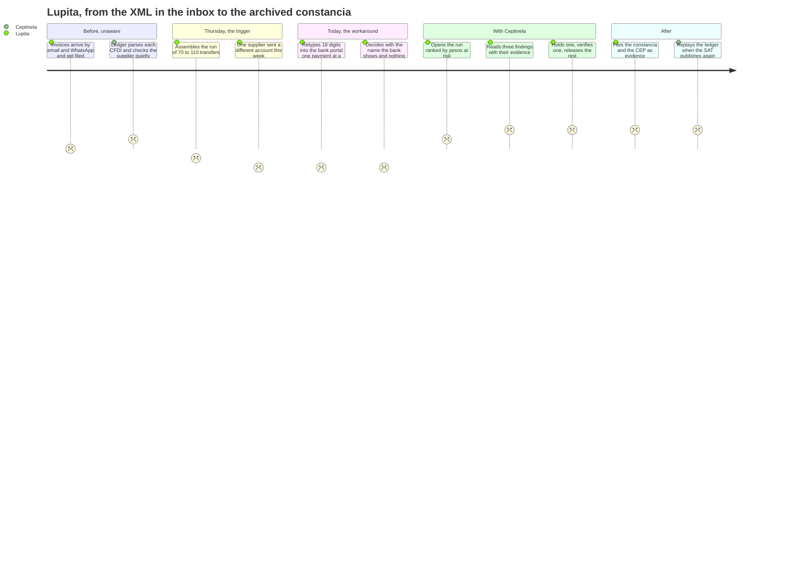
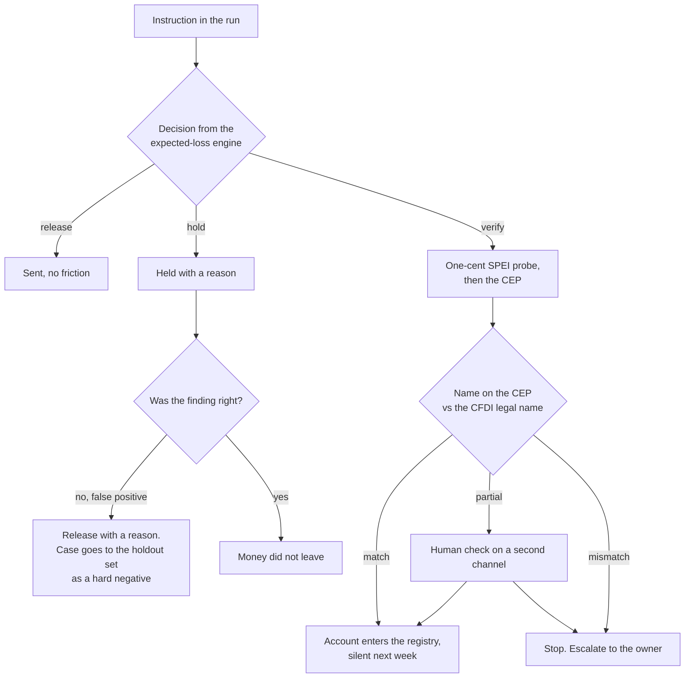

# 03. User journey

Worth 7 points. The rubric pays for **structure**, so this map names a pre-trigger stage and a
post-outcome stage. Most teams draw only the happy middle and lose half of this block.

Owner: Patricio (`garzario`), drafted for the team to validate. Screens confirmed by Fabricio
(`FabriBanda`), who owns issues #46 to #51. Issue #52. Due M2.

Persona: Lupita Elizondo, `docs/02-persona.md`. One cycle of the journey is one week, and the map
runs from the XML landing in her inbox on Monday to the constancia archived after the run.

## Journey

Emotion scale is minus 2 to plus 2.

## Stage table

Every row names a real screen or it is a story, not a journey.

| Stage | Trigger | User action | System action | Emotion | Friction today | Our intervention | Screen in `apps/web` | Evidence |
|---|---|---|---|---|---|---|---|---|
| 0. Pre-trigger, unaware | Monday to Wednesday, CFDI XML arrives by email, portal or WhatsApp | Saves the file, notes the amount in the spreadsheet | Parses CFDI 4.0 (#33), appends `cfdi_received`, links the supplier, matches the RFC against the loaded 69-B list versions (#35), no alert unless something changed | 0 | Nothing is checked at all. The cost accrues invisibly and surfaces months later | Continuous ingest, so Thursday starts with the work already done | Payment run screen, quiet state (#46) | TODO(FabriBanda) screenshot path in `assets/screenshots/` |
| 1. Trigger | Thursday morning, bank cutoff hours away | Assembles what has to go out, 70 to 110 transfers | Builds the week's `PaymentRun`, runs all six detectors over every instruction, composes findings and an expected-loss decision per item | -1 | The list exists only in a spreadsheet, with no risk order | The run arrives already triaged, sorted by pesos at risk | Payment run screen with the alert rail (#46) | `GET /api/v1/run/current` in `docs/09-api.md` |
| 2. Workaround today | The same Thursday, without us | Pastes eighteen digits per payment, eyeballs the beneficiary name the bank returns | Nothing. The bank shows a name after the account is typed and gives no history, no fiscal status and no duplicate check | -2 | Attention is spent uniformly across 80 payments, so the two that matter get the same seconds as the rest | Attention is spent where the pesos at risk are | Not our screen. This row exists to name what we replace | `docs/02-persona.md`, the workaround table |
| 3. **The moment that is the product** | A row with MXN at risk sits at the top of the rail | Opens the finding, reads the evidence chips, chooses hold, verify or release | Shows the explanation in plain Spanish with its evidence: the two digits that differ from the historical CLABE, the bank change, the 69-B status with its DOF date, the duplicate original. Records the decision as a ledger event with the person who made it | +2 | The clerk has no way to see a supplier's payment history, its previous accounts or its fiscal status at the moment she pays | The three joins nobody else makes, at the moment of payment, with a person deciding | Finding detail panel and supplier drawer (#47), QR intake for anything that arrives mid-run (#48) | `Finding` and `Decision` in `packages/core/src/domain.ts` |
| 4. Post-outcome | The run is sent | Files the constancia for the run and the CEP for the verified account | Appends `payment_sent` and `cep_verified`, adds the account to the supplier's `knownAccounts` with `establishedBy: "cep"`, so the same supplier is silent next week. On the next SAT publication, replays the ledger and quantifies exposure | +2 | The next SAT publication is discovered by the accountant months later, or by an assessment | The measurable change: verified beneficiaries accumulate, and the retroactive sweep runs the same week the list moves | SAT publication simulation with replay (#49), CEP viewer and beneficiary registry (#50), metrics page (#51) | `SweepResult` in `packages/core/src/domain.ts`, `POST /api/v1/sat/publish` |

TODO(FabriBanda): confirm each screen exists or is planned and drop the screenshot path into the
evidence column once it does. TODO(garzario) verify the cycle-level outcome numbers (payments
verified per run, minutes saved) only after the generator in #43 and one timed run exist. No number
goes in this table before then.

## The moment that is the product

Before stage 3, Lupita believes a payment is a data-entry task: the risk is that she mistypes, and
the control is to read the digits twice. After stage 3 she believes a payment is a decision with
evidence behind it, and that the evidence already exists: the invoice she received, the list the SAT
published, and the receipt Banxico signs. Nothing about the transfer changed. What changed is that
the three documents are joined at the one moment when joining them can still stop money.

That is the sentence to say over the screen, and it is why the mental model changes rather than the
data getting prettier. A dashboard would show her the same payments, sorted, in a chart. It would
not tell her that this one supplier appeared on a list published eleven days ago.

## The three branches, which are the honest part of this journey

A journey with one happy path describes a demo, not a product. These three branches are the ones a
judge asks about, and each one has a screen and a recorded outcome.

### Branch 1, false positive

| | |
|---|---|
| What triggers it | A legitimate new account that has never been paid before, an OCR misread of a CLABE from a photo, or a supplier whose issuance pattern genuinely changed because it won more of our work |
| What she sees | `requiere_verificacion`, never an accusation. The explanation names the quantity that produced it: "this CLABE differs in two digits from the account paid in the last 6 payments" |
| What she does | Releases with a reason, in one click, from the same panel that raised it |
| What the system records | `decision_made` with `action: "release"`, `decidedBy`, and the finding that was overridden |
| What it costs | Minutes, not money. The expected-loss engine already weighs `amountAtRisk` against `delayCostPerDay`, which is why a small payment is not held for a weak signal |
| Where it goes afterwards | Into the labelled holdout cases as a hard negative (#55), so the next measurement of the false-positive rate includes it. A false positive the team never sees again is a false positive the team never fixes |

### Branch 2, partial name match

| | |
|---|---|
| What triggers it | The CEP beneficiary name is not byte-identical to the CFDI legal name: a truncation by the bank, a missing "SA DE CV", a trade name where the invoice carries the legal name |
| What she sees | `nameMatch: "partial"` with both strings shown side by side, the CFDI legal name and the CEP holder name, and the signature status of the CEP next to them |
| What she does | Confirms on a second channel: the phone number on an earlier CFDI or a number she already had, never the number in the message that brought the new account |
| What the system records | The CEP, the comparison result and who confirmed. A partial match confirmed by a person is stored as evidence, not silently upgraded to a match |
| Why it is a branch and not a bug | This is the direct answer to "the bank already shows the beneficiary name". The bank shows a name after the account is typed and it does not compare it with anything. We compare it with the legal name on the invoice we are paying, and we keep the signed document that proves what it said |
| Screen | CEP viewer with the side-by-side comparison and the clave de rastreo a judge can re-check (#50) |

### Branch 3, legitimate bank change

| | |
|---|---|
| What triggers it | The supplier really did change bank. This is the common case, and treating it as fraud is how a product like this gets uninstalled |
| What she sees | The change, the history of accounts we have paid, and how each was established: `payment_complement`, `instruction` or `cep` |
| What she does | Verifies once with the one-cent probe, or accepts the payment complement the supplier issued after a previous payment, which carries `CtaBeneficiario` and is itself a fiscal document |
| What the system records | The account enters `knownAccounts` with `establishedBy: "cep"` or `"payment_complement"` and `establishedAt` |
| The measurable outcome | Next week the same supplier produces no finding. Verification is paid once per account, not once per payment, and the verified beneficiary registry is the asset that accumulates |
| Screen | Supplier drawer (#47) and the beneficiary registry (#50) |

## Rules for this doc

- Five stages, no more. A twelve-stage map reads as padding.
- One emotion score per row, and at least one negative. A journey that is pleasant at every stage is
  not describing a real problem.
- The pre-trigger stage names what she is doing while the cost accrues without her noticing.
- The post-outcome stage names the measurable thing that changed and on what cycle: verified
  beneficiaries per supplier, and exposure quantified the same week a list is published.
- Stage 3 maps one-to-one to beats 1 and 3 of `docs/10-demo-script.md`.
- The three branches are part of the journey, not an appendix. If a branch loses its screen, it
  loses its row here in the same PR.
