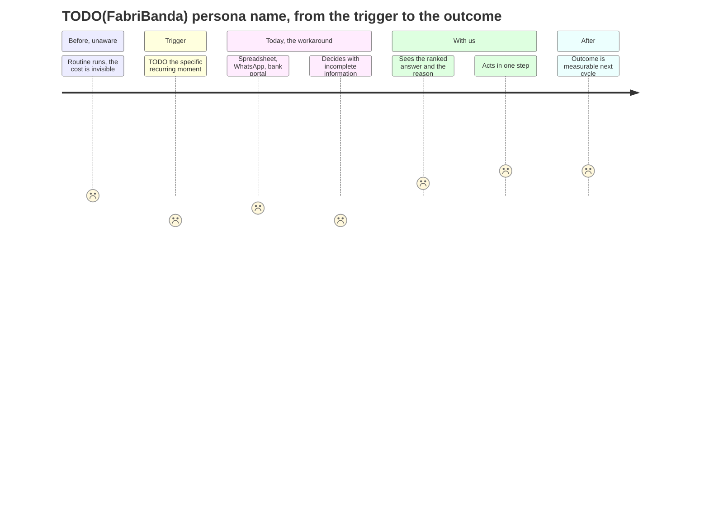

# 03. User journey

Worth 7 points. The rubric pays for **structure**, so the map names a pre-trigger stage and a
post-outcome stage. Most teams draw only the happy middle and lose half of this block.

Owner: Fabricio (`FabriBanda`), with Adan (`Apanawa`) on the screen mapping. Due M1.

## Journey

TODO(FabriBanda): replace the stage labels and the scores with the real ones. Keep exactly five
stages. The emotion scale is minus 2 to plus 2.

## Stage table

Every row must name a real screen in `apps/web` or it is not a journey, it is a story.

| Stage | Trigger | User action | System action | Emotion (-2..+2) | Friction today | Our intervention | Screen in `apps/web` | Evidence |
|---|---|---|---|---|---|---|---|---|
| 0. Pre-trigger, unaware | | | | | | | | |
| 1. Trigger | | | | | | | | |
| 2. Workaround today | | | | | | | | |
| 3. **The moment that is the product** | | | | | | | | |
| 4. Post-outcome | | | | | | | | |

TODO(FabriBanda): fill the table. TODO(Apanawa): confirm each screen exists or is planned, and drop
the screenshot path in the evidence column once it does.

## The moment that is the product

Stage 3 is the one the demo is built around and the only one that gets motion, because it is the
only one where the user's mental model changes. Everything else is plumbing the judge will forgive.

TODO(FabriBanda): one paragraph. What does the user believe before this screen, and what do they
believe after it. If the answer is "they see their data in a chart", the moment is not the product
and the idea needs another pass.

## Rules for this doc

- Five stages, no more. A twelve-stage map reads as padding.
- One emotion score per row, and at least one negative score. A journey that is pleasant at every
  stage is not describing a real problem.
- The pre-trigger stage names what the user is doing while losing money without noticing.
- The post-outcome stage names the measurable thing that changed, on what cycle.
- Stage 3 maps one-to-one to the demo beat in `docs/10-demo-script.md`.
