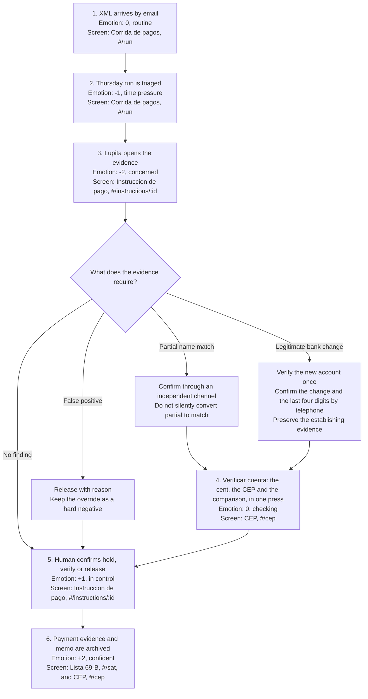

# 03. User journey

Issue #52. Persona: Lupita Elizondo, the sole administrative clerk at the synthetic 28-employee
metalmecanica defined in `docs/02-persona.md`.

The journey begins when a CFDI XML arrives by email and ends when the verified payment evidence
and decision memo are archived. Emotion uses a scale from -2, anxious, to +2, confident. Every
product stage names the current screen and hash route that serves it.

## Journey map

The screen at `#/sat` currently shows the retroactive sweep and an explicit pending state for the
constancia PDF. The final archive artifact is still `TODO(fabbyyyy)`. The journey names it because
the post-outcome stage is required, but it does not claim that the PDF generator exists today.

## Stage-by-stage map

| Stage | Trigger and user action | System result | Emotion | Exact screen |
|---|---|---|---|---|
| 1. Pre-trigger | A supplier's CFDI XML arrives by email. Lupita files it for Thursday. | The ledger records `cfdi_received`, links the synthetic supplier and makes the invoice available to the run. | 0, routine | **Corrida de pagos**, `RunScreen`, `#/run` |
| 2. Trigger | On Thursday, Lupita opens the run and scans the highest pesos at risk first. | `PaymentRun` shows totals and ranks instructions with decisions and findings. The reference synthetic run contains 92 payment instructions totaling MXN 2,174,210.76. | -1, time pressure | **Corrida de pagos**, `RunScreen`, `#/run` |
| 3. Evidence | She opens one row, reads the evidence chips and opens the supplier history when needed. | The detail shows the CFDI link, CLABE, source, findings, expected loss and delay cost without treating message text as evidence. | -2, concerned | **Instruccion de pago**, `InstructionScreen`, `#/instructions/:id`; **Expediente del proveedor**, `SupplierScreen`, `#/suppliers/:rfc` |
| 4. Verification | For an unproved account, she presses **Verificar cuenta** once. She types nothing: no clave de rastreo, no XML, no statement to read. | The one cent leaves through the configured rail inside the same run, `cent_sent` records the clave de rastreo the bank gave back, the CEP for that clave is resolved and its seal checked as far as the server can, the holder is compared with the CFDI legal name, and the engine releases or blocks the instruction. A verified account enters the beneficiary registry. | 0, checking | **CEP**, `CepScreen`, `#/cep`; **Instruccion de pago**, `InstructionScreen`, `#/instructions/:id` |
| 5. Decision and payment | She returns to the instruction and confirms **Retener**, **Verificar** or **Liberar**. The bank remains the place where the SPEI is sent. | The API appends `decision_made` with the action and `decidedBy`. SentryOne advises; a person decides. | +1, in control | **Instruccion de pago**, `InstructionScreen`, `#/instructions/:id` |
| 6. Post-outcome | She keeps the signed CEP, the decision and the SAT sweep memo with the payment evidence. | `cep_verified` preserves the verified beneficiary. A later `sat_list_published` event replays the ledger and quantifies prior exposure. The constancia PDF remains `TODO(fabbyyyy)`. | +2, confident | **CEP**, `CepScreen`, `#/cep`; **Lista 69-B**, `SatScreen`, `#/sat` |

## The cent inside the run

Stage 4 used to be a procedure with a button on top. The clerk sent one cent from the
company's bank, waited, read the clave de rastreo off a statement, typed it into the CEP
screen, and only then did the product have anything to compare. Three of those four steps
were hers and none of them needed a person: Mexico has no confirmation-of-payee API, so
the cent has to exist, but the clave de rastreo comes back from the bank and not from a
keyboard.

What is automated now, from one press of **Verificar cuenta**:

- the 0.01 MXN probe, through `packages/rail`, on the company's own account;
- the clave de rastreo, recorded as `cent_sent` the moment the rail answers;
- the CEP lookup by that clave, and the seal check when a Banxico certificate is
  configured;
- the holder comparison against the CFDI legal name, by the same `nameMatch` the manual
  path used;
- the release of a payment whose only problem was an unproved account, or the block of one
  whose CEP names somebody else, as `decision_made` signed `system`.

What is still a person's, and stays a person's:

- **starting the run.** Nothing sends a cent on its own. The clerk decides that this
  account is worth verifying, which is also what keeps the product from probing every
  account it sees.
- **anything the engine holds for another reason.** A CEP that confirms the holder does
  not settle a duplicated invoice or a supplier on the 69-B list, and those still end in
  **Retener**, **Verificar** or **Liberar** with a name on the decision.
- **the payment itself.** SentryOne never sends the SPEI. The cent is the only transfer it
  originates, and `release` means nothing stops this payment.

After the Thursday run there is nothing left to do by hand. No statement to reconcile
against a clave nobody wrote down, no second visit to the bank portal, no manual entry the
following morning. That is the change: the work is concentrated in the run the clerk was
already doing.

## Branch 1: false positive

**Example trigger:** a legitimate pattern change or new account produces
`requiere_verificacion`, but the independent evidence shows that the payment is valid.

1. Lupita opens **Instruccion de pago** at `#/instructions/:id` and reads the exact evidence that
   raised the finding.
2. She checks the supplier history in `SupplierScreen` at `#/suppliers/:rfc` and completes any
   independent verification the evidence requires.
3. She selects **Liberar**. The system stores `decision_made` with `action: "release"` and the
   person who decided.
4. The team adds the reviewed case to the labelled hard-negative set used by the blind metrics
   harness. This is an evaluation step, not a claim that the runtime learns automatically.

Emotion moves from -2, concern, to 0, cautious, to +1, resolved. The intended cost is review time,
not a blocked legitimate payment with no explanation.

## Branch 2: partial name match

**Example trigger:** the Banxico CEP beneficiary name is similar to, but not byte-identical with,
the CFDI legal name because of normalization, abbreviation or truncation.

1. Lupita opens **CEP** at `#/cep` and sees the beneficiary holder and CFDI legal name side by
   side with `nameMatch: "partial"` and the CEP signature status.
2. She verifies through an independent channel already on file. She does not use the contact data
   in the same instruction that introduced the account.
3. If confirmed, she returns to **Instruccion de pago** and selects **Liberar**. If not confirmed,
   she selects **Retener** and escalates to the owner.
4. The partial result remains partial in the evidence. A human confirmation does not rewrite the
   detector output into a perfect match.

Emotion moves from 0, checking, to -1, uncertain, then to +1, resolved, or stays at -1 while held.
Recording the second-channel confirmation is not yet represented as a separate API field and is an
honest product gap.

## Branch 3: legitimate bank change

**Example trigger:** the supplier has genuinely moved to a new account, so the CLABE is valid but
is absent from `knownAccounts`.

1. **Instruccion de pago** and **Expediente del proveedor** show the new CLABE beside prior accounts,
   how each was established and which plaza each one sits in.
2. Lupita presses **Verificar cuenta** on the instruction. The cent leaves through the rail, the
   CEP comes back under the clave the rail recorded, and **CEP** at `#/cep` shows its beneficiary
   beside the CFDI legal name with the seal state the server can prove.
3. If she wants the supplier's own word as well, **Llamada de verificacion** at `#/verify-call`
   rings them, or hands her the script to read on her own telephone. The call confirms two things
   and asks for nothing: that the account changed, and the **last four digits** of the new one. It
   never reads the whole CLABE, and it never reads any digit of the account the supplier has always
   been paid on. The outcome reaches the ledger as `verification_call` with those four digits and
   the sentence it was read from, and it releases nothing on its own.
4. After a match and human decision, the account enters the beneficiary registry with
   `establishedBy: "cep"` and she selects **Liberar** on the instruction.
5. The same account carries its evidence into the next run, so the legitimate change does not
   create an identical exception every Thursday.

Emotion moves from -2, concern, to 0, checking, to +2, evidence established.

Why the call asks about the change and not only about the digits: "is this account yours" can be
answered yes by whoever opened it yesterday, and "did you change your account, and is this one
yours" cannot be answered yes by accident. It is still one yes or no, because a call that asks two
questions gets an answer to one of them. `packages/voice/README.md` carries the five rules the
script may not break and the tests that pin them.

## Why the branches matter

The decision engine emits `hold`, `verify` or `release`; it never accuses a supplier and it never
sends a SPEI. The false-positive branch protects operations, the partial-match branch preserves
uncertainty, and the legitimate-bank-change branch lets verified knowledge accumulate. Together
they make the journey a human decision workflow instead of a one-way alert funnel.

## Validation status

The journey has not been validated with two real people at the venue. The open interview tasks and
exact questions are in `docs/02-persona.md#pending-human-validation`. Until those two conversations
are recorded, the workload is synthetic and the workflow remains a design hypothesis.
