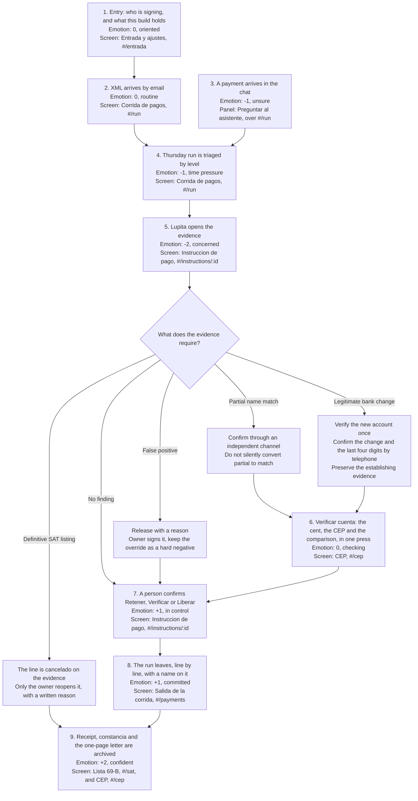

# 03. User journey

Issue #52. Persona: Lupita Elizondo, the sole administrative clerk at the synthetic 28-employee
metalmecanica defined in `docs/02-persona.md`.

The journey begins at the front door, where a person says who they are acting as, runs through a CFDI
XML arriving by email, and ends when the payment has left on the rail and its evidence is archived. Emotion uses a scale from -2, anxious, to +2, confident. Every product
stage names the current screen and hash route that serves it, and the routes are the ones in
`apps/web/src/lib/router.tsx`.

Two things changed the shape of this journey on 12 and 13 September and both are in the map below.
A payment now **arrives in a conversation**: Lupita drops the screenshot she already received on
WhatsApp into the assistant panel, and the instruction comes back as a card with its level and its
evidence (ADR-0007, issue #197). And the run now **leaves from here**: until ADR-0008 SentryOne
stopped payments and the SPEI left from the company's own banking portal, which left the honest
answer to "why would Lupita upload the screenshot" at "because we asked her to". The instruction is
the payment order now, so every peso that leaves carries a CFDI, a decision and a name.

## Journey map

Every artifact this map names exists. `packages/constancia` writes four documents and the route for
each one is in `docs/09-api.md`: the sweep constancia, the run constancia, the one-page evidence
letter of an instruction, and the receipt of one payment. The `TODO(fabbyyyy)` this page used to carry
against the archive stage closed with issue #196 and issue #204, and the page count of the letter is
asserted by a test rather than intended.

## Stage-by-stage map

| Stage | Trigger and user action | System result | Emotion | Exact screen |
|---|---|---|---|---|
| 1. Entry | Lupita opens SentryOne and lands on **Entrada y ajustes**. She picks which of the two people of the company she is acting as, and reads what this instance is configured with. | The choice is the `X-Actor` header every write will carry, kept in `localStorage` so a reload does not hand the run to somebody else, and the page says on the screen rather than only in a file that this is not a login: no password, no session, nothing verified. The settings are read-only on purpose, each row naming the file and the constant it is, and the capability list is run through the same `decideRequirement` the API enforces, so the screen cannot offer something the API would answer `403` to. | 0, oriented | **Entrada y ajustes**, `EntryScreen`, `#/entrada` |
| 2. Pre-trigger | A supplier's CFDI XML arrives by email. Lupita files it for Thursday. | The ledger records `cfdi_received`, links the synthetic supplier and makes the invoice available to the run. | 0, routine | **Corrida de pagos**, `RunScreen`, `#/run` |
| 3. Intake in the conversation | A supplier sends payment details on WhatsApp. Lupita presses **Preguntar al asistente** and drags the screenshot into the chat. She types no CLABE. | `intake_image` records the reference, the media type and her name, never the bytes. `packages/extract` transcribes the account and nothing else, the supplier is attributed deterministically by matching the account against the ones this company has paid and then the payee against the legal names in the run, and when that answers the instruction is created through the same `POST /api/v1/instructions` the QR page posts to. The reply is a card with the level, the state and the findings. When the attribution does not answer, nothing is created and the turn ends with an `intake` proposal for her to complete. | -1, unsure | **Preguntar al asistente**, `AssistantPanel`, a dock over whichever route is open; or **Alta de una instruccion**, `IntakeScreen`, `#/intake` from the QR code |
| 4. Trigger | On Thursday, Lupita opens the run and scans the highest pesos at risk first, reading the level and the state on each line. | `PaymentRun` shows totals in counts and in pesos and ranks instructions with their decisions and findings. Every line carries `confidence`, `confidenceRule`, `state` and `stateRule` from `packages/core/src/levels.ts`, so a level is always shown with the findings that produced it and never as a number. The reference synthetic run contains 92 payment instructions totaling MXN 2,174,210.76, of which MXN 785,289.86 is not leaving yet. | -1, time pressure | **Corrida de pagos**, `RunScreen`, `#/run` |
| 5. Evidence | She opens one row, reads the evidence chips and opens the supplier history when needed. | The detail shows the CFDI link, the CLABE with its participant and its plaza, the source, the findings, the expected loss and the delay cost, without treating message text as evidence. The same five level and state keys arrive through the same function as on the run, so clicking a line cannot change its level. | -2, concerned | **Instruccion de pago**, `InstructionScreen`, `#/instructions/:id`; **Expediente del proveedor**, `SupplierScreen`, `#/suppliers/:rfc` |
| 6. Verification | For an unproved account, she presses **Verificar la cuenta con un centavo** once. She types nothing: no clave de rastreo, no XML, no statement to read. | The one cent leaves through the configured rail inside the same run, `cent_sent` records the clave de rastreo the bank gave back, the CEP for that clave is resolved and its seal checked as far as the server can, the holder is compared with the CFDI legal name, and the engine releases or blocks the instruction signed `system`. A verified account enters the beneficiary registry. | 0, checking | **CEP**, `CepScreen`, `#/cep`; **Instruccion de pago**, `InstructionScreen`, `#/instructions/:id` |
| 7. Decision | She returns to the instruction and confirms **Retener**, **Verificar** or **Liberar**. Two shapes are not hers: a release over something that is not `confiable`, and any decision on a line the run already cancelled. Those need the owner and a written reason. | The API appends `decision_made` carrying `decidedBy`, `decidedByRole` and `reason`. Every write carries the `X-Actor` header, a clerk who asks for one of the two owner shapes is answered `403` with the sentence that says who can, and an owner who asks for one with no reason is answered `422` asking for it. SentryOne advises; a person decides. | +1, in control | **Instruccion de pago**, `InstructionScreen`, `#/instructions/:id` |
| 8. Execution | She reviews the released lines, presses **Enviar corrida**, confirms, and watches it go line by line. | `POST /api/v1/run/:id/execute` needs `confirm: true` and her name on the header. `planRunExecution` asks one question per line through the ADR-0009 state table: `liberado` goes, `cancelado` is dropped before anything is sent, `rojo` and `pendiente` stay in front of a person, `enviado` is already gone. Each line that leaves appends `payment_sent` with the clave de rastreo the rail filed, `payment_settled` once the rail can answer for it, and a receipt. The outflow is written to the company's own bank mirror, so control 6 reconciles the payment instead of reporting it missing. A server with no rail answers `503` and appends nothing. | +1, committed | **Salida de la corrida**, `PaymentsScreen`, `#/payments` |
| 9. Post-outcome | She files the receipt of each payment, the run constancia, and the one-page letter for any supplier who rings to ask why a transfer has not arrived. | `cep_verified` preserves the verified beneficiary. A later `sat_list_published` event replays the ledger, prices prior exposure and cancels any line the publication made definitive. The four documents are real PDFs produced on the server with no headless browser, each carrying a SHA-256 huella of the ledger range and the sentence that it is not an electronic signature. | +2, confident | **CEP**, `CepScreen`, `#/cep`; **Lista 69-B**, `SatScreen`, `#/sat` |

## El recorrido, the same journey walked by whoever opened the link

Everything above is the journey of the person who pays the suppliers. This is the journey of the
judge, the teammate or the visitor who opens the link cold and meets ninety-two rows of pesos that
explain nothing on their own, and it is a stage of the product rather than a page about it.

**Recorrido** in the top bar, and a banner on `#/entrada` on a first visit, opens nine stops over the
running app. The steps are `tourSteps` in `apps/web/src/lib/tour.ts`: each one navigates to the
screen a stage above happens on, dims the page except for the one element it is about, and says in
three paragraphs what that element is for. In order: why SentryOne exists, the Thursday run, the
WhatsApp screenshot arriving in the assistant panel, the account and its plaza, the cent and the
CEP, the SAT publishing, the run leaving, who signs, and the call. Every line a stop points at is
derived from the run through `GET /api/v1/tour`, so a reseed moves the recorrido with it and no stop
names a folio.

The ninth stop is the one that is not a screen. The visitor types their own mobile number, ticks a
box, and the payments line telephones them as Gerardo Villarreal, the owner of the synthetic
company. It reads them the payment the CLABE control stopped, says the account is new and ends in
four digits it reads one at a time, names the plaza it was opened in beside the plaza the supplier
has always been paid in, and asks the one question the owner is the only person who can answer,
whether the line stays held until it is verified or is released under their own name. What they
answer is applied to that line as a `decision_made` carrying their name and the sentence it was read
from, through the same `recordDecision` stage 7 uses, and ten minutes later a second decision signed
`Recorrido` puts the line back for the next visitor.

It is stage 7 argued from the other end. The stages say a person decides; the recorrido hands the
telephone to the person in front of the screen and lets them be the one who did. The three limits
are the ones the rest of this page already carries. No call releases anything on its own, because
what a call produces is a decision with a name on it and the two absences, `no_answer` and
`unclear`, apply nothing at all. The number is never stored, logged or shown: what survives is a
salted SHA-256, which is `docs/06-regulatory-privacy.md` section 4.5. And the whole feature is off
unless the instance carries `ALLOW_TOUR_CALLS=1`, so no deployment acquires the ability to ring a
telephone by accident; with it unset the stop reads the script out on the screen instead and says
so.

## The cent inside the run

Stage 5 used to be a procedure with a button on top. The clerk sent one cent from the
company's bank, waited, read the clave de rastreo off a statement, typed it into the CEP
screen, and only then did the product have anything to compare. Three of those four steps
were hers and none of them needed a person: Mexico has no confirmation-of-payee API, so
the cent has to exist, but the clave de rastreo comes back from the bank and not from a
keyboard.

What is automated now, from one press of **Verificar la cuenta con un centavo**:

- the 0.01 MXN probe, through `packages/rail`, on the company's own account;
- the clave de rastreo, recorded as `cent_sent` the moment the rail answers;
- the CEP lookup by that clave, and the seal check when a Banxico certificate is
  configured;
- the holder comparison against the CFDI legal name, by the same `nameMatch` the manual
  path used;
- the release of a payment whose only problem was an unproved account, or the block of one
  whose CEP names somebody else, as `decision_made` signed `system`.

What is still a person's, and stays a person's:

- **starting the probe.** Nothing sends a cent on its own. The clerk decides that this
  account is worth verifying, which is also what keeps the product from probing every
  account it sees.
- **anything the engine holds for another reason.** A CEP that confirms the holder does
  not settle a duplicated invoice or a supplier on the 69-B list, and those still end in
  **Retener**, **Verificar** or **Liberar** with a name on the decision.
- **sending the run.** The rail carries what a person released and confirmed, in their name,
  and `release` means nothing stops this payment rather than that it has left. The two are
  different states on screen, `liberado` and `enviado`, exactly so that nobody can read one
  as the other.

After the Thursday run there is nothing left to do by hand. No statement to reconcile
against a clave nobody wrote down, no second visit to the bank portal, no manual entry the
following morning. That is the change: the work is concentrated in the run the clerk was
already doing.

## The run leaving, and what it does not mean

Stage 7 is the stage a judge will push on hardest, so the three limits are here rather than left to
be inferred.

- **SentryOne holds no funds.** It instructs the participant the company itself contracts, which is
  what `packages/rail` is: `NessieRail` writes the run to the company's bank mirror, which is a
  Capital One sandbox and not a bank, so no pesos move and no CEP is produced; `StpRail` is the SPEI
  participant that would produce a Banxico-signed CEP and it refuses to construct without `STP_*`,
  because this team holds no `empresa` contract; `LayoutRail` writes the dispersal file a bank portal
  takes and reads the response file it hands back, which is the route a PyME actually has today and
  has no `RailId` at all, because the participant that executes it is the company's own bank.
  `GET /api/v1/rails` answers which rail this server holds and which of them has ever moved money.
- **A rail can only be asked for one amount.** `PaymentOrder` carries the instruction this product
  already holds, that instruction's own amount, and the account that instruction names. There is no
  shape of it that expresses an amount the instruction did not carry.
- **Nothing is undone.** `sent` and `settled` are two claims and the product never collapses them: a
  transfer is acknowledged when the rail says so and not when we asked. A line that failed is `rojo`
  with the rail's own sentence against it, and a line the evidence cancelled carries the article, the
  list version and the DOF date in its reason.

## Branch 1: false positive

**Example trigger:** a legitimate pattern change or new account produces
`requiere_verificacion`, but the independent evidence shows that the payment is valid.

1. Lupita opens **Instruccion de pago** at `#/instructions/:id` and reads the exact evidence that
   raised the finding. If she wants it in a sentence, she presses **Preguntar al asistente** and asks
   why the line is red: the panel answers over read-only tools and quotes the control's own Spanish
   rather than rewriting it.
2. She checks the supplier history in **Expediente del proveedor** at `#/suppliers/:rfc` and
   completes any independent verification the evidence requires.
3. She selects **Liberar**. Because the line is not `confiable`, this is the override shape:
   `decideRequirement` in `packages/core/src/actor.ts` answers `override_release`, so the header has
   to carry `role=owner` and the body has to carry a written reason. A clerk is refused with a `403`
   that says who can, and the owner's decision stores `decidedBy`, `decidedByRole` and `reason` on
   `decision_made`. An exception approved with no argument is the record ADR-0002 refuses to hold.
4. The team adds the reviewed case to the labelled hard-negative set used by the blind metrics
   harness. This is an evaluation step, not a claim that the runtime learns automatically.

Emotion moves from -2, concern, to 0, cautious, to +1, resolved. The intended cost is review time,
not a blocked legitimate payment with no explanation.

## Branch 2: partial name match

**Example trigger:** the Banxico CEP beneficiary name is similar to, but not byte-identical with,
the CFDI legal name because of normalization, abbreviation or truncation.

1. Lupita opens **CEP** at `#/cep` and sees the beneficiary holder and CFDI legal name side by
   side with `nameMatch: "partial"` and the CEP signature status.
2. She verifies through an independent channel already on file. She does not use the contact data
   in the same instruction that introduced the account. Where that channel is the telephone, the
   verification call at `#/verify-call` records what was said: `verification_call` carries the
   outcome, the quoted sentence it was read from, the transcript and the last four digits of the
   account, never the whole CLABE, and none of its four outcomes releases anything.
3. If confirmed, she returns to **Instruccion de pago** and selects **Liberar**. If not confirmed,
   she selects **Retener** and escalates to the owner.
4. The partial result remains partial in the evidence. A human confirmation does not rewrite the
   detector output into a perfect match.

Emotion moves from 0, checking, to -1, uncertain, then to +1, resolved, or stays at -1 while held.
A confirmation through a channel the product cannot reach, a visit or a call from a personal phone,
is still recorded only as the clerk's written reason on the decision, and that remains an honest
product gap.

## Branch 3: legitimate bank change

**Example trigger:** the supplier has genuinely moved to a new account, so the CLABE is valid but
is absent from `knownAccounts`.

1. **Instruccion de pago** and **Expediente del proveedor** show the new CLABE beside prior accounts
   and how each was established, with the plaza of each account named as well as numbered: digits 4 to 6 are
   the plaza the branch that opened it belongs to, so a foundry always paid in plaza 580 (APODACA,
   NL) that sends an account in plaza 180 (DISTRITO FEDERAL, DF) has changed something a clerk can
   ask about in one sentence.
2. Lupita presses **Verificar la cuenta con un centavo** on the instruction. The cent leaves through
   the rail, the CEP comes back under the clave the rail recorded, and **CEP** at `#/cep` shows its
   beneficiary beside the CFDI legal name with the seal state the server can prove.
3. If she wants the supplier's own word as well, **Llamada de verificacion** at `#/verify-call`
   rings them, or hands her the script to read on her own telephone. The call confirms two things
   and asks for nothing: that the account changed, and the **last four digits** of the new one. It
   never reads the whole CLABE, and it never reads any digit of the account the supplier has always
   been paid on. The outcome reaches the ledger as `verification_call` with those four digits and
   the sentence it was read from, and it releases nothing on its own.
4. After a match and human decision, the account enters the beneficiary registry with
   `establishedBy: "cep"` and she selects **Liberar** on the instruction.
5. The same account carries its evidence into the next run, so the legitimate change does not
   create an identical exception every Thursday.

Emotion moves from -2, concern, to 0, checking, to +2, evidence established.

Why the call asks about the change and not only about the digits: "is this account yours" can be
answered yes by whoever opened it yesterday, and "did you change your account, and is this one
yours" cannot be answered yes by accident. It is still one yes or no, because a call that asks two
questions gets an answer to one of them. `packages/voice/README.md` carries the five rules the
script may not break and the tests that pin them.

## Branch 4: the SAT publishes, and the line is cancelled

**Example trigger:** a version of the Article 69-B list lands, or a resolution under article 49 Bis
is published, naming a supplier this run pays. The situation is `definitivo`.

1. The publication is the trigger and nobody on the clerk's side caused it. `POST /api/v1/sat/publish`
   prices what it did to invoices already paid and already deducted, re-scores the pending lines of
   the open run, and appends one `payment_cancelled` per line the publication made definitive, after
   the `decision_made` so a replay reads as the publication and then its consequences.
2. That event carries **no actor**, and the absence is the statement: the evidence dropped the line
   rather than a person. The reason names the article, the list version and the DOF date.
3. The line reads `cancelado` and not `rojo`, which is rule 4 of the ADR-0009 state table, because
   the comprobantes have no fiscal effect at all and there is nothing for a clerk to wait out.
4. Reopening it is the owner's, with a written reason: `decideRequirement` answers `reopen_cancelled`
   for any decision on a line the ledger holds a `payment_cancelled` for, whatever the new action is.
   Nothing is deleted when the owner does reopen it. The cancellation stays on the ledger next to the
   `decision_made` that carries the name and the argument, and `releasedByAPerson` is what makes the
   signature outrank the listing, which is ADR-0002 refusing to overrule a person in either direction.
5. Lupita attaches `GET /api/v1/instructions/:id/carta` to her reply when the supplier rings. One
   page, seven signals, none of them blank, the level with the rule behind it, the decision with the
   name and the reason, and no number about the risk anywhere on it.

Emotion moves from 0, routine, to -2, exposed, to +1, documented.

## Why the branches matter

The decision engine emits `hold`, `verify` or `release`; it never accuses a supplier and it never
decides to send a run. The false-positive branch protects operations, the partial-match branch
preserves uncertainty, the legitimate-bank-change branch lets verified knowledge accumulate, and the
SAT branch is the one case where the evidence stops a payment with nobody's name on it and only the
owner can undo that. Together they make the journey a human decision workflow instead of a one-way
alert funnel.

## What the screens still owe

Stated here rather than discovered by a judge clicking.

- **The run totals show no count per level** (issue #208). Every line carries `confidence` and the
  chip renders it, and `runLevels` already counts the three levels and the five states into `totals`,
  so this is the payload reaching a number on the hero rather than anything the engine owes.
- **The instruction detail does not ask for the override reason before the click** (issue #174), so a
  clerk meets the `422` and then types the argument, instead of being asked for it first. The API
  carries both halves, and `decideInstruction` in `apps/web/src/lib/api.ts` sends no `reason` yet.
- **The blind evaluation's per-level matrix reaches no screen** (`perLevel` on
  `GET /api/v1/metrics`), which is the view a clerk reads and the one a judge asks for.
- **Stage 1 is not authentication and never claims to be.** The person selector on
  **Entrada y ajustes** writes the `X-Actor` header the ledger records, and nothing verifies it: no
  password, no session, and a `curl` can claim to be the owner as easily as the browser. The screen
  says that on the screen, and `docs/06-regulatory-privacy.md` section 4.4 says what production needs.

## Validation status

The journey has not been validated with two real people at the venue. The open interview tasks and
exact questions are in `docs/02-persona.md#pending-human-validation`. Until those two conversations
are recorded, the workload is synthetic and the workflow remains a design hypothesis.
