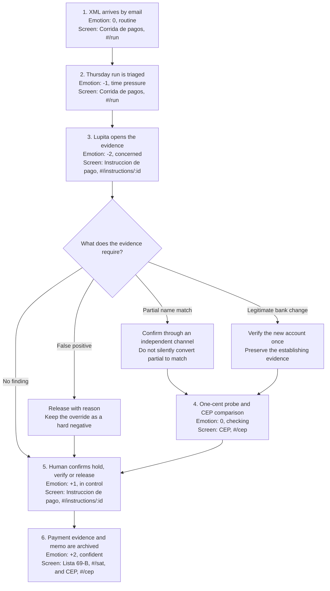

# 03. User journey

Issue #52. Persona: Lupita Elizondo, the sole administrative clerk at the synthetic 28-employee
metalmecanica defined in `docs/02-persona.md`.

The journey begins when a CFDI XML arrives by email and ends when the verified payment evidence
and decision memo are archived. Emotion uses a scale from -2, anxious, to +2, confident. Every
product stage names the current screen and hash route that serves it.

## Journey map

The screen at `#/sat` currently shows the retroactive sweep and an explicit pending state for the
constancia PDF. The final archive artifact is still `TODO(fabbyyyy)`. The journey names it because
the post-outcome stage is required, but it does not claim that the PDF generator exists today.

## Stage-by-stage map

| Stage | Trigger and user action | System result | Emotion | Exact screen |
|---|---|---|---|---|
| 1. Pre-trigger | A supplier's CFDI XML arrives by email. Lupita files it for Thursday. | The ledger records `cfdi_received`, links the synthetic supplier and makes the invoice available to the run. | 0, routine | **Corrida de pagos**, `RunScreen`, `#/run` |
| 2. Trigger | On Thursday, Lupita opens the run and scans the highest pesos at risk first. | `PaymentRun` shows totals and ranks instructions with decisions and findings. The reference synthetic run contains 92 invoices totaling MXN 673,460.27. | -1, time pressure | **Corrida de pagos**, `RunScreen`, `#/run` |
| 3. Evidence | She opens one row, reads the evidence chips and opens the supplier history when needed. | The detail shows the CFDI link, CLABE, source, findings, expected loss and delay cost without treating message text as evidence. | -2, concerned | **Instruccion de pago**, `InstructionScreen`, `#/instructions/:id`; **Expediente del proveedor**, `SupplierDrawer` |
| 4. Verification | For an unproved account, she sends a human-initiated one-cent SPEI probe, enters its clave de rastreo or signed XML, and selects **Verificar**. | The CEP signature status and beneficiary holder are shown beside the CFDI legal name. A verified account enters the beneficiary registry. | 0, checking | **CEP**, `CepScreen`, `#/cep` |
| 5. Decision and payment | She returns to the instruction and confirms **Retener**, **Verificar** or **Liberar**. The bank remains the place where the SPEI is sent. | The API appends `decision_made` with the action and `decidedBy`. Ceptinela advises; a person decides. | +1, in control | **Instruccion de pago**, `InstructionScreen`, `#/instructions/:id` |
| 6. Post-outcome | She keeps the signed CEP, the decision and the SAT sweep memo with the payment evidence. | `cep_verified` preserves the verified beneficiary. A later `sat_list_published` event replays the ledger and quantifies prior exposure. The constancia PDF remains `TODO(fabbyyyy)`. | +2, confident | **CEP**, `CepScreen`, `#/cep`; **Lista 69-B**, `SatScreen`, `#/sat` |

## Branch 1: false positive

**Example trigger:** a legitimate pattern change or new account produces
`requiere_verificacion`, but the independent evidence shows that the payment is valid.

1. Lupita opens **Instruccion de pago** at `#/instructions/:id` and reads the exact evidence that
   raised the finding.
2. She checks the supplier history in `SupplierDrawer` and completes any independent verification
   the evidence requires.
3. She selects **Liberar**. The system stores `decision_made` with `action: "release"` and the
   person who decided.
4. The team adds the reviewed case to the labelled hard-negative set used by the blind metrics
   harness. This is an evaluation step, not a claim that the runtime learns automatically.

Emotion moves from -2, concern, to 0, cautious, to +1, resolved. The intended cost is review time,
not a blocked legitimate payment with no explanation.

## Branch 2: partial name match

**Example trigger:** the Banxico CEP beneficiary name is similar to, but not byte-identical with,
the CFDI legal name because of normalization, abbreviation or truncation.

1. Lupita opens **CEP** at `#/cep` and sees the beneficiary holder and CFDI legal name side by
   side with `nameMatch: "partial"` and the CEP signature status.
2. She verifies through an independent channel already on file. She does not use the contact data
   in the same instruction that introduced the account.
3. If confirmed, she returns to **Instruccion de pago** and selects **Liberar**. If not confirmed,
   she selects **Retener** and escalates to the owner.
4. The partial result remains partial in the evidence. A human confirmation does not rewrite the
   detector output into a perfect match.

Emotion moves from 0, checking, to -1, uncertain, then to +1, resolved, or stays at -1 while held.
Recording the second-channel confirmation is not yet represented as a separate API field and is an
honest product gap.

## Branch 3: legitimate bank change

**Example trigger:** the supplier has genuinely moved to a new account, so the CLABE is valid but
is absent from `knownAccounts`.

1. **Instruccion de pago** and `SupplierDrawer` show the new CLABE beside prior accounts and how
   each was established.
2. Lupita initiates the one-cent SPEI in the company's bank, then uses **CEP** at `#/cep` to verify
   the signed receipt and compare its beneficiary with the CFDI legal name.
3. After a match and human decision, the account enters the beneficiary registry with
   `establishedBy: "cep"` and she selects **Liberar** on the instruction.
4. The same account carries its evidence into the next run, so the legitimate change does not
   create an identical exception every Thursday.

Emotion moves from -2, concern, to 0, checking, to +2, evidence established.

## Why the branches matter

The decision engine emits `hold`, `verify` or `release`; it never accuses a supplier and it never
sends a SPEI. The false-positive branch protects operations, the partial-match branch preserves
uncertainty, and the legitimate-bank-change branch lets verified knowledge accumulate. Together
they make the journey a human decision workflow instead of a one-way alert funnel.

## Validation status

The journey has not been validated with two real people at the venue. The open interview tasks and
exact questions are in `docs/02-persona.md#pending-human-validation`. Until those two conversations
are recorded, the workload is synthetic and the workflow remains a design hypothesis.
