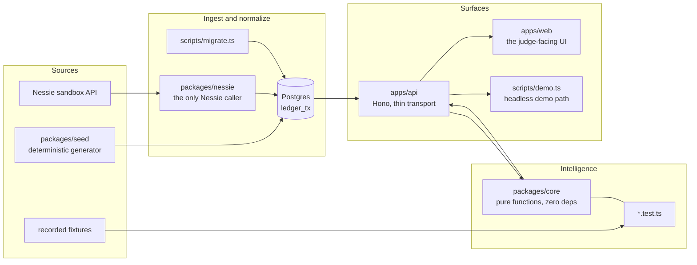
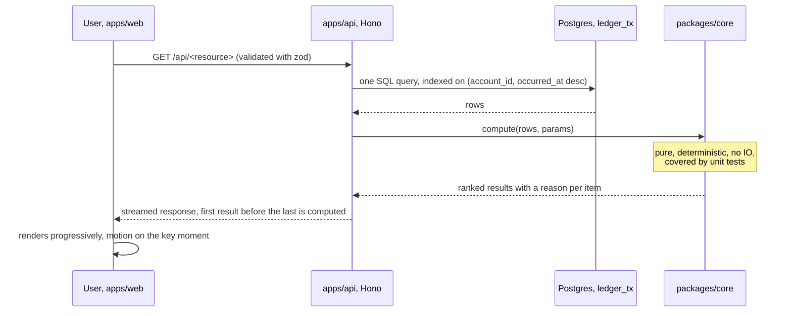

# 07. Architecture

Worth 5 points directly (system design) and it underwrites the algorithmic-logic row, because a
judge cannot believe the algorithm is real until they can see where it lives and what it touches.

Owner: Patricio (`garzario`). Due M3, drafted at M0.

## The shape of the system

Four lanes. The rule that makes the diagram true: **the intelligence lane has no network and no
database access.** It takes values and returns values, which is why it is unit-testable and why a
judge can run it in front of us.

## The most important flow

TODO(garzario): replace the step labels with the real ones once ADR-0002 closes. The shape stays:
the request reads from the ledger, the engine computes with no IO, the API streams results as they
are produced, and the UI renders progressively.

## Why each choice, and what would make us switch

| Decision | Alternative considered | Why this, for this problem | What would make us switch |
|---|---|---|---|
| Bun 1.3.11 as the single runtime | Node plus a bundler, or Deno | One runtime for the API, the tests, the seeder and the migrations. Native TypeScript with no build step, so at 03:00 there is no build to debug. Cold start fast enough for a streaming endpoint | A dependency we need that does not run on Bun |
| TypeScript monorepo, Bun workspaces | Separate repos, or a single flat app | All four people commit on day one, and the engine can be imported by the API, the tests and the demo script without publishing anything | Nothing in this window |
| `packages/core`, pure functions, zero dependencies | Business logic in route handlers | This is the technical-depth play. A judge opens the function and the adjacent test file and sees deterministic logic with no mocks and no network, which is the direct answer to the Wizard-of-Oz suspicion | Nothing. This rule is load-bearing |
| Hono on the deploy target from ADR-0005 | Express, or a framework-free handler | Small, fast, portable across the three deploy targets we considered, and `@hono/zod-validator` gives request validation that doubles as the documented contract in `docs/09-api.md` | A target that does not support it |
| Postgres, one dialect | SQLite for the offline path | Two dialects means two implementations and two sets of bugs. Same SQL everywhere, same driver, and the offline fallback is a local Postgres 18, not a second database | Nothing. This was an explicit correction |
| Timescale as primary, hypertable plus one continuous aggregate | Plain Postgres only | A transaction ledger genuinely is a time series. Hypertables and a continuous aggregate are the honest fit, not a sponsor-prize costume, and they produce a real architecture story | If the managed instance is unreachable, `0002_timescale.sql` is skipped and the demo still runs |
| Raw SQL through `postgres@3.4.9`, no ORM | Drizzle or Prisma | When a judge asks how the forecast works, showing the SQL is the answer. No migration tool to fight, no generated client to explain | A schema complex enough that hand-written queries drift |
| Streaming response over polling | Poll every N seconds | The product's key moment is "results appear as they are computed", which reads as real-time without inventing a websocket layer | If the compute is fast enough that streaming adds nothing visible |
| One web client over a native app | SwiftUI iOS client | Continuous evaluation means judges walk up repeatedly. A URL they open on their own phone beats handing them our device, and it removes signing and provisioning from the critical path | See the deviation condition in ADR-0001 |

The full scored decision matrix is in `docs/adr/0001-stack-and-runtime.md`.
The deploy target and its consequences are in `docs/adr/0005-deploy-target.md`.

## Deliberately not in this tree

Git cannot track an empty directory, so these are recorded here rather than as empty folders.

- **`apps/ios`.** Not created. The condition that creates it: ADR-0001 deviates to option B because
  the differentiator is inherently on-device, for example document capture with the camera, live
  alerts on the lock screen, on-device inference so raw transactions never leave the phone, or NFC
  and CoDi. If that happens, the engine stays in TypeScript in the API and `apps/ios` is created in
  that PR. It is a superset of the current design in the same repo, never a rewrite.
- **`services/ml`, a Python sidecar.** Not created. The rule: if the model is under 150 lines of
  math, it goes in `packages/core` in TypeScript and gets unit tests, because a testable TypeScript
  implementation scores higher on algorithmic logic than an opaque artifact. The condition that
  creates it: a library with no TypeScript equivalent that we genuinely need, argued in an ADR.
- **Extra infrastructure surfaces.** Out of scope unless an ADR argues them in. Four infrastructure
  surfaces for four people in 36 hours is how the demo dies.

## How this scales to other platforms

The client is one consumer of a documented HTTP contract in `docs/09-api.md`, so a native app, a
WhatsApp bot or an institution's existing portal are all additional consumers rather than rewrites.
The intelligence is a pure library with no runtime dependencies, so it can also be embedded directly
in a partner's backend or compiled to run on the client when data residency requires it. The only
shared assumption is the ledger shape in `docs/08-data-model.md`, which is deliberately narrow.
