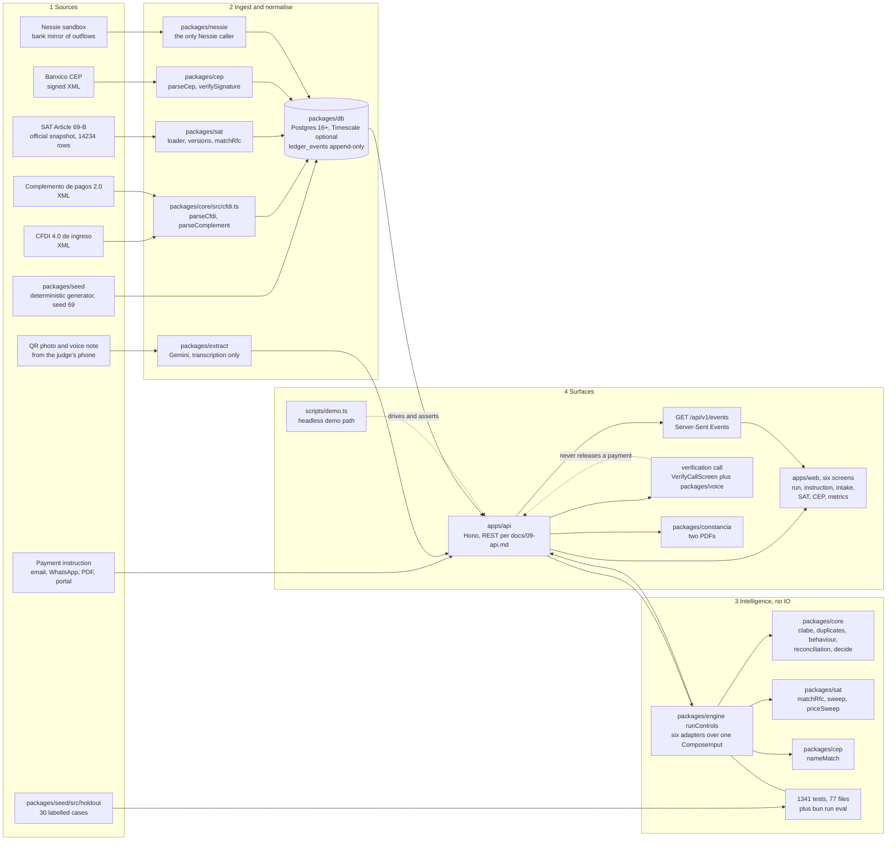
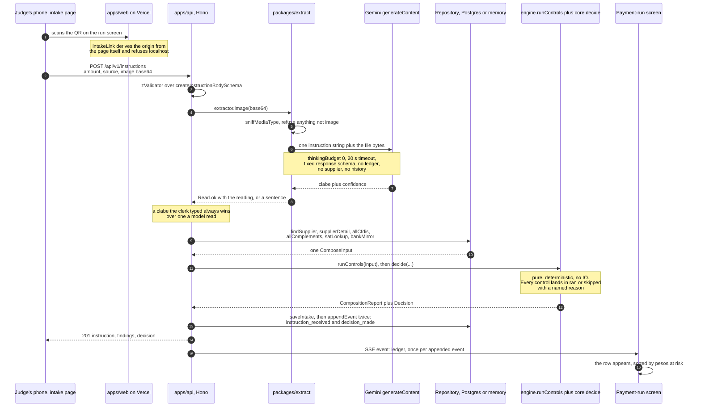
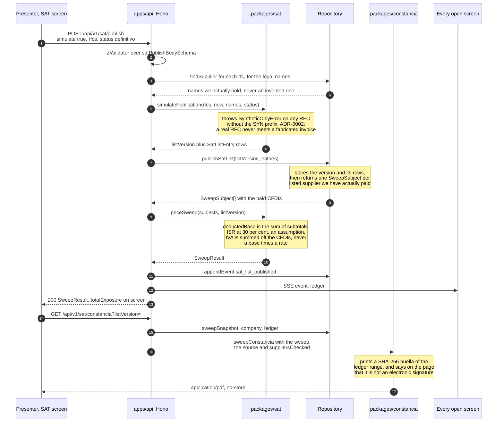

# 07. Architecture

Worth 5 points directly (system design) and it underwrites the algorithmic-logic row, because a
judge cannot believe the algorithm is real until they can see where it lives and what it touches.

Owner: Patricio (`garzario`). Issue #64. Due M3, drafted at M0, rewritten for SentryOne after
ADR-0002 was accepted, and rewritten again against the merged tree.

Product: SentryOne, track 3. The thesis and the six controls are in
`docs/adr/0002-track-and-thesis.md`. The domain types are in `packages/core/src/domain.ts` and the
HTTP contract is in `docs/09-api.md`. Nothing below invents a second shape for either. Every figure
on this page names the command or the file it came from.

## The shape of the system

Four lanes. The rule that makes the diagram true: **the intelligence lane has no network and no
database access.** It takes values and returns values, which is why it is unit-testable, why the
retroactive sweep is a replay rather than a migration, and why a judge can run it in front of us
with the Wi-Fi off.



Four things to say out loud about this diagram.

1. **`packages/core` has no edge to the database, to Nessie, to the SAT or to Banxico.** Everything
   it needs arrives as an argument. `packages/engine` exists for that dependency direction and
   nothing else: `packages/sat` and `packages/cep` already depend on core, so core cannot import
   them back, and the two adapters that need them live one level up. That is the whole
   technical-depth argument in one property.
2. **The language model is in lane 2, not lane 3.** `packages/extract/src/gemini.ts` is the only
   file in the repository that sends anything to a model. It sends one instruction string this repo
   wrote plus the bytes of one file a human chose to send us, and it asks for JSON against a fixed
   schema, so what comes back is a transcription and not an opinion.
   `packages/extract/src/boundary.test.ts` reads the package's own source and asserts four things:
   that it names nothing from the decision layer, that it imports from core only the check digit and
   the normaliser, that no schema field could carry a judgment, and that it sends no supplier, no
   history and no ledger. ADR-0004.
3. **The ledger is the spine.** `LedgerEvent` is append-only in the database and not only by
   convention: `0005_sentryone_drift.sql` installs a trigger that raises `restrict_violation` on an
   update or a delete. So the retroactive sweep after a SAT publication is a replay over events that
   already exist, not a recomputation of mutable rows.
4. **The verification call points back at the API and stops there.** A voice agent that phoned the
   supplier can append a `verification_call` event, and none of its four outcomes releases a
   payment. The release stays a `decision_made` a person signs.

## The most important flow, the intake path

A payment instruction arriving mid-run is the path that touches every lane: it comes in from a
phone, a model reads eighteen digits off the photo, pure functions score it, it is written as
events, and it appears on the big screen without anybody reloading anything.



Three properties of this path that are worth checking rather than believing.

**A server with no key refuses rather than invents.** `UNAVAILABLE_EXTRACTOR` in
`apps/api/src/extraction.ts` answers every image and every voice note with a sentence, the route
turns it into `422 unprocessable`, and the whole test suite runs that way: `bun test` never opens a
socket and never needs a key. A voice note goes down the same path through `extractor.audio`, its
transcript lands in `PaymentInstruction.text` as context, and no detector reads that field.

**Nothing on this path decides anything in a route handler.** The handler in
`apps/api/src/routes/instructions.ts` validates, delegates to `runIntake`, stores and emits. The
arithmetic is `runControls` and `decide`, which is the same entry point the blind evaluation calls.

**The stream is a view of the ledger, never a second source.** `deps.emit` in `apps/api/src/deps.ts`
appends to the repository first and publishes to the broadcaster second, so a subscriber can never
see an event that was not stored.

**What the compute step costs, measured.** `assessRun` in `apps/api/src/assess.ts` puts all six
controls plus `decide` over the whole seeded payment run: 92 instructions against 4103 CFDIs, 3801
complements and 2446 bank-mirror rows. Median of five runs after a warm-up, on an Apple M3 Pro under
bun 1.3.11, measured 2026-09-12: 1387 ms for the run, 15.1 ms per line. That is the arithmetic only, with no network and
no database in it, and it is the number that does not move when the load does, because there is no
inference in it. TODO(fabbyyyy): measure the full request on the deployed box in #44, split into
extraction, read, compute and append, and put the measured milliseconds here. The extraction call
is the part that will dominate, and it only exists when a human sent a file.

## The second flow, the SAT publication replay

This is the product's strongest moment and it is a replay, not a recomputation. A list version is
published on stage and the question it answers is what that publication just did to invoices the
company already paid and already deducted.



**The same numbers come out of a pure fold, which is how we know the API is not making them up.**
`sweep` in `packages/sat/src/sweep.ts` takes `LedgerEvent[]` and nothing else: no database, no clock,
no network. Over the seeded company (`generateSentryOne({ seed: 69, weekOf: "2026-09-07" })`, 7997
events) it prices the seeded publication `2026-08-14` in 3.6 ms and returns one newly listed
supplier, `SYN080910HI8`, with 24 paid CFDIs, a deducted base of MXN 878,592.59, ISR exposure MXN
263,577.78, IVA exposure MXN 140,574.81 and a total exposure of MXN 404,152.59. The `newlyListed`
diff is real: republishing the same RFC on a later version returns zero, because it was already
listed and its exposure was priced then.

The repository path and the fold answer the same question from two directions on purpose. The fold
is the definition, the repository is what the API stores, and `paidCfdisOf` is exported from the
same file so that `bank_reconciliation` cannot disagree with the sweep about what "paid" means.

## Why each choice, and what would make us switch

| Decision | Alternative considered | Why this, for this problem | What would make us switch |
|---|---|---|---|
| Bun 1.3.11 as the single runtime | Node plus a bundler, or Deno | One runtime for the API, the tests, the seeder, the migrations and the demo script. Native TypeScript with no build step, so at 03:00 there is no build to debug. `bun test` runs 1341 tests across 77 files in 5.8 s with no network, no database and no key | A dependency we genuinely need that does not run on Bun. ADR-0001 |
| TypeScript monorepo, Bun workspaces | Separate repos, or one flat app | All four people commit on day one, and the engine is imported by the API, the tests, the metrics harness and the demo script with nothing published | Nothing in this window |
| `packages/core`, pure functions, zero runtime dependencies | Detectors inside route handlers | This is the technical-depth play and the answer to the Wizard-of-Oz hunt. A judge opens a detector next to its test file and sees deterministic logic with no mocks and no network. It is also what makes the blind evaluation in `docs/08-data-model.md` possible at all | Nothing. This rule is load-bearing |
| `packages/engine` as a thin adapter layer | Detectors discovered dynamically | Issue #106: the registry it replaced discovered modules by dynamic import, guessed their argument tuples from arity, called none of them, and returned an empty payment run that every test read as "sin hallazgos". `SENTRYONE_DETECTORS` is now a literal array of six typed adapters, and every control lands in `ran` or `skipped` with a reason | A seventh control, which is a new adapter in that array and a visible diff |
| Event-sourced ledger, `ledger_events` append-only | Mutable tables updated in place | The retroactive sweep is a replay. With mutable rows, "what did we deduct to this supplier before it was listed" is unanswerable. Enforced by a trigger that raises, not by convention | Nothing before M5. It is the spine |
| Hono 4.13.7 | Express, or a framework-free handler | Small, standards-based, portable across the three deploy targets we considered, and `@hono/zod-validator` gives request validation that doubles as the documented contract in `docs/09-api.md` | A target that does not support it |
| Postgres, one dialect, two hosts | SQLite for the offline path | Two dialects means two implementations and two sets of bugs. Same SQL everywhere, same driver, and the offline fallback is a local Postgres 18 rather than a second database. ADR-0003 | Nothing. This was an explicit correction, and `bun:sqlite` is now forbidden |
| Timescale on Tiger Data, hypertables on `ledger_tx` and `ledger_events` | Plain Postgres only | The ledger genuinely is a time series: append-only, read as one company over a window, rolled up per day. `0002` and `0004` add the hypertables and the two continuous aggregates, and they are the honest answer to "what happens at ten times the volume": the same SQL, partitioned by time | Nothing, because the fallback already exists. `migrate` in `packages/db/src/migrate.ts` checks `pg_available_extensions` and skips both files on a plain Postgres 18, where the same rollups run as plain `date_trunc` queries. `bun run doctor` names which path is live |
| Raw SQL through `postgres@3.4.9`, no ORM | Drizzle or Prisma | When a judge asks how the sweep is fed, the answer is the SQL on screen. No migration tool to fight, no generated client to explain. Numerics cross the boundary as strings and are moved as integer cents | A schema complex enough that hand-written queries drift. `packages/db/src/queries.ts` is the one file to watch |
| **`apps/api` on a Vultr instance** | Serverless functions on the web host | The payment-run screen updates from a Server-Sent Events stream, and SSE needs a long-lived process. A function runtime with a request timeout either drops the stream or forces a polling fallback that makes the product feel like a report. One small box with the API and Postgres next to it also removes a network hop from the read path. This amends ADR-0005, see below | If the SSE stream were dropped in favour of polling, the box stops earning its keep and the API goes back to the function runtime, which the no-`bun:*` rule keeps available |
| **`apps/web` static on Vercel** | Serving the built assets from the same box | Judges walk up repeatedly across 36 hours and open the product on their own phone. A CDN-hosted static build with a preview URL per pull request is the cheapest way to be reachable and the cheapest evidence to attach to a UI PR. A dead API box then costs us the data, not the page | Nothing. The two-unit split is deliberate |
| Hash router in `apps/web`, no router dependency | A path router | The app ships as a static build, so a path router needs a rewrite rule on the host for every deep link, and `#/intake` inside a QR code would break the first time a deploy target changed | A server-rendered surface, which we do not have |
| **Gemini boxed to extraction** (`packages/extract`) | A model call that reads the whole instruction and proposes an action | The model is handed one instruction string and one file, and asked for JSON against a fixed schema with no field that could carry a judgment. Thinking is off: transcription needs none, and on a small output budget thinking tokens can eat the whole allowance and return an empty answer. The Files API is deliberately unused, because a file uploaded there is stored by the provider | A document type the post-processor genuinely cannot read. Any move of the boundary needs its own ADR, and `boundary.test.ts` fails first |
| **ElevenLabs for the verification call** (`packages/voice`) | A human-only phone call, or a chatbot | When the decision is `verify`, somebody has to ring the supplier. The agent reads a script this repo wrote and the outcome parser is deterministic string work, not a model. The endpoint answers `422` with the exact script when the keys are absent, so the clerk reads it on their own telephone and the demo never depends on a provider | A provider outage, which already degrades to the script. The parser stays deterministic whatever happens to the caller |
| **No LLM in the decision** | A model call per instruction, or per finding | Cost that scales with volume, hundreds of milliseconds of latency, non-determinism that cannot be unit-tested, and a transfer of financial data to a third party that LFPDPPP constrains. Every one of those is a point lost under this rubric. Deterministic scoring is auditable, reproducible in a test and explainable to a regulator. ADR-0004 | A control that genuinely needs semantic judgment inside the decision, which would need its own ADR with a measured cost per call first |
| SSE over polling, and over WebSocket | Poll every N seconds, or a socket layer | The product's live moment is the instruction a judge just sent from their phone appearing on the big screen. SSE is one HTTP response, the browser reconnects on its own, and it needs no protocol upgrade or extra library. A `ready` event on connect, a comment line every 15 s and `X-Accel-Buffering: no` are the three details that make it survive a proxy | Bidirectional traffic from the browser, which we do not have |
| One web client | A native iOS client | Continuous evaluation means repeated walk-ups. A URL a judge opens on their own phone beats handing them our device, and it keeps signing and provisioning off the critical path. ADR-0001 | The deviation condition in ADR-0001, which is a differentiator that is inherently on-device |

The full scored stack matrix is in `docs/adr/0001-stack-and-runtime.md`. The datastore reasoning is
in `docs/adr/0003-datastore-and-timeseries.md`. The LLM boundary and its cost model are in
`docs/adr/0004-llm-boundary-and-privacy.md` and `docs/06-regulatory-privacy.md`.

### The ADR-0005 amendment, stated rather than hidden

ADR-0005 was accepted with `apps/api` on a function runtime and the hard consequence that
`apps/api` imports no `bun:*` modules. The amendment dated 2026-09-12 03:10 in that file moves
`apps/api` to a Vultr instance because the SSE stream needs a long-lived process. Two things follow
and both are deliberate.

1. **The no-`bun:*` rule stays.** It costs us nothing on a box we control and it keeps the API
   portable, so the function runtime remains a live fallback if the instance dies at 05:00. A
   constraint that buys a fallback for free is kept.
2. **The amendment is in the ADR and not only here.** An architecture doc that contradicts an ADR is
   worse than either one alone, which is why the status line, the reasoning and the tracking issue
   (#44) are all written into `docs/adr/0005-deploy-target.md` itself.

### Deploy topology and commands

Live as of 2026-09-12 15:32 CST: the web at <https://sentryone-one.vercel.app>, the API at
<https://api.104.238.147.69.sslip.io>, the ledger on Tiger Data. The browser only ever talks to the
Vercel origin: `vercel.json` rewrites `/api` and `/health` to the instance, which is why the bundle
carries no base URL and there is no CORS configuration anywhere in `apps/api`.

| Unit | Where | How it is deployed | Evidence |
|---|---|---|---|
| `apps/web` | Vercel, static build | Production from `main`, previews from `dev` and every PR, driven by the Vercel GitHub App rather than a workflow in this repo. `vercel.json` holds the build: `bun install --frozen-lockfile`, then `bun run --filter '@hackmty/web' build`, output `apps/web/dist` | Preview URL on each UI PR |
| `apps/api` | One Vultr instance, Caddy terminating HTTPS in front of the container | `bun run deploy:vultr`, which reuses the instance labelled `sentryone-api` and ends by calling `/health` and `/api/v1/run/current` over HTTPS | The smoke test the script prints, and the SSE trace below |
| Database | Tiger Data managed Timescale | `bun run migrate` applies the six plain files always and the three Timescale files only when the extension exists. Live there: `timescaledb 2.30.0` on PostgreSQL 18.6, `ledger_events` and `ledger_tx` as hypertables, `ledger_daily`, `ledger_events_daily` and `supplier_weekly_outflow` as continuous aggregates | `bun run doctor` names the live path |
| Offline fallback | Local Postgres 18 on 5432, second API port | Same SQL, same driver, same migrations | `docs/10-demo-script.md`, offline section |
| No database at all | Any laptop | `SEED=sentryone bun run dev` serves the generated company out of memory through the same `Repository` interface | The boot log line from `repositoryBootNote` |

**The web.** `apps/web` is a hash-routed static bundle, so there is no rewrite rule to keep and no
deep link that can 404 on a static host: `#/intake` is an anchor, which is also why the QR code on
the printed card survives a change of deploy target. What `vercel.json` does carry is the build,
because the bundle imports `@hackmty/core` from the workspace and a build rooted at `apps/web`
cannot resolve it. `.vercelignore` keeps the upload to what the build reads: the SAT snapshot and
the judging assets are 7.6 of the repository's 8.6 MB and the web bundle imports neither.

**The API, in four moving parts.**

1. `apps/api/Dockerfile` builds on `oven/bun:1.3.11-slim`, the tag that matches `.bun-version`. The
   build context is the repository root because the API imports eight workspace packages. ADR-0005's
   no-`bun:*` rule is untouched: Bun here is packaging, not a dependency of the code.
2. `deploy/docker-compose.yml` runs two services, the API on 3000 with no published port and Caddy
   holding 80 and 443. The API is reachable only through Caddy, so there is no plaintext port
   answering the same data.
3. `deploy/Caddyfile` terminates TLS for `api.<ip>.sslip.io`. sslip.io resolves any name embedding
   an IPv4 address to that address, so the box has a real DNS name the minute it boots and Let's
   Encrypt can answer the HTTP-01 challenge with no domain bought or delegated. `flush_interval -1`
   is the line that makes `GET /api/v1/events` work: a buffered proxy turns Server-Sent Events into
   one lump at the end of the connection. There is no `encode` directive for the same reason.
4. `deploy/cloud-init.sh` is what the instance runs on first boot: apt Docker, clone the public repo
   at the branch it was given, write `/srv/sentryone/.env`, `docker compose up -d --build`. It also
   writes `/srv/sentryone/refresh.sh <branch>`, which repoints a running box at another branch and
   rebuilds, so a merge does not need a reprovision.

```bash
bun --env-file=.env run scripts/deploy-vultr.ts --dry-run   # what would be sent, secrets redacted
bun run deploy:vultr --branch dev                           # create or reuse, then smoke test
bun run deploy:vultr --smoke-only                           # just prove the live one answers
ssh -i ~/.ssh/sentryone_vultr root@<ip> /srv/sentryone/refresh.sh dev
```

The instance holds its configuration in `/srv/sentryone/.env`, written by cloud-init from the deploy
machine's own `.env`: `DATABASE_URL`, `NESSIE_API_KEY`, `NESSIE_BASE_URL`, `GEMINI_API_KEY`,
`GEMINI_MODEL` and the three `ELEVENLABS_*` values. `ALLOW_SEED` is forced empty there, because
`POST /api/v1/seed` would rewrite the demo company under the judges' feet. Two consequences worth
stating rather than discovering: the values travel inside the Vultr user data, which anyone holding
the Vultr API key can read back, and they are the same keys the laptops hold, so the rotation after
the ceremony in `SECURITY.md` covers the box as well.

**Tiger Data, wired.** One connection string does everything: `bun run migrate`, `bun run seed` and
the deployed API all read `DATABASE_URL`, and `packages/db` opens it lazily through `postgres@3.4.9`
with `sslmode=require`. `.env` also carries `TIGER_DATABASE_URL`, which is the same string kept
under its own name so a teammate can point `DATABASE_URL` at the local Postgres 18 for offline work
without losing the managed one. The password is not in this repository and is not in the deployed
image: it reaches the instance only through the user data described above, and `describeDatabaseUrl`
in `apps/api/src/deps.ts` prints the host and the database and never the credentials, because that
boot line is projected on a screen.

## Deliberately not in this tree

Git cannot track an empty directory, so these are recorded here rather than as empty folders. Each
row carries the condition that would create it, because a decision with no reversal condition is a
preference.

| Not built | Why not | What would create it |
|---|---|---|
| **`apps/ios`**, a native client | ADR-0001 scored it as the strongest originality and privacy story and the worst fit for continuous evaluation: signing and provisioning on the critical path, no link a judge can open, two people idle on UI work. The camera path we do need is a web intake page opened from a QR code | A differentiator that is inherently on-device: on-device inference so raw transactions never leave the phone, lock-screen alerts, NFC or CoDi. ADR-0001 says B is a superset of A in the same repo, never a rewrite, and the deadline for that call was 2026-09-11 22:00 |
| **`services/ml`**, a Python sidecar | Every one of the six controls is arithmetic, string distance, a state machine or a check digit. A testable TypeScript implementation scores higher on algorithmic logic than an opaque artifact, and it keeps one runtime, one lockfile and one CI job | A model with no TypeScript equivalent that the product genuinely needs. ADR-0001 states the rule as a threshold: under 150 lines of maths goes in `packages/core` |
| **MongoDB**, including MongoDB Atlas | It is an MLH prize category (`docs/00-challenge.md`), which is exactly why it is named here rather than quietly skipped. Our two write shapes are an append-only event log and a set of projections with foreign keys and check constraints, and both are Postgres shapes. Adopting a document store for a prize would be the sponsor-costume version of the Timescale decision we made honestly | A workload that is genuinely document-shaped. The nearest candidate is raw Nessie payloads, whose `_id` mixes UUIDs and Mongo ObjectIds and whose `amount` mixes integers and floats, and today those live verbatim in `ledger_tx.raw` as `jsonb`, which costs nothing and needs no second database |
| **A queue or a worker tier** | The sweep is a replay over events that fits in one request at demo scale: 3.6 ms over 7997 events. The SSE fan-out is one process | A second API instance, which is the SSE row of the scaling table below: the fan-out moves to Postgres `LISTEN`/`NOTIFY` and a sweep that no longer fits one request goes behind the same publisher. Until then a queue would be a component with nothing in it |
| **A second database for the SAT list** | A list version is rows in `sat_list_versions` and `sat_list_entries` plus an in-memory index keyed by RFC, rebuilt on load. The committed official snapshot is 14234 rows and 28935 situations, parsed once per process | Nothing at this size. Matching is a hash lookup, so growth changes load time and not query time |
| **An LLM explanation layer** | ADR-0004 allows one, on demand and outside the decision. It is not built: `Finding.explanation` is deterministic Spanish written by the control that produced the finding | A clerk asking for a rephrasing often enough to be worth the cost model in `docs/06-regulatory-privacy.md`. It never changes an action, a severity or a state |

## How this scales beyond one platform

**The contract is the boundary.** `apps/web` is one consumer of the documented HTTP contract in
`docs/09-api.md`. A WhatsApp intake bot, an accounting firm's own portal or a bank's SMB portal are
additional consumers of the same endpoints, not rewrites. The QR intake page already proves the
shape: a surface built with none of the run screen's components creates an instruction with one
POST.

**The intelligence travels.** `packages/core` has zero runtime dependencies and no IO, so it can be
imported by a partner's backend, or run inside the client when data residency requires that the
ledger never leaves the customer perimeter. The only shared assumption is the domain contract, which
is deliberately narrow and lives in one file.

**Where it breaks first, in order.** Stated as thresholds so the answer is checkable rather than
reassuring.

| Limit | What happens | The fix, and when it is worth doing |
|---|---|---|
| SSE fan-out on one process | `createBroadcaster` is a `Set` of callbacks inside one process, so two API instances do not see each other's events and a browser on instance B misses what instance A appended | Publish through Postgres `LISTEN`/`NOTIFY` on the ledger table. The `LedgerBroadcaster` interface stays and only `createBroadcaster` changes, which is the TODO already written in `apps/api/src/events.ts`. Worth doing the day there is a second instance, not before |
| Detector work per run | Every control is O(n) over one company's window with no IO. Measured: 15.1 ms per line over 4103 CFDIs and 2446 mirror rows, so a 92-line run costs 1.4 s of arithmetic | Narrow the evidence per line. `composeInputFor` hands every control the whole ledger because the concentration signal needs it as a denominator, so the first fix is a precomputed per-supplier rollup, which is exactly what a continuous aggregate is for. Worth doing when one company's history stops fitting a single read |
| SAT list size | A version is loaded once and matched by hash lookup, so matching is O(1) per supplier. The `sweep` fold indexes the version rather than filtering per RFC, because a filter inside the loop makes publishing quadratic over the 28935 situations the committed snapshot carries | Nothing. Growth in the list changes load time, not query time |
| Ledger growth | Append-only rows accumulate for every company | This is the Timescale case: `0004` partitions `ledger_events` by `at` and keeps `ledger_events_daily` as a continuous aggregate, so the timeline reads a rollup instead of scanning |
| The retroactive sweep | A replay over the newly listed suppliers' events | Bounded by what the publication touched and not by the whole ledger: a supplier already listed on a prior version is skipped, so a republication costs nothing |
| Rate limiting on the public lookup | `GET /api/v1/sat/lookup` is 30 requests per minute per client, counted per process and keyed on the forwarded client address, which is caller-controlled | It stops one machine enumerating 14234 taxpayers and it is not a defence against a distributed client. A shared counter is the fix, and it arrives with the second instance, alongside the broker above |

**Multi-tenancy, stated as what is built and what is not.** Today the schema is single-tenant by
construction: `0006_company.sql` declares `id integer primary key default 1 check (id = 1)`, so a
second company row is refused by the database rather than left silently ambiguous. That is the honest shape for a
36-hour prototype, and it is the shape that makes every read simple enough to show a judge.

The path to many tenants is one column and one policy, and it is worth saying precisely because the
business model in `docs/05-business-model.md` sells to accounting firms holding thirty companies:

1. `company_id` becomes a column on `ledger_events`, `instructions`, `cfdis`, `suppliers` and the
   projections, and the leading column of every index that already starts with a time or an RFC.
2. On Timescale it becomes the space dimension next to `at`, so one tenant's ledger is one set of
   chunks and a scan never crosses a customer.
3. The intelligence lane does not change at all. Every pure function is already called with one
   company's context already selected, so the tenant key never reaches `packages/core`. That is why
   `COMPANY` is not in `domain.ts`, and it is what lets a detector be tested with ten lines of
   fixture.
4. An accounting firm holding thirty companies is thirty partitions behind one screen and one
   `Repository`, which is the distribution path in `docs/05-business-model.md` rather than a new
   architecture. The firm plan is a list view over the same run endpoint, not a second product.
