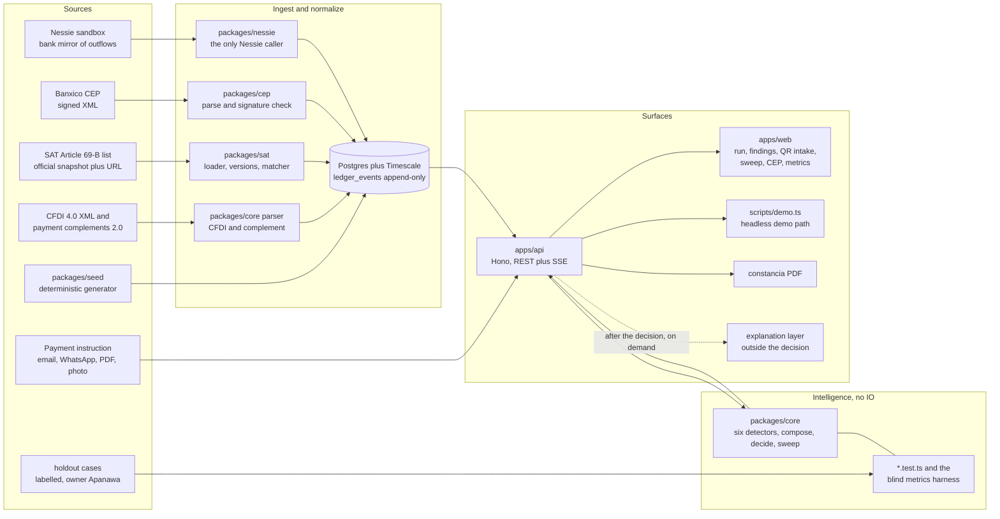
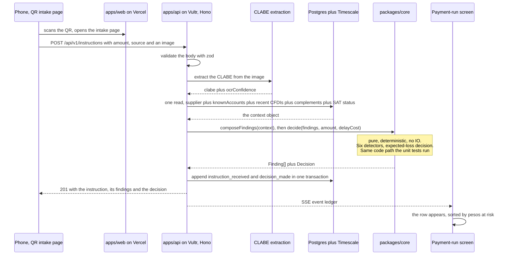

# 07. Architecture

Worth 5 points directly (system design) and it underwrites the algorithmic-logic row, because a
judge cannot believe the algorithm is real until they can see where it lives and what it touches.

Owner: Patricio (`garzario`). Issue #64. Due M3, drafted at M0, rewritten for Ceptinela after
ADR-0002 was accepted.

Product: Ceptinela, track 3. The thesis and the six controls are in
`docs/adr/0002-track-and-thesis.md`. The domain types are in `packages/core/src/domain.ts` and the
HTTP contract is in `docs/09-api.md`. Nothing below invents a second shape for either.

## The shape of the system

Four lanes. The rule that makes the diagram true: **the intelligence lane has no network and no
database access.** It takes values and returns values, which is why it is unit-testable, why the
retroactive sweep is a replay rather than a migration, and why a judge can run it in front of us
with the Wi-Fi off.

Three things to say out loud about this diagram.

1. **`packages/core` has no edge to the database, to Nessie, to the SAT or to Banxico.** Everything
   it needs arrives as an argument. That is the whole technical-depth argument in one property.
2. **The explanation layer is a dashed edge and it points away from the decision.** No model call
   produces a finding, a score or an action. ADR-0004.
3. **The ledger is the spine.** `LedgerEvent` is append-only, so the retroactive sweep after a SAT
   publication is a replay over events that already exist, not a recomputation of mutable rows. That
   is what makes "we can tell you what you already deducted to a supplier listed yesterday"
   implementable in 36 hours.

## The most important flow, the intake path

A payment instruction arriving mid-run is the path that touches every lane: it comes in from a
phone, it is parsed, it is scored by pure functions, it is written as events, and it appears on the
big screen without anybody reloading anything.

Latency budget, to be measured rather than asserted: TODO(garzario) verify end to end at M3 and
write the measured milliseconds here, split into extraction, read, compute and append. The claim we
make out loud is only the one we measured. What we can say without measuring: the compute step has
no IO and no inference in it, so it cannot be the slow part.

TODO(garzario): decide where CLABE extraction runs, on the device or in `apps/api`, and record it in
an ADR if it is not trivial. Either way it sits in the transport lane and not in `packages/core`,
because it is IO. Its output, including `ocrConfidence`, is an input to the detectors, so a blurry
photo weakens a signal rather than silently inventing one.

## Why each choice, and what would make us switch

| Decision | Alternative considered | Why this, for this problem | What would make us switch |
|---|---|---|---|
| Bun 1.3.11 as the single runtime | Node plus a bundler, or Deno | One runtime for the API, the tests, the seeder, the migrations and the demo script. Native TypeScript with no build step, so at 03:00 there is no build to debug. Fast enough cold start for a streaming endpoint | A dependency we genuinely need that does not run on Bun |
| TypeScript monorepo, Bun workspaces | Separate repos, or one flat app | All four people commit on day one, and the engine is imported by the API, the tests, the metrics harness and the demo script with nothing published | Nothing in this window |
| `packages/core`, pure functions, zero dependencies | Detectors inside route handlers | This is the technical-depth play and the answer to the Wizard-of-Oz hunt. A judge opens a detector next to its test file and sees deterministic logic with no mocks and no network. It is also what makes the blind evaluation in `docs/08-data-model.md` possible at all | Nothing. This rule is load-bearing |
| Event-sourced ledger, `LedgerEvent` append-only | Mutable tables updated in place | The retroactive sweep is the product's strongest moment and it is a replay. With mutable rows, "what did we deduct to this supplier before it was listed" is unanswerable | Nothing before M5. It is the spine |
| Hono | Express, or a framework-free handler | Small, fast, portable across the three deploy targets we considered, and `@hono/zod-validator` gives request validation that doubles as the documented contract in `docs/09-api.md` | A target that does not support it |
| Postgres, one dialect, two hosts | SQLite for the offline path | Two dialects means two implementations and two sets of bugs. Same SQL everywhere, same driver, and the offline fallback is a local Postgres 18 rather than a second database. ADR-0003 | Nothing. This was an explicit correction |
| Timescale on Tiger Data, hypertable on `ledger_events` plus one continuous aggregate | Plain Postgres only | The ledger genuinely is a time series: append-only, read as one company over a window, rolled up per supplier per week. The continuous aggregate is the feed for the supplier-behaviour detector (#72), which is a real use and not a sponsor costume | If the managed instance is unreachable, `0002_timescale.sql` is skipped, the behaviour detector reads the plain-SQL equivalent and the demo still runs |
| Raw SQL through `postgres@3.4.9`, no ORM | Drizzle or Prisma | When a judge asks how the sweep is fed, the answer is the SQL on screen. No migration tool to fight, no generated client to explain | A schema complex enough that hand-written queries drift |
| **`apps/api` on a Vultr instance** | Serverless functions on the web host | The payment-run screen updates from a Server-Sent Events stream, and SSE needs a long-lived process. A function runtime with a request timeout either drops the stream or forces a polling fallback that makes the product feel like a report. One small box with the API and Postgres or Timescale next to it also removes a network hop from the read path. This amends ADR-0005, see the note below | If the SSE stream were dropped in favour of polling, the box stops earning its keep and the API goes back to the function runtime |
| **`apps/web` static on Vercel** | Serving the built assets from the same box | Judges walk up repeatedly across 36 hours and open the product on their own phone. A CDN-hosted static build with a preview URL per pull request is the cheapest way to be reachable and the cheapest evidence to attach to a UI PR. It also means a dead API box costs us the data, not the page | Nothing. The two-unit split is deliberate |
| **No LLM in the decision** | A model call per instruction, or per finding | Cost that scales with volume, hundreds of milliseconds of latency, non-determinism that cannot be unit-tested, and a transfer of financial data to a third party that LFPDPPP constrains. Every one of those is a point lost under this rubric. Deterministic scoring is auditable, reproducible in a test and explainable to a regulator. ADR-0004 | A control that genuinely needs semantic judgment inside the decision, which would need its own ADR with a measured cost per call first |
| An explanation layer outside the decision, on demand | No natural language at all | Plain-Spanish phrasing of an already-computed finding is genuinely useful to the persona and costs approximately nothing when a human asks for it. It never changes an action, a severity or a state | If it cannot be kept out of the decision path cleanly, it is cut |
| SSE over polling, and over WebSocket | Poll every N seconds, or a socket layer | The product's live moment is "the instruction a judge just sent from their phone appears on the big screen in under two seconds" (#48). SSE is one HTTP response, reconnects on its own, and needs no protocol upgrade or extra library | Bidirectional traffic from the browser, which we do not have |
| One web client | A native iOS client | Continuous evaluation means repeated walk-ups. A URL a judge opens on their own phone beats handing them our device, and it keeps signing and provisioning off the critical path. ADR-0001 | The deviation condition in ADR-0001 |

The full scored stack matrix is in `docs/adr/0001-stack-and-runtime.md`. The datastore reasoning is
in `docs/adr/0003-datastore-and-timeseries.md`. The LLM boundary and its cost model are in
`docs/adr/0004-llm-boundary-and-privacy.md` and `docs/06-regulatory-privacy.md`.

### The ADR-0005 amendment, stated rather than hidden

ADR-0005 is Accepted with `apps/api` on a function runtime and the hard consequence that `apps/api`
imports no `bun:*` modules. Issue #44 moves `apps/api` to a Vultr instance because the SSE stream
needs a long-lived process. Two things follow and both are deliberate.

1. **The no-`bun:*` rule stays.** It costs us nothing on a box we control and it keeps the API
   portable, so the function runtime remains a live fallback if the instance dies at 05:00. A
   constraint that buys a fallback for free is kept.
2. TODO(garzario): amend ADR-0005 in the same pull request that lands the deploy (#44), with the
   status line updated and this reasoning copied there. An architecture doc that contradicts an ADR
   is worse than either one alone.

### Deploy topology and commands

| Unit | Where | How it is deployed | Evidence |
|---|---|---|---|
| `apps/web` | Vercel, static build | Production from `main`, previews from `dev` and every PR, driven by the Vercel GitHub App rather than a workflow in this repo | Preview URL on each UI PR |
| `apps/api` | Vultr instance, HTTPS in front | TODO(fabbyyyy): the exact commands, per issue #44 | `curl /health` and an SSE trace |
| Database | Tiger Data managed Timescale, or Timescale on the same instance | `bun run migrate` applies `0001` always and `0002` only when the `timescaledb` extension exists | `bun run doctor` names the live path |
| Offline fallback | Local Postgres 18 on 5432, second API port | Same SQL, same driver, same migrations | `docs/10-demo-script.md`, offline section |

TODO(fabbyyyy): fill the command rows before M3, including how HTTPS is terminated and which
environment variables the box needs. The production URL goes in the README and in
`docs/10-demo-script.md` in the same PR.

## Deliberately not in this tree

Git cannot track an empty directory, so these are recorded here rather than as empty folders.

- **`apps/ios`.** Not created. The condition that would create it is in ADR-0001: a differentiator
  that is inherently on-device. Ours is not. The camera path we do need is a web intake page a judge
  opens from a QR code, which needs no signing and no store.
- **`services/ml`, a Python sidecar.** Not created. Every one of the six controls is arithmetic,
  string distance, a state machine or a check digit. A testable TypeScript implementation scores
  higher on algorithmic logic than an opaque artifact, and ADR-0001 already recorded that decision.
- **A queue or a worker tier.** Not created. The sweep is a replay over events that fits in one
  request at demo scale, and the SSE fan-out is one process. The condition that creates one is in
  the scaling section below, stated as a threshold rather than as a feeling.
- **A second database for the SAT list.** Not created. A list version is rows in Postgres plus an
  in-memory map keyed by RFC, rebuilt on load.

## How this scales beyond one platform

**The contract is the boundary.** `apps/web` is one consumer of the documented HTTP contract in
`docs/09-api.md`. A WhatsApp intake bot, an accounting firm's own portal or a bank's SMB portal are
additional consumers of the same endpoints, not rewrites. The QR intake page already proves the
shape: a surface we did not build the UI framework for can create an instruction with one POST.

**The intelligence travels.** `packages/core` has zero runtime dependencies and no IO, so it can be
imported by a partner's backend, or run inside the client when data residency requires that the
ledger never leaves the customer perimeter. The only shared assumption is the domain contract, which
is deliberately narrow and lives in one file.

**Where it breaks first, in order.** Stated as thresholds so the answer is checkable rather than
reassuring.

| Limit | What happens | The fix, and when it is worth doing |
|---|---|---|
| SSE fan-out on one process | Open streams cost memory and the box becomes the single point of failure | Shard by company, or put the stream behind a broker. Not before there is more than one customer |
| Detector work per run | Every detector is O(n) over one company's window with no IO, so a run is bounded by the read | Nothing to do until a single company exceeds a run the read cannot serve. TODO(garzario) verify the real per-run timing at M3 |
| SAT list size | A list version is loaded once and matched by hash lookup, so matching is O(1) per supplier | Nothing. Growth in the list changes load time, not query time |
| Ledger growth | Append-only rows accumulate for every company | This is the Timescale case: hypertable partitioning by time plus the continuous aggregate that already feeds the behaviour detector |
| The retroactive sweep | A replay over the affected supplier's events | Bounded by the events of newly listed suppliers, not by the whole ledger. Only ever replays what the publication touched |

**Multi-tenancy.** One company is one partition key on the ledger. An accounting firm holding thirty
companies is thirty partitions behind one screen, which is the distribution path in
`docs/05-business-model.md` rather than a new architecture.
