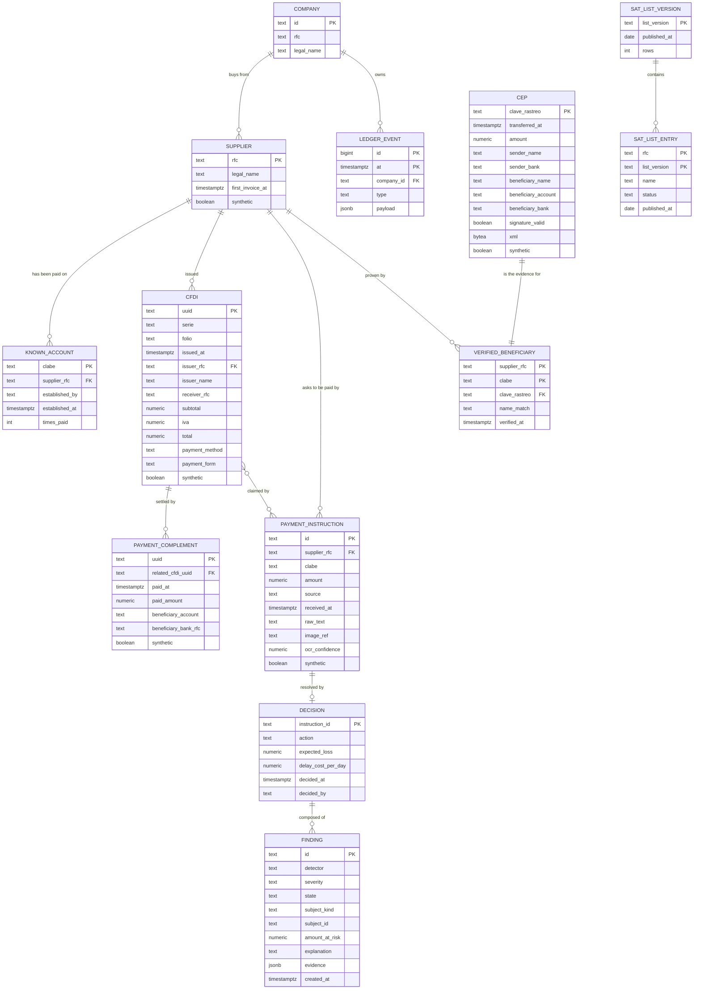

# 08. Data model, synthetic data and blind evaluation

Worth 6 points (data foundation) and it is where "what happens with dirty data" gets answered with a
test name instead of a promise, and where "how do you know it works" gets answered with a protocol
instead of a number we picked.

Owner: Patricio (`garzario`). Issue #64, with the schema itself landing in issue #40 (`fabbyyyy`)
and the generator in issue #43 (`Apanawa`). Due M3.

The types are `packages/core/src/domain.ts`. This document describes how those exact types are
stored and generated. Where the storage shape differs from the domain shape, the difference is named
and justified below. There is no second shape.

## Entities



### Where the storage shape differs from the domain shape, and why

Three places, all deliberate. The API returns the domain shape in every case, per `docs/09-api.md`.

| Domain | Storage | Why |
|---|---|---|
| `PaymentInstruction.cfdiUuids: string[]` | Junction table `instruction_cfdi (instruction_id, cfdi_uuid)` | One instruction can settle several invoices and one invoice can appear in more than one instruction, which is exactly how a duplicate payment happens. A junction table makes that query trivial and an array makes it painful. The API rebuilds the array |
| `Decision.findings: Finding[]` | `findings` rows addressed by `subject_kind` plus `subject_id`, exactly as `Finding.subject` is typed | A finding can hang off an instruction, a CFDI or a supplier, so it cannot be a blob inside one decision row. The decision for an instruction collects the findings whose subject is that instruction, plus the supplier-level findings for its supplier. Findings are written once, read by three screens and counted by the metrics harness |
| `Supplier.knownAccounts: KnownAccount[]` | `known_account` rows, ordered by `established_at desc` | The order matters to the CLABE detector, and a row per account is what lets `times_paid` be incremented without rewriting the supplier |
| `COMPANY` | Table, plus `company_id` on the ledger | It is not in `domain.ts` on purpose. Every pure function is called with one company's context already selected, so the tenant key never reaches the intelligence lane. Multi-tenancy is a storage concern here, and keeping it out of the domain is what makes the detectors testable with ten lines of fixture |

## Migrations

Eight files, applied in order by `scripts/migrate.ts` and tracked in `schema_migrations` with a
checksum, so an edited migration is reported instead of silently diverging between four laptops.
Five run on any Postgres 16 or newer. Three are applied **only when the `timescaledb` extension is
available**, which the migrator checks against `pg_available_extensions`, and that is what keeps a
plain local PostgreSQL 18 usable as the offline demo database. The tables are the ERD above, written
out field for field against `domain.ts` in `0003_ceptinela.sql`; the rules for adding a migration
are in `packages/db/migrations/README.md`.

| File | Runs on | What it adds |
|---|---|---|
| `0001_init.sql` | any Postgres 16+ | `ledger_tx`, the bank mirror spine |
| `0003_ceptinela.sql` | any Postgres 16+ | the Ceptinela schema and the append-only `ledger_events` |
| `0005_ceptinela_drift.sql` | any Postgres 16+ | the columns the domain grew after `0003`, and the append-only guard rewritten as a trigger that raises |
| `0006_company.sql` | any Postgres 16+ | the one-row `company` table: who we are, and the account the mirror hangs off |
| `0007_supplier_outflow.sql` | any Postgres 16+ | `supplier_weekly_outflow` as a plain view |
| `0002_timescale.sql` | only with `timescaledb` | hypertable and daily aggregate over `ledger_tx` |
| `0004_timescale_ceptinela.sql` | only with `timescaledb` | hypertable and daily aggregate over `ledger_events` |
| `0008_timescale_supplier_outflow.sql` | only with `timescaledb` | `supplier_weekly_outflow` as a continuous aggregate |

The plain files all run before the ones that need the extension, so a fresh database is fully usable
even when the extension turns out to be missing halfway through.

Two shapes in `0003` exist because of Timescale and are worth naming, because both were found by
running the migration rather than by reading the documentation. `ledger_events` has
`primary key (at, event_id)` and not `event_id` alone, because a hypertable refuses a unique index
that leaves out the partitioning column; the same discovery moved `ledger_tx` to
`primary key (occurred_at, id)` in `0005`. And the append-only guard on `ledger_events` started as
two rules, which Timescale also refuses on a hypertable, so `0005` replaced them with a trigger that
raises `restrict_violation`. The trigger is the louder guard `0003` wanted anyway: an update or a
delete now fails instead of being silently ignored.

### supplier_weekly_outflow, one name over two definitions

The feed the `supplier_behaviour` detector and the supplier drawer read: what each supplier invoiced
this company, per week. It exists twice under one name, so `packages/db/src/queries.ts` holds one
query, `packages/db/src/rows.ts` holds one mapper, and `bun run doctor` is what says which of the
two answered.

```sql
-- packages/db/migrations/0007_supplier_outflow.sql   runs on ANY Postgres 16+
create or replace view supplier_weekly_outflow as
  select ledger_events.payload -> 'cfdi' ->> 'issuerRfc' as supplier_rfc,
         date_trunc('week', ledger_events.at at time zone 'UTC') at time zone 'UTC'
           as week,
         count(*)::bigint as invoices,
         sum((ledger_events.payload -> 'cfdi' ->> 'total')::numeric(14,2))
           as outflow,
         max((ledger_events.payload -> 'cfdi' ->> 'total')::numeric(14,2))
           as max_invoice
  from ledger_events
  where ledger_events.type = 'cfdi_received'
  group by ledger_events.payload -> 'cfdi' ->> 'issuerRfc',
           date_trunc('week', ledger_events.at at time zone 'UTC') at time zone 'UTC';
```

```sql
-- packages/db/migrations/0008_timescale_supplier_outflow.sql   only with timescaledb
drop view if exists supplier_weekly_outflow;

create materialized view supplier_weekly_outflow
  with (timescaledb.continuous) as
  select payload -> 'cfdi' ->> 'issuerRfc' as supplier_rfc,
         time_bucket('7 days', at) as week,
         count(*)::bigint as invoices,
         sum((payload -> 'cfdi' ->> 'total')::numeric(14,2)) as outflow,
         max((payload -> 'cfdi' ->> 'total')::numeric(14,2)) as max_invoice
  from ledger_events
  where type = 'cfdi_received'
  group by payload -> 'cfdi' ->> 'issuerRfc', time_bucket('7 days', at);

alter materialized view supplier_weekly_outflow
  set (timescaledb.materialized_only = false);

select add_continuous_aggregate_policy('supplier_weekly_outflow',
  start_offset      => interval '1 year',
  end_offset        => interval '1 hour',
  schedule_interval => interval '1 hour',
  if_not_exists     => true);
```

Four decisions, each one a constraint rather than a preference.

1. **The source is the event ledger, and on the Timescale path there is no alternative.** `cfdis`
   cannot become a hypertable: `payment_complements.related_cfdi_uuid` references `cfdis (uuid)`,
   that foreign key needs a unique index on `uuid` alone, and a unique index without the
   partitioning column is exactly what `create_hypertable` refuses. `instructions` is pinned the
   same way by `decisions.instruction_id`. Neither key can be widened without dropping a foreign key
   the sweep and the payment run depend on, and `0003` is applied everywhere so it cannot be edited.
   `ledger_events` is already the hypertable `0004` made, and `0003` calls it the system of record
   with every other table a projection of it, so the aggregate belongs there on the merits as well.
   One `cfdi_received` is emitted per CFDI at `cfdi.issuedAt`, so the aggregate and the `cfdis` table
   carry the same pesos; `queries.test.ts` asserts that against `sumAmounts` rather than trusting it.
2. **The bucket is Monday 00:00 UTC on both paths.** `date_trunc('week', ...)` lands on Monday, and
   `time_bucket('7 days', ...)` counts from Timescale's default origin of 2000-01-03, itself a
   Monday, in UTC. Every boundary is therefore the same instant under both definitions. The week is
   cut in UTC and not in Monterrey on purpose: an invoice stamped 23:59 UTC on a Sunday is 17:59
   locally, a local cut would move it into the next bucket, and nobody reads the hour a week opened.
   The daily chart in `dailySpend` does cut in Monterrey, because a purchase at 23:30 belongs to the
   day the person made it. Different question, different cut, both stated in the query.
3. **Money is cast to `numeric(14,2)` on the way out of the jsonb.** `total` is `numeric(14,2)` in
   `cfdis` and a JSON number in the payload. Without the cast the sum is built out of floats and
   stops agreeing with `sum(total) from cfdis` at the cent, which is the drift `@hackmty/core`
   exists to avoid.
4. **Real-time aggregation is on, and it is a demo-path decision.** TimescaleDB 2.13 changed the
   default of `materialized_only` to true, and under that default a CFDI ingested during the demo
   would not reach the detector until the next refresh ran. Set to false, a read unions the
   materialised buckets with the rows newer than the refresh watermark. The refresh policy is what
   makes the aggregate cheaper than the view: buckets older than an hour are computed once and kept,
   and only the tail is computed per request.

**The two-path note.** The plain view is not a degraded mode. It is the same five columns over the
same rows with the same bucket boundaries, computed at read time instead of kept materialised, so
the offline database answers every question the managed one answers and answers it with the same
numbers. What changes is cost, not truth: the view rescans the CFDI events of the window on every
request, the aggregate reads buckets it already has. `supplierHistory(rfc, weeks)` in
`packages/db/src/queries.ts` is written against the name and never against either definition, and it
returns `SupplierBehaviourInput` from `packages/core/src/behaviour.ts` with one extra field, so
`assessSupplierBehaviour(await supplierHistory(sql, rfc))` runs with nothing in between. A feed that
has to be reshaped before the detector accepts it is a feed that can be reshaped wrongly, and
`rows.test.ts` holds the type-level assertion that keeps the two shapes in step without a database.

The window that function reads is `SUPPLIER_BEHAVIOUR_DEFAULTS.baselineWeeks + recentWeeks`, taken
from the detector's own defaults rather than restated as a number, so lengthening the baseline
cannot leave the feed handing it less history than it is about to measure against. It is bounded at
the bottom and open at the top: the lower bound is what stops the read from growing with the age of
the company, and an upper bound would add a boundary the detector does not share, because the
detector keeps an invoice issued at exactly `now` and drops anything after it. The weekly series is
bounded by the bucket that contains the lower bound, not by the raw instant, or the series would
start a week late.

`bun run doctor` reports which path is live, so nobody demos against the wrong database by accident.
Recorded in `docs/adr/0003-datastore-and-timeseries.md`.

## Field notes

| Field | Why it is shaped like this |
|---|---|
| `clabe text check (length(clabe) = 18)` | A CLABE can start with a zero, so it is never a number. The check is length only: the check digit is validated in `packages/core`, where the failure produces a finding with an explanation instead of a rejected insert |
| `rfc text`, no foreign key to `sat_list_entries` | Most suppliers are on no list, and list entries are versioned, so an RFC is a join key and not a reference. The match is a lookup per list version |
| `amount numeric(14,2)` | Money never becomes a float. Nessie mixes integers and floats in the same field and `postgres.js` returns numerics as strings on purpose, which `packages/db/src/queries.ts` already handles by moving cents as integers |
| `at timestamptz` on events | CFDI carries a timestamp, the SAT list carries a publication date with no time, and Nessie carries a date with no time at all. Our ledger holds the real instant, and anything date-only is stored as the date it is plus the source that produced it. Intraday ordering is ours, never Nessie's |
| `payload jsonb` on `ledger_events` | The event is the record. Projections are rebuildable, so a bug in a projection is a replay and not a data loss |
| `evidence jsonb` on `findings` | It maps exactly to `Finding.evidence: Record<string, string \| number \| boolean>`, which is what the UI renders as chips. Flat by contract: no nested objects, so a chip is always renderable |
| `xml bytea` on `ceps` | XMLDSig verification is byte-exact. Storing the CEP as text invites a re-encoding that silently breaks the signature. This is the single most breakable field in the schema |
| `synthetic boolean` | The watermark is rendered from this flag and never from a name. Set on every generated row, per ADR-0002 |
| `ocr_confidence numeric(3,2)` | Present only when the CLABE came from an image. A low value weakens the CLABE finding rather than being ignored, which is what keeps a blurry photo from becoming a confident accusation |
| `decided_by text` nullable | Null until a person decides. The system proposes, a human disposes, and the column is the proof |

## Synthetic data methodology

The generator lives in `packages/seed`, owner Adan (`Apanawa`), issue #43. This section is the
data-foundation score.

**Determinism.** One fixed RNG seed, committed. The same seed produces byte-identical output, which
is asserted in a test rather than claimed. The demo IDs printed by `bun run seed` are therefore
stable and can be hard coded in `docs/10-demo-script.md`.

**Scale of the demo company.** A metalmecanica in Apodaca with 28 employees, about 42 active
suppliers, 8 months of CFDIs and payment complements, and a current payment run of 70 to 110
instructions. These are scenario parameters chosen to match the persona in `docs/02-persona.md`, not
measurements of Mexico. TODO(garzario) verify the exact counts here once `bun run seed` prints them.

**Identifiers, and the rule that protects the narrative.**

| Rule | Why |
|---|---|
| Every synthetic RFC carries the `SYN` prefix, for example `SYN010101AAA` | It is recognisable on screen and greppable in the repo |
| A test asserts that no synthetic RFC appears in the loaded official SAT list snapshot | This is the enforcement of the binding ADR-0002 rule that real RFCs never sit next to fabricated evidence. A naming convention is a hope; a test is a control. TODO(garzario) write this test in the SAT loader PR (#35) |
| Real RFCs appear in exactly one place: the lookup box a judge types into | ADR-0002, narrative rules |
| Synthetic CLABEs are generated with a **valid** check digit (3-7-1 weights, mod 10) | Otherwise the check-digit detector would fire on every row and prove nothing. Invalid ones exist only where a case means them to be invalid |
| Synthetic legal names are constructed, never taken from a real company | Includes the CEP fixture, which is redacted before it is committed (#57) |

**Distributions and cadences.**

| Property | Method | Why |
|---|---|---|
| Invoice amounts | Lognormal per supplier category | Real purchase amounts are right-skewed. A uniform distribution looks fake at a glance and breaks any percentile logic in the behaviour detector |
| Supplier issuance cadence | Per-supplier rate with jitter, some monthly, some weekly, a few one-off | The behaviour detector measures drift against a supplier's own history, so the history has to have a shape to drift from |
| Payment concentration | Thursday runs, with month-end and quincena weight | Matches the persona's trigger moment and makes the weekly aggregate non-trivial |
| PUE and PPD mix | Both, with complements following PPD invoices after a delay | The complement is what establishes a known account honestly, so the mix is load-bearing for branch 3 of the journey |
| Bank mix across CLABEs | Several bank codes, with plaza consistency | Otherwise the bank-consistency half of the CLABE detector has nothing to check |
| Nessie mirror | Outflows mirrored into the sandbox for reconciliation | Feeds the bank-reconciliation detector (#39): a payment with no document behind it |

**Hard negatives, generated on purpose** (issue #43). These exist so that the false-positive rate is
measured against cases designed to fool us, not against easy rows: a legitimate bank change backed
by a payment complement, a legitimate new supplier ramping to 15 percent of outflow, a round-number
invoice, a seasonal spike, and a partial legal-name match that is fine.

**Does it look real.** A short side-by-side of one summary statistic from the generator against the
Nessie sandbox shape and against a public benchmark: mean and median invoice amount, invoices per
supplier per month, share of PPD. TODO(garzario) verify after #43 lands, and cite the public series
by name or leave the column empty. An empty cell is honest; a plausible number is not.

## Real document validation

Every fixture above is invented, and a parser proven only on documents we wrote ourselves is a
parser proven on our own assumptions. So exactly one thing in this repository is allowed to come
from outside it: a small number of CFDIs that a PAC actually stamped, redacted before they are
committed. That is what lets us say on stage that the parser was validated on a real document, and
the sentence is only worth saying because the file is in the repository and the command that
produced it is too.

**Status, issue #68.** The importer, the tests and this section are merged.
`packages/core/src/fixtures/real/` is empty until the real document is in hand, and the test that
reads it skips with a message that says so rather than passing on nothing. Until a file is in that
folder, the claim above is not one to make on stage. TODO(garzario) import the document and update
this line.

**The rule.** The real document never enters the repository. It is read from outside it, or from
`.seed/real/`, which is gitignored, and only the redacted copy reaches
`packages/core/src/fixtures/real/`. A nested `.gitignore` in that folder allows nothing but
`*.redacted.xml`, so a raw file dropped there by mistake cannot be committed from it. This is the
ADR-0002 rule about real identifiers, applied to the one place where real data is legitimate.

**The command.**

```
bun run scripts/import-real-cfdi.ts ~/outside/the/repo/factura.xml
```

Flags: `--name=<slug>` names the output, `--dry-run` prints the plan and writes nothing, `--force`
replaces an existing fixture, `--allow-unknown-complement` blanks a complement the script does not
read instead of refusing. It writes two files. The fixture goes to
`packages/core/src/fixtures/real/<name>.redacted.xml` and is committed. The change map, which lists
every original value and is the only way back, goes to `.seed/real/<name>.map.json` and is
gitignored. The command reads `.gitignore` before writing the map and refuses to write anything if
the rule is missing.

**The secret.** Amounts are scaled by a factor read from `REAL_CFDI_SCALE`. Unset, the script
generates one, prints it once and never writes it to a committed file. The factor is also the seed
of every pseudonym, so the invoice and the payment complement that settles it have to be imported
under the same factor: that is what keeps `IdDocumento` in the complement pointing at the UUID the
invoice was given, and the supplier RFC the same in both. It is deliberately not in `.env.example`,
because a secret that is worth keeping does not belong in a file everyone copies.

**What is replaced.**

| In the document | Becomes | Why this way |
|---|---|---|
| Every amount | The amount times the factor, at the same number of decimals | A real invoice total is commercially sensitive and is also the one number a supplier would recognise |
| Every RFC, including the PAC one | `SYN` plus a date plus a homoclave, with the real SAT check digit computed over it | It stays shaped like an RFC, so the fixture still exercises everything downstream, and it meets no real taxpayer |
| Every legal name | A constructed name carrying the word DEMO, keeping the legal form suffix verbatim | `packages/cep` normalises that suffix away before comparing two names, so keeping it is what leaves the fixture useful to the name comparison |
| Postal codes, the only address CFDI 4.0 carries | 64000 | Blanking a required attribute would change the shape of the document |
| UUID, folio, serie, operation number, certificate serials | Derived values that keep the length and the character classes | A folio of four digits stays four digits, so nothing that reads a shape changes its mind |
| Bank accounts | A synthetic CLABE with a correct control digit, keeping the three digit institution code | The CLABE control reads the bank code, and an invented one would exercise that control against nothing. The eleven digits that identify the company are replaced |
| Sello, SelloCFD, SelloSAT, Certificado | Obvious placeholders | A CSD certificate carries the taxpayer name and RFC inside it. This is the attribute that leaks a real identity while looking like noise |

**What is kept, and why.** The structure, the namespaces, the attribute order and the whitespace,
because the output is the input with attribute values rewritten in place rather than a
reserialisation: a diff of the two is a diff of values and never of shape. The catalogue codes, the
quantities and the tax rates, because they are not identifying and they are what the parser reads.
The dates, because a timestamp is what the parser's offset handling is being validated against and a
date on its own identifies nobody once the names, RFCs, folios and UUIDs are gone.

**Rounding.** Scaling a document by a factor and rounding each amount on its own breaks the
arithmetic a PAC signed. The importer scales in integer arithmetic and then puts the identities
back: for every relation the original document satisfied, and only for those, the dependent value is
recomputed from the scaled inputs. `Importe` from `Cantidad` and `ValorUnitario`, the taxable base
from the line, the tax from the base and the rate, `SubTotal` from the lines, `Total` from the
subtotal and the taxes, `Monto` from the settled documents, the `Totales` block of a complement from
its payments. A document that did not add up before still does not add up afterwards, in the same
places, because a document silently corrected here would be a document no PAC ever issued.

**Two verifications, both of which fail the command.** First, nothing that was replaced survives
anywhere in the output, checked on token boundaries so that a folio of 318 inside an amount of
72613.18 is not a false alarm, plus a scan for the shapes themselves, which is what catches an RFC or
a CLABE typed into a free text description by whoever issued the invoice. Second, the redacted
document is parsed again by the same parser, as the same kind of document, and every identity that
held before still holds. The importer refuses to write a file that fails either one.

**The tests.** `packages/core/src/cfdi-real.test.ts` parses every file in the folder and asserts
again, over the committed bytes, that every RFC is synthetic and that no stamp or certificate
survived. With the folder empty it skips with a message that names the script, so the repository is
green before the first document arrives.
`scripts/import-real-cfdi.test.ts` runs the importer over the synthetic fixtures, which are
CFDI 4.0 documents with the same structure, and asserts the properties that matter: the shape is
unchanged with every value stripped, the amounts moved by the factor, the tax breakdown still adds
up, an invoice and its complement still point at each other, and the same factor produces the same
file twice.

**Residual risk, stated rather than hidden.** Free text is kept verbatim: `Descripcion`,
`NoIdentificacion`, `CondicionesDePago`. A description that names the buyer in prose is not
something an attribute level rule can catch, so the command prints every free text value it kept and
the person importing the document reads them before committing. A complement the script does not
understand, a carta porte or an addenda, is refused rather than guessed at, because rewriting
attributes it has never seen is exactly how a real name survives into a fixture.

## What we made messy on purpose

Each row gets one test. This is why the dirty-data question is the easiest question we get.

| Deliberate defect | Where it appears | How the engine handles it |
|---|---|---|
| The same supplier with two spellings of its legal name | Supplier catalog and CFDI issuer names | Normalised (case, accents, punctuation, corporate suffixes) before comparison. The test asserts both collapse and that the normalisation is not used to hide a real mismatch |
| Missing `folio`, missing `serie` | A share of CFDIs | The duplicate detector falls back to issuer plus amount plus date window, and says which rule fired in the evidence |
| A PPD invoice with no complement yet | Several suppliers | Treated as unsettled, never as a payment. A missing complement is not evidence of anything |
| Out-of-order arrival | Events inserted with `at` earlier than the previous row | Every query orders explicitly and the sweep sorts before replay. The test asserts the engine is insertion-order independent |
| Mixed integer and float amounts | Straight from the Nessie shape | Parsed as numbers, stored as `numeric`, compared with a tolerance, never with strict equality |
| A CLABE read from a photo with two digits transposed | QR intake path | Produces a finding whose confidence is weakened by `ocrConfidence`, and the evidence chip shows which digits differ |
| A truncated beneficiary name on a CEP | CEP fixture and generated CEPs | Produces `nameMatch: "partial"`, state `requiere_verificacion`, never `mismatch`. Branch 2 in `docs/03-user-journey.md` |
| An RFC with the wrong length or an invalid shape | Instruction intake | Flagged as unparseable and shown as such. It never becomes a silent lookup miss, because a lookup miss reads as "not on the list" and that is the dangerous failure |

**The engine never throws on bad input.** It returns a result with the affected rows flagged. That
is a test, not a hope.

## Blind evaluation protocol

The reason this section exists: any team can report precision on cases it wrote for itself. The
number means something only if the person who wrote the detectors did not see the cases.

**Separation of duties.** Labels and cases are owned by Adan (`Apanawa`) in
`packages/seed/src/holdout/` (issue #55). Detectors are owned by Patricio (`garzario`) in
`packages/core` (issues #33, #34, #36, #37, #38, #39). The generator that produces the everyday data
is a third thing again, and the labelled positives do not come from it.

**The rule, and how it is checkable rather than promised.**

1. The detector author does not open `packages/seed/src/holdout/` before the detector PRs are
   merged. The evidence is the git history: the holdout commits and the detector commits have
   different authors and different dates, which a judge can check with `git log`. TODO(garzario):
   `.github/CODEOWNERS` currently assigns all of `/packages/seed/` to `fabbyyyy`, so add
   `/packages/seed/src/holdout/ @Apanawa` in the #55 pull request. Until that line exists, the
   separation rests on an agreement plus the history rather than on a tool, and we say it that way.
2. The thresholds we would refuse to ship at are written **before** the first run.
   TODO(garzario): set them in this file before the harness is run for the first time. A threshold
   chosen after seeing the numbers is a description, not a threshold.
3. If a detector is tuned after its author has read a case, that run is void. The tuning is recorded
   in `docs/14-process.md` and the case is replaced. Saying this out loud is worth more than the
   half point a quietly tuned number would buy.

**Case format.** Each case is JSON: the input objects (supplier, CFDIs, complements, instruction,
SAT entries, CEP where relevant), the expected findings, and the expected action. Synthetic RFCs
only. At least 25 cases, covering every detector as a true positive and every hard negative listed
above.

**The harness.** A pure function that runs `composeFindings` and `decide` over every case and
returns `Metrics` exactly as typed in `domain.ts`: `cases`, `truePositives`, `falsePositives`,
`falseNegatives`, `precision`, `recall`, `falsePositiveRate`, and `perDetector`. Exposed as
`bun run eval` and as `GET /api/v1/metrics`, and rendered by the metrics page (#51).

**How the numbers are reported, so they are not oversold.**

- Always with `cases`. A rate without its denominator is a decoration, and at n around 25 the
  confidence interval is wide enough that a judge who knows statistics will say so first if we do
  not.
- Per detector, not only in aggregate. One strong detector can hide a useless one.
- The false-positive rate is reported against the hard negatives specifically, because that is the
  number that decides whether a real clerk keeps the product installed.
- The metrics page carries a short "what we measured and refused to ship" note, naming any detector
  that did not clear its pre-registered threshold and is therefore off by default.

TODO(garzario) verify: fill the measured numbers here only after the harness runs on merged
detectors, and stamp the date and the commit. Until then this section describes a protocol and
claims no result.
