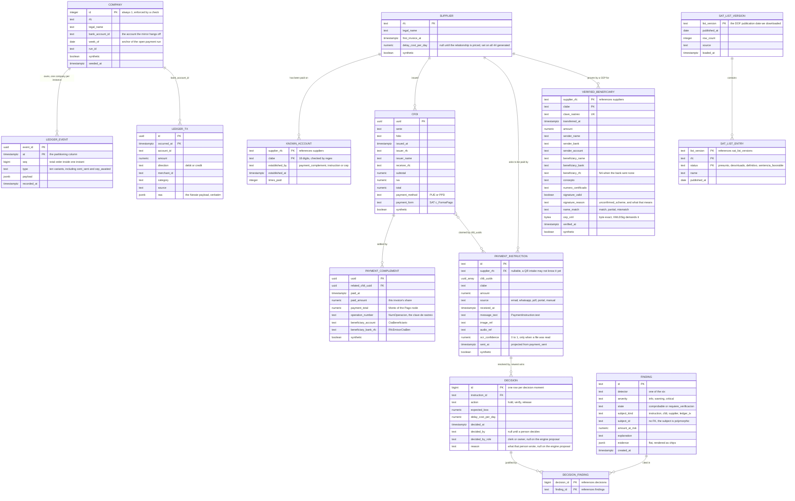

# 08. Data model, synthetic data and blind evaluation

Worth 6 points (data foundation) and it is where "what happens with dirty data" gets answered with a
test name instead of a promise, and where "how do you know it works" gets answered with a protocol
and a measured table instead of a number we picked.

Owner: Patricio (`garzario`). Issue #64, with the schema landing in issue #40 (`fabbyyyy`), the
generator in issue #43 and the holdout in issue #55. Due M3.

The types are `packages/core/src/domain.ts`. This document describes how those exact types are
stored and generated. Where the storage shape differs from the domain shape, the difference is named
and justified below. There is no second shape.

**Every figure on this page comes from a run.** The dataset numbers are
`summarizeSentryOne(generateSentryOne({ seed: 69, weekOf: "2026-09-07" }))`, which is the reference
run `packages/seed/src/sentryone/documented-figures.test.ts` asserts the judged documents against.
The evaluation numbers are `bun run eval`. Anything not yet measured is a `TODO`, never a plausible
number.

## Entities

Transcribed from `packages/core/src/domain.ts`, including the fields the domain grew after the first
schema landed: `Supplier.delayCostPerDay`, `PaymentComplement.paymentTotal` and `operationNumber`,
`PaymentInstruction.audioRef` and `sentAt`, the CEP evidence fields, `ledger_tx` as a finding
subject, and `verification_call`, `cent_sent` and `cep_awaited` as ledger events.



**Which of those lines is a foreign key, and which is only a join key.** Enforced by the database:
`known_accounts.supplier_rfc`, `payment_complements.related_cfdi_uuid`, `instructions.supplier_rfc`,
`decisions.instruction_id`, both columns of `decision_findings`, `sat_list_entries.list_version` and
`verified_beneficiaries.supplier_rfc`. Deliberately not enforced: `cfdis.issuer_rfc`, because an
invoice can arrive from an issuer we have not created a supplier row for yet and refusing it would
lose the document; `findings.subject_id`, because the subject is polymorphic; and the two `COMPANY`
lines, because the schema holds one company and the tenant key is not a column yet. That last one is
the honest version of the multi-tenancy answer in `docs/07-architecture.md`.

### Where the storage shape differs from the domain shape, and why

Eight places, all deliberate. Seven of them are a storage shape that differs, and the API returns the
domain shape in every case, per `docs/09-api.md`, with `packages/db/src/rows.ts` the only file that
translates between the two. The eighth is a domain type with no storage at all, which is the same
question answered the other way.

| Domain | Storage | Why |
|---|---|---|
| `PaymentInstruction.cfdiUuids: string[]` | `instructions.cfdi_uuids uuid[]` | One instruction settles several invoices, which is exactly how a duplicate payment happens, so the array is load-bearing. It is a Postgres array and not a junction table because every read of it is "give me this instruction's invoices" and no read is "give me this invoice's instructions"; the duplicate control gets that second direction from the ledger. A junction table would be a join on the demo path for a query nobody makes |
| `Decision.findings: Finding[]` | `findings` rows plus the `decision_findings` join | A finding hangs off an instruction, a CFDI, a supplier or a bank-mirror row, so it cannot be a blob inside one decision row. The join is explicit so the exact set that justified a decision can be rebuilt a year later, after the detectors changed and would produce a different set today |
| One decision per instruction | `decisions` is one row per decision moment, with its own identity key | A clerk holds a payment on Thursday and releases it on Friday, and both have to survive in the history a judge scrolls. The current decision is the newest row by append order, not the largest `decided_at`, which is what lets a person override an engine decision stamped at a run instant ahead of their own clock |
| `Supplier.knownAccounts: KnownAccount[]` | `known_accounts` rows, keyed `(supplier_rfc, clabe)` | The order matters to the CLABE control, and a row per account is what lets `times_paid` be incremented without rewriting the supplier. `known_accounts_clabe` indexes the reverse lookup, because the same account under two suppliers is a signal |
| `Cep` | Columns on `verified_beneficiaries`, not a table of its own | A CEP only exists here as evidence that one supplier was really paid on one account, so the registry row and the document are the same fact. There is no orphan CEP to store. `clave_rastreo` carries a unique index, so one Banxico receipt can prove exactly one row |
| `COMPANY` | A one-row table, absent from `domain.ts` | Every pure function is called with one company's context already selected, so the tenant key never reaches the intelligence lane. That is what makes a detector testable with ten lines of fixture. The multi-tenant path is written out in `docs/07-architecture.md` |
| `NetworkSignal` | `consortium_snapshot` plus the one-row `consortium_pull` | The domain object is one answer about one pair, and it is computed from three stored facts: the pull, the pair row and how many accounts the network holds for that RFC. The split is what lets "the network was not read" and "the network read and knows nothing" be different answers. `apps/api/src/consortium.ts` is the only file that assembles one, and it hashes the RFC and the CLABE on the way in, so no raw identifier ever reaches these tables |
| `Sat49BisEntry` | Nothing. There is no table | Issue #180, and the absence is the design. `sat_list_entries` is keyed `(list_version, rfc, status)` and article 49 Bis has no status: fraccion X publishes one outcome and provides for no published clearing, so a row there would need a fifth `status` value that means "this is a different statute". More to the point, there is nothing to store: the SAT publishes that list one oficio at a time as a DOF note and ships no machine-readable file, so nothing in this repository can hold a 49 Bis version it did not transcribe by hand. `packages/sat/src/art49bis.ts` reads publications passed to it, `official49BisListing()` reports the coverage, and the day a file exists this row becomes a migration rather than a silent schema we guessed at in advance |

## Migrations

Nine files, applied in order by `bun run migrate`. The list is `MIGRATIONS` in
`packages/db/src/migrate.ts`, written out rather than discovered by reading the directory, so adding
a file is a deliberate one-line change in a diff and a stray `.sql` left in the folder never runs.
The plain files run first and the Timescale ones after, so a fresh database is fully usable even
when the extension is missing halfway through. Applied files are recorded in `schema_migrations`
with a checksum, so an edited migration is reported instead of silently diverging between four
laptops.

| File | Runs on | What it adds |
|---|---|---|
| `0001_init.sql` | any Postgres 16+ | `ledger_tx`, the bank mirror spine, plus `(account_id, occurred_at desc)` |
| `0003_sentryone.sql` | any Postgres 16+ | the SentryOne schema: suppliers, known accounts, CFDIs, complements, instructions, findings, decisions and their join, the SAT list, the verified-beneficiary registry, and the append-only event ledger |
| `0005_sentryone_drift.sql` | any Postgres 16+ | the columns the domain grew after 0003, the two widened check constraints, the `ledger_tx` key, and the append-only trigger |
| `0006_company.sql` | any Postgres 16+ | the one-row `company` table |
| `0007_supplier_outflow.sql` | any Postgres 16+ | `supplier_weekly_outflow` as a plain view over the CFDI events |
| `0009_consortium_snapshot.sql` | any Postgres 16+ | `consortium_snapshot` and the one-row `consortium_pull`: the local projection of the cross-tenant network |
| `0010_rail_events.sql` | any Postgres 16+ | `cent_sent` and `cep_awaited` as ledger event types, the two the one-cent verification appends |
| `0011_decision_reason.sql` | any Postgres 16+ | `decisions.reason`, the argument a person wrote when they overrode the engine, next to the name in `decided_by` |
| `0012_assistant_and_payment_events.sql` | any Postgres 16+ | the five ledger event types the assistant panel and the payment execution append |
| `0013_decision_actor_role.sql` | any Postgres 16+ | `decisions.decided_by_role`, the capacity the signature was given in, checked to the two roles of `ActorRole` |
| `0002_timescale.sql` | only with `timescaledb` | hypertable and continuous aggregate over `ledger_tx` |
| `0004_timescale_sentryone.sql` | only with `timescaledb` | hypertable and continuous aggregate over `ledger_events` |
| `0008_timescale_supplier_outflow.sql` | only with `timescaledb` | `supplier_weekly_outflow` again, as a continuous aggregate with the same columns and buckets |

**`0001_init.sql`** is the bootstrap bank mirror from before ADR-0002, and it stayed. `ledger_tx` is
what Nessie normalises into and what `bank_reconciliation` reads, so replacing it would have been a
rewrite for a rename. `amount` is `numeric(14,2)`, `direction` is a check constraint and not an
enum, and `raw jsonb` keeps the original payload verbatim because Nessie mixes integers and floats
in `amount` and UUIDs with Mongo ObjectIds in `_id`.

**`0003_sentryone.sql`** is the product schema, and its column names are snake_case versions of the
domain fields one for one, so a reader can hold the TypeScript type and the table side by side.
Three shape decisions are worth the review time.

- `ledger_events` is the system of record and everything else is a projection of it. The primary key
  is `(at, event_id)` and not `event_id` alone, because a Timescale hypertable requires the
  partitioning column in every unique index and `0004` partitions this table on `at`. `seq` is an
  identity column with a plain index, which gives a total order inside one instant without adding a
  unique index that would block `create_hypertable`.
- The discriminated union in the domain becomes a `type` column with a check constraint listing the
  variants plus a `jsonb` payload. The sweep filters that payload by supplier RFC and by CFDI uuid,
  so it is indexed with `gin (payload jsonb_path_ops)`, the smaller of the two operator classes and
  the one that supports containment.
- `findings.subject_id` deliberately has no foreign key, because the subject is polymorphic. The
  index is `(subject_kind, subject_id)`.

Statement style in this file is whole-line `--` comments only and no dollar-quoted bodies, because
`splitSqlStatements` in `packages/db/src/migrate.ts` splits on semicolons outside a string. That is
why `0003` wrote the append-only guard as two rules rather than as a trigger.

**`0005_sentryone_drift.sql`** closes the gap between `0003` and the domain as it stands today. The
first three of its five changes are domain drift; the last two were found by running `0002` and
`0004` against a real managed instance rather than by reading them, which is the reason this file is
worth a reviewer's time.

1. Fields the domain grew: `suppliers.delay_cost_per_day`, `payment_complements.payment_total` and
   `operation_number`, `instructions.audio_ref` and `sent_at`, and five CEP evidence columns on
   `verified_beneficiaries`.
2. `Finding.subject.kind` gained `ledger_tx`, the row of the bank mirror an unbacked outflow hangs
   off. Without it every reconciliation finding of that case would be refused by the check
   constraint at the door.
3. `LedgerEvent` gained `verification_call`. An append-only ledger that refuses one of the event
   types is a ledger with a hole in it.
4. `ledger_tx` keyed on `id` alone, and a hypertable refuses a unique index that leaves out the
   partitioning column, so `0002` could never run on the managed instance. The key becomes
   `(occurred_at, id)`, and `on conflict (occurred_at, id)` keeps the seed idempotent. Found the
   first time `0002` was run on Tiger Data.
5. The append-only guard on `ledger_events` was two rules, and Timescale refuses to turn a table
   with rules into a hypertable, so `0004` could never run either. The rules become a trigger that
   raises `restrict_violation`, which a hypertable accepts and which is the louder guard `0003`
   wanted in the first place: an update or a delete now fails instead of being silently ignored. The
   splitter understands the dollar quoting this needs.

A check constraint has no `if not exists` form, so the two widened constraints are dropped by the
name Postgres gave them and recreated. `0003` is never edited: the checksum in `schema_migrations`
would report it and the next laptop would diverge.

**`0010_rail_events.sql`** widens the same check constraint again, for the two event kinds the
one-cent verification appends (issue #166). `cent_sent` is the 0.01 MXN probe leaving the company's
account through a payment rail, with the clave de rastreo the rail filed it under, four digits of the
account probed and a `simulated` flag that is true only for the in-process rail the suite and
`bun run demo` use. `cep_awaited` is the cent being out with no CEP published for that clave yet,
with how long the pipeline waited and how many times it asked. A CEP is published once the transfer
settles, so that second one is an ordinary state for minutes rather than an error, and the event is
what lets the screen say "ya salio, esperando el CEP" instead of showing nothing.

Neither kind adds a column. The discriminant is `type` and the rest of the variant is `payload`, so
an event kind is a check-constraint change and nothing else, which is the property that made the
ledger the right system of record in the first place. The read that folds them is
`readVerificationEvents` in `packages/db/src/queries.ts`: three kinds carry `instructionId` at the
top of the payload, `decision_made` carries it one level down inside the decision, and `cep_verified`
carries no instruction at all and is matched on the beneficiary account, because a CEP proves who
holds an account and says nothing about which invoice we were about to pay.

**`0006_company.sql`** adds the one-row `company` table, and it exists because three reads needed
something that described us rather than our suppliers: the constancia header, the bank account the
mirror hangs off (`ledger_tx` also carries the consumer dataset, so the company's mirror is replaced
by account and never by truncating the table), and the anchor of the open payment run. Deriving the
run week from the newest instruction instead would let one payment received next Monday move the run
and take the 92 seeded lines off the screen with it. The run opens where it was opened, and a later
intake joins it. One row, enforced by `id integer primary key default 1 check (id = 1)` rather than
by convention, because a second company row would make "which one is us" a question with two
answers.

**`0002_timescale.sql`, `0004_timescale_sentryone.sql` and `0008_timescale_supplier_outflow.sql`**
are the files that need the extension, and `migrate` in `packages/db/src/migrate.ts` checks `pg_available_extensions` and skips
them otherwise. They are separate files rather than guarded branches because a continuous aggregate
cannot be created inside a transaction or a `DO` block.

```sql
-- 0004_timescale_sentryone.sql
create extension if not exists timescaledb;
select create_hypertable('ledger_events', 'at', if_not_exists => true, migrate_data => true);
create materialized view ledger_events_daily
  with (timescaledb.continuous) as
  select time_bucket('1 day', at) as day,
         type,
         count(*) as n
  from ledger_events group by day, type;
```

Nothing SentryOne needs to work is in either file. They make the event ledger cheaper to scan, which
is the honest answer to "what happens at ten times the volume": the same SQL, partitioned by time,
with the daily counts the timeline reads kept as a continuous aggregate instead of recomputed per
request. On a plain Postgres 18 the same rollup is a `date_trunc` query over the base table, and
`dailySpend` in `packages/db/src/queries.ts` is written in exactly the shape of `ledger_daily` so
the two paths answer identically. `bun run doctor` reports which path is live, so nobody demos
against the wrong database by accident. Recorded in `docs/adr/0003-datastore-and-timeseries.md`.
### supplier_weekly_outflow, one name over two definitions

**`0007_supplier_outflow.sql`** and **`0008_timescale_supplier_outflow.sql`** are the feed the
`supplier_behaviour` detector and the supplier drawer read: what each supplier invoiced this
company, per week. The object exists twice under one name, so `packages/db/src/queries.ts` holds one
query, `packages/db/src/rows.ts` holds one mapper, and neither path gets a private shape.

```sql
-- 0007_supplier_outflow.sql   runs on ANY Postgres 16+
create or replace view supplier_weekly_outflow as
  select ledger_events.payload -> 'cfdi' ->> 'issuerRfc' as supplier_rfc,
         date_trunc('week', ledger_events.at at time zone 'UTC') at time zone 'UTC'
           as week,
         count(*)::bigint as invoices,
         sum((ledger_events.payload -> 'cfdi' ->> 'total')::numeric(14,2))
           as outflow,
         max((ledger_events.payload -> 'cfdi' ->> 'total')::numeric(14,2))
           as max_invoice
  from ledger_events
  where ledger_events.type = 'cfdi_received'
  group by ledger_events.payload -> 'cfdi' ->> 'issuerRfc',
           date_trunc('week', ledger_events.at at time zone 'UTC') at time zone 'UTC';
```

```sql
-- 0008_timescale_supplier_outflow.sql   only with timescaledb
drop view if exists supplier_weekly_outflow;

create materialized view supplier_weekly_outflow
  with (timescaledb.continuous) as
  select payload -> 'cfdi' ->> 'issuerRfc' as supplier_rfc,
         time_bucket('7 days', at) as week,
         count(*)::bigint as invoices,
         sum((payload -> 'cfdi' ->> 'total')::numeric(14,2)) as outflow,
         max((payload -> 'cfdi' ->> 'total')::numeric(14,2)) as max_invoice
  from ledger_events
  where type = 'cfdi_received'
  group by payload -> 'cfdi' ->> 'issuerRfc', time_bucket('7 days', at);

alter materialized view supplier_weekly_outflow
  set (timescaledb.materialized_only = false);

select add_continuous_aggregate_policy('supplier_weekly_outflow',
  start_offset      => interval '1 year',
  end_offset        => interval '1 hour',
  schedule_interval => interval '1 hour',
  if_not_exists     => true);
```

The Timescale file drops the view before it takes the name, which is safe because the plain files
always run first and `schema_migrations` stops either file running twice. Four decisions, each a
constraint rather than a preference.

1. **The source is the event ledger, and on the Timescale path there is no alternative.** `cfdis`
   cannot become a hypertable: `payment_complements.related_cfdi_uuid` references `cfdis (uuid)`,
   that foreign key needs a unique index on `uuid` alone, and a unique index without the
   partitioning column is exactly what `create_hypertable` refuses. `instructions` is pinned the
   same way by `decisions.instruction_id`. Neither key can be widened without dropping a foreign key
   the sweep and the payment run depend on, and `0003` is never edited. `ledger_events` is already
   the hypertable `0004` made and it is the system of record, so the aggregate belongs there on the
   merits as well. One `cfdi_received` is emitted per CFDI at `cfdi.issuedAt`, so the aggregate and
   the `cfdis` table carry the same pesos. Over the seeded company that is 4,103 events against
   4,103 rows and MXN 45,003,735.01 against MXN 45,003,735.01, with a difference of 0.00.
2. **The bucket is Monday 00:00 UTC on both paths.** `date_trunc('week', ...)` lands on Monday, and
   `time_bucket('7 days', ...)` counts from Timescale's default origin of 2000-01-03, itself a
   Monday, in UTC, so every boundary is the same instant under both definitions. The week is cut in
   UTC and not in Monterrey: an invoice stamped 23:59 UTC on a Sunday is 17:59 locally, a local cut
   would move it into the next bucket, and nobody reads the hour a week opened. `dailySpend` does
   cut in Monterrey, because a purchase at 23:30 belongs to the day the person made it. Different
   question, different cut, both stated in the query.
3. **Money is cast to `numeric(14,2)` coming out of the jsonb.** `total` is `numeric(14,2)` in
   `cfdis` and a JSON number in the payload. Without the cast the sum is built out of floats and
   stops agreeing with `sum(total) from cfdis` at the cent.
4. **Real-time aggregation is on, and it is a demo-path decision.** TimescaleDB 2.13 changed the
   default of `materialized_only` to true, and under that default a CFDI ingested during the demo
   would not reach the detector until the next refresh ran. Set to false, a read unions the
   materialised buckets with the rows newer than the refresh watermark. The policy is what makes the
   aggregate cheaper than the view: buckets older than an hour are computed once and kept, and only
   the tail is computed per request.

**The two-path note.** The plain view is not a degraded mode. It is the same five columns over the
same rows with the same bucket boundaries, computed at read time instead of kept materialised, so
the offline database answers every question the managed one answers and answers it with the same
numbers. What changes is cost, not truth. `migrate.test.ts` compares the two column lists without a
database, so a column added to one and not the other fails in CI.

`supplierHistory(rfc, weeks)` in `packages/db/src/queries.ts` is written against the name and never
against either definition. It returns `SupplierBehaviourInput` from `packages/core/src/behaviour.ts`
with the weekly series attached, so `assessSupplierBehaviour(await supplierHistory(sql, rfc))` runs
with nothing in between: a feed that has to be reshaped before the detector accepts it is a feed
that can be reshaped wrongly, and `rows.test.ts` holds the type-level assertion that keeps the two
shapes in step without a database. The window is
`SUPPLIER_BEHAVIOUR_DEFAULTS.baselineWeeks + recentWeeks` taken from the detector's own defaults
rather than restated as a number, so lengthening the baseline cannot leave the feed handing it less
history than it is about to measure against. It is bounded at the bottom and open at the top: the
lower bound is what stops the read from growing with the age of the company, and an upper bound
would add a boundary the detector does not share, because the detector keeps an invoice issued at
exactly `now` and drops anything after it. The CFDI set is company wide and not this supplier's
slice, because that is the denominator of the concentration signal. The weekly series is bounded by
the bucket that contains the lower bound and not by the raw instant, or the series would start a
week late.

### consortium_snapshot, and why there are two tables

**`0009_consortium_snapshot.sql`** holds the local projection of the SentryOne consortium: what other
tenants have paid, for a hashed (supplier RFC, account) pair. It is the second data store in this
product and the only one that is not per company, so it is worth being precise about where the line
falls. The operational ledger stays on Tiger Data per company and answers on the hot path in
milliseconds; the network is a cold, cross-tenant warehouse on Snowflake, which is what Snowflake is
for. Neither ever calls the other at request time. `bun run consortium:pull` reads the warehouse on a
laptop and writes these two tables, and the engine reads only these two tables.

```sql
-- 0009_consortium_snapshot.sql   runs on ANY Postgres 16+
create table if not exists consortium_snapshot (
  rfc_hash       char(64) not null check (rfc_hash ~ '^[0-9a-f]{64}$'),
  clabe_hash     char(64) not null check (clabe_hash ~ '^[0-9a-f]{64}$'),
  bank_code      char(3)  not null check (bank_code ~ '^[0-9]{3}$'),
  tenants        integer  not null check (tenants >= 0),
  first_seen     date     not null,
  last_seen      date     not null,
  fraud_reports  integer  not null default 0 check (fraud_reports >= 0),
  other_accounts integer  not null default 0 check (other_accounts >= 0),
  pulled_at      timestamptz not null default now(),
  primary key (rfc_hash, clabe_hash)
);

create table if not exists consortium_pull (
  id        integer primary key default 1 check (id = 1),
  pulled_at timestamptz not null,
  source    text    not null check (source in ('snowflake', 'synthetic')),
  rows      integer not null check (rows >= 0)
);
```

Four decisions, each a consequence rather than a preference.

1. **Two tables, because three states have to be told apart.** No `consortium_pull` row means the
   network was never consulted here, and the engine then reads `NOT_CONSULTED` and decides exactly
   what this product decided before the consortium existed. A pull row with no matching snapshot row
   means the network WAS consulted and has never seen this account, which is a much stronger claim.
   A pull row and a snapshot row is what the network knows. One table could not separate the first
   two, and reading "no row" as "nobody pays this account" would be the product inventing an answer.
2. **The snapshot is replaced wholesale by a pull, never merged.** A pair the network has stopped
   corroborating must not stay behind, because a stale corroboration is the one way this signal turns
   into a false release. The delete and the insert run inside one transaction, so there is no instant
   at which the snapshot is half a network.
3. **The hashes are `char(64)` with a hex check, not `text`.** They are HMAC-SHA256 hex digests of
   exactly that length, so the type is the documentation and neither a raw RFC nor a raw CLABE can
   land in these columns by accident: neither is 64 characters of hex. There is no column for a name,
   an amount, an invoice or a clave de rastreo, in this table or in the warehouse. The bank code is
   the one public thing that survives, and it is printed on every SPEI receipt.
4. **`first_seen` and `last_seen` are `date`.** The warehouse keeps a calendar day per event on
   purpose, because an instant would narrow a payment to a window and a day does not. Storing a
   timestamp here would invent a precision the source never had.

`consortium_pull.source` is load bearing rather than decorative. `snowflake` means the rows came from
the warehouse; `synthetic` means `bun run consortium:pull --offline` generated them from the
deterministic network on this laptop, which is how a rehearsal works with no account and no Wi-Fi. A
screen or a document that says "red SentryOne" has to be able to say which of the two it is looking
at, so the value is constrained in the table and not left to whatever a script writes.

The warehouse side is one table and one view, `SENTRYONE.CONSORTIUM.BENEFICIARY_EVENTS` and
`BENEFICIARY_NETWORK`, and `packages/consortium/src/ddl.ts` is the only place they are defined.
`aggregateNetwork` in the same package is the same fold in TypeScript, which is what makes the
offline path produce the rows the view would have produced. There is no Timescale twin for 0009: a
few thousand rows replaced once per pull is not a time series and a hypertable would buy nothing.
`truncateSentryOne` deliberately leaves both tables alone, because the network is not company data
and a re-seed of the company should not throw away a pull.

## Field notes

| Field | Why it is shaped like this |
|---|---|
| `clabe text check (clabe ~ '^[0-9]{18}$')` | A CLABE can start with a zero, so it is never a number. The check is shape only: the 3-7-1 control digit is validated in `packages/core/src/clabe.ts`, where a failure produces a finding with an explanation instead of a rejected insert |
| `rfc text`, no foreign key to `sat_list_entries` | Most suppliers are on no list, and list entries are versioned, so an RFC is a join key and not a reference. The match is a lookup per list version |
| `amount numeric(14,2)` everywhere | Money never becomes a float. `postgres.js` returns numerics as strings on purpose, and `packages/db/src/queries.ts` returns aggregates as integer cents in a text column so nothing is rounded twice |
| `at timestamptz` on events | CFDI carries a timestamp, the SAT list carries a publication date with no time, and Nessie carries a date with no time at all. Our ledger holds the real instant, and anything date-only is stored as the date it is plus the source that produced it. Intraday ordering is ours, never Nessie's |
| `payload jsonb` on `ledger_events` | The event is the record. Projections are rebuildable, so a bug in a projection is a replay and not a data loss |
| `evidence jsonb` on `findings` | It maps exactly to `Finding.evidence: Record<string, string \| number \| boolean>`, which is what the UI renders as chips. Flat by contract: no nested objects, so a chip is always renderable, and a new detector needs no migration |
| `cep_xml bytea` | XMLDSig verification is byte-exact. Storing the CEP as text invites a re-encoding, a newline normalisation or a whitespace tidy by the driver that silently breaks a signature we claim to have checked. It leaves the server as `encode(cep_xml, 'base64')` for the same reason. This is the single most breakable field in the schema |
| `signature_reason text` | `packages/cep` refuses to report a valid Banxico seal because Banxico publishes no specification of the signed string, the hash or the padding. It runs the whole candidate matrix and returns `unconfirmed_scheme`, and the column carries that word so the UI can say "firma no verificada" and never "firma invalida". Two different claims, and only one of them is ours to make |
| `synthetic boolean` | The watermark is rendered from this flag and never from a name. Set on every generated row, per ADR-0002 |
| `ocr_confidence numeric(4,3) check (between 0 and 1)` | Present only when the CLABE came from a file. A low value weakens the CLABE finding rather than being ignored, which is what keeps a blurry photo from becoming a confident accusation |
| `delay_cost_per_day numeric(14,2)` nullable | Absent means the relationship has not been priced yet, and `supplierModelOf` reads that as zero. Zero is conservative rather than neutral: with no delay cost the engine verifies anything carrying a positive expected loss and releases only what is clean. It is nullable because a real tenant's first import prices nothing; the generated company prices all 44, so the column is populated everywhere the demo reads it |
| `message_text` rather than `text` | `text` is a type name in Postgres and reads badly as a column. It is the one column name that is not the domain field spelled in snake_case, and `rows.ts` maps it back |
| `sent_at timestamptz` nullable | Projected from the `payment_sent` event. Absent while the instruction is still pending, which is what separates "not paid yet" from "paid and missing from the bank mirror", and the second is a `bank_reconciliation` finding |
| `decided_by text` nullable | Null until a person decides. The system proposes, a human disposes, and the column is the proof |
| `decided_by_role text` nullable, checked | The capacity that name was acting in, from the `X-Actor` header of the request. It is the half an auditor reads first, because a release over a finding is the owner's exception to approve and a document printing only the name cannot tell that from a clerk exceeding theirs. Null for the same reason `decided_by` is, plus one more: `SYSTEM_DECIDER` is not a person and has no role. The check keeps the two roles of `ActorRole` so a third one is a migration rather than a typo in a request body |

## Synthetic data methodology

The generator is `packages/seed/src/sentryone`, issue #43. Its own layout, arithmetic and rules are
in `packages/seed/src/sentryone/README.md`. This section is the data-foundation score.

**Determinism.** `createRng` is mulberry32 with integer maths only, so output is byte-identical on
every machine. The SentryOne seed is 69 and the consumer generator's is 86, deliberately different,
so a determinism bug in one does not look like a bug in the other. Two laptops asking for the same
seed and the same week serve the same data, which is what makes a rehearsal reproducible and a
screenshot still true an hour later.

**The reference run.** Seed 69, week of 2026-09-07. These are the figures `summarizeSentryOne`
returns, and `documented-figures.test.ts` fails when a document quotes a number the generator no
longer produces. That test exists because the numbers drifted once: `docs/02-persona.md` claimed a
run of 92 invoices totalling MXN 673,460.27 over 42 suppliers while the generator was producing MXN
2,174,210.76 over 44. Nobody wrote a wrong number; the seed moved underneath them.

| Figure | Reference run | Where it comes from |
|---|---|---|
| Company | Metalicos del Norte SA de CV, `SYN090615C01`, 28 employees, Apodaca, Nuevo Leon | `company.ts`, invented. Apodaca is a real municipality; the company is not a real company |
| History window | 2026-01-07 to 2026-09-07, 8 months | `HISTORY_MONTHS` |
| Suppliers | 44 | the 42-row catalogue plus the one that ramps and the one the list names |
| CFDIs | 4103 | drawn on working days, not on calendar days rolled forward |
| Payment complements | 3801 | one per settled invoice, two when the invoice was settled in instalments |
| SPEI transfers | 2446, of which 902 settle more than one invoice | `mirror.ts` groups the complements into the transfers that paid them |
| Bank mirror rows | 2446, all debits, all `source: "nessie"` | built through `normalizePurchase` in `@hackmty/nessie`, the same function the live import uses |
| Payment-run lines | 92, inside the asserted band of 70 to 110 | one line per supplier per due day, settling 129 distinct CFDIs, up to 4 on one line |
| Run total | MXN 2,174,210.76 | the sum of the 92 lines |
| Monthly supplier spend | MXN 5,636,926.16 | implied by the generated invoices, not an assumption |
| Pesos already out of the account | MXN 35,303,591.37 | the debits in the bank mirror |
| Ledger events | 7997: 4103 `cfdi_received`, 3801 `complement_received`, 92 `instruction_received`, 1 `sat_list_published` | `toLedgerEvents`, in chronological order |
| Article 69-B rows | 1, a synthetic RFC on version 2026-08-14 | taken verbatim from the synthetic snapshot in `@hackmty/sat` |

**What the run size is not.** It is not padded to a target. It falls out of the cadence, and
`RUN_SIZE_MIN` and `RUN_SIZE_MAX` are asserted so that editing the catalogue without noticing what
it does to the demo screen fails in CI instead of at 03:00. Three decisions shape it: one line per
supplier per due day rather than one per invoice, six per cent of the previous fortnight still
unpaid because a clerk who has never been behind is not a clerk, and invoices drawn on working days
because rolling to the next Monday puts three times its share of the due dates in one run.

**Identifiers, and the rule that protects the narrative.**

| Rule | Why, and how it is enforced |
|---|---|
| Every synthetic RFC carries the `SYN` prefix, for example `SYN090615C01` | Recognisable on screen and greppable in the repo. In the holdout set it is checked three times: `case.schema.json` carries the pattern `^SYN[0-9]{6}[A-Z0-9]{3}$`, `parseHoldoutCase` refuses an instruction that is not flagged `synthetic`, and `holdout.test.ts` asserts the pattern over every committed case |
| A synthetic RFC never reaches the Article 69-B publication path by accident, and a real one never reaches it at all | `simulatePublication` throws `SyntheticOnlyError` on any RFC without the prefix, and `satPublishBodySchema` refuses it at the door. This is the ADR-0002 rule enforced by code rather than by agreement |
| Real RFCs appear in exactly one place, the lookup box a judge types into | ADR-0002 narrative rules, and `docs/09-api.md` specifies that endpoint on its own for that reason |
| Synthetic CLABEs carry a valid 3-7-1 control digit | Otherwise the check-digit control would fire on every row and prove nothing. Invalid ones exist only where a case means them to be invalid. Eight distinct institution codes appear across the known accounts, so the bank-consistency half of the control has something to check |
| Synthetic legal names are constructed, never taken from a real company | Including the bank RFC on a payment complement, and including the row on the simulated 69-B list, whose name carries `SINTETICOS` because a row on a fiscal blacklist is an accusation and an invented one has to be unmistakably invented even in a screenshot with the watermark cropped off |
| Nothing is dated after the run day | A ledger a judge scrolls must not contain tomorrow. Asserted in `sentryone.test.ts`; the latest event in the reference run is 2026-09-10T23:54Z and the run day is 2026-09-10 |

**Distributions and cadences, with what the reference run actually produced.**

| Property | Method | Measured | Why it matters |
|---|---|---|---|
| Invoice amounts | Lognormal per supplier category | mean MXN 10,968.50, median MXN 3,527.25, p90 MXN 21,760.99, max MXN 371,200.00, mean over median 3.11 | Real purchase amounts are right-skewed. A uniform distribution looks fake at a glance and breaks any percentile logic in the behaviour control |
| Supplier issuance cadence | Per-supplier rate with jitter, some monthly, some weekly, a few one-off | 6 invoices for the thinnest supplier, 74 at the median, 256 at the heaviest, about 11.7 per supplier per month across the eight-month window | The behaviour control measures drift against a supplier's own history, so the history has to have a shape to drift from |
| PUE and PPD mix | Both, with complements following PPD invoices after a delay | 1642 PPD of 4103, 40.0 per cent | The complement is what establishes a known account honestly, so the mix is load-bearing for the legitimate bank change |
| Payment concentration | Thursday runs, with month-end and quincena weight | 92 lines on the run day | Matches the persona's trigger moment and makes the weekly aggregate non-trivial |
| How an account became known | Every account in the reference run was established by a payment complement | 45 known accounts, all `payment_complement` | The only document that can legitimately establish a new account is one the supplier issued itself. `instruction` and `cep` are the other two paths and they appear when a payment is made or a CEP is verified, not in the generated history |
| Bank mirror | Outflows mirrored into the Nessie shape for reconciliation | 2446 debits, one per transfer | Feeds `bank_reconciliation`. A mirror row per invoice instead of per transfer would make the control report duplicates that never happened |

**What the generator deliberately does not produce.** `payment_sent` events and any outflow with no
document behind it, because nothing in this week's run has left the bank yet and that is the premise
of the product. Findings, decisions and verified beneficiaries, because they are the engine's
output and a generator that shipped its own findings would be answering the question the controls
exist to answer. Voice notes, because no instruction in the generated run arrived as audio. All of
that is printed by `bun run seed` under `pending`, rather than left for a judge to discover.

**What it does produce, and used not to.** `Supplier.delayCostPerDay` on all 44 suppliers, between
MXN 101.98 and MXN 4,611.27 a day, priced in `packages/seed/src/sentryone/delay-cost.ts` from the
catalogue row: moratory interest on the balance this company owes that supplier, plus the pronto pago
discount that expires the day the payment is late, weighted up where a delay stops production rather
than annoying a consumables vendor. It is arithmetic over the spec and draws nothing from the RNG, so
the price is the same whichever eight months the generator drew, and adding it moved no id. Until #182
the field was unset, `supplierModelOf` fell back to `DEFAULT_DELAY_COST_PER_DAY`, and the expected-loss
trade-off weighed the pesos at risk against zero: every line with any positive expected loss was
stopped and rule 3 never reached its release branch. It reaches it now, on one line of the reference
run.

**Does it look real.** TODO(garzario): the honest comparison is one summary statistic of the
generator against a public series, and the only figures above that a public source could contradict
are the amount distribution and the PPD share. Cite the series by name or leave the cell empty. An
empty cell is honest; a plausible number is not. The shape claims that are already checkable are the
right-skew (mean over median 3.11, not 1.0) and the fact that the mirror reconciles to the cent
against the complements and the transfers, which is a test name and not a claim.

## Hard negatives, and how they are measured

A hard negative is a case that looks like fraud and is not. They exist so that the false-positive
rate is measured against cases designed to fool us rather than against easy rows, and they live in
two places on purpose.

**In the demo company**, four injectors mutate the draft and then MEASURE what landed. `applied`
comes from the measurement and never from the intention, so the notes `bun run seed` prints cannot
claim a case the data does not contain. These are the measurements from the reference run, quoted
from `dataset.notes.hardNegatives`.

| Case | What it is | What was measured |
|---|---|---|
| `legitimate_bank_change` | A supplier really did move bank, and the complement it issued for the invoice we paid names the new account | `SYN100210S38` moved from `072180103395290574` to `058180205619396283`, established by a complement on 2026-08-27, and 3 lines in this run pay the new account |
| `ramping_new_supplier` | A supplier that did not exist four months ago now carries a material share of the outflow, legitimately | `SYN260401R43` first invoiced on 2026-05-18 and reached 16.3 per cent of the 2026-08 outflow across 86 invoices. The cadence is sized for 15 per cent; the share it actually drew is measured and printed |
| `round_number_invoice` | An invoice for a round figure to the cent, because the quote was | Invoice A14 of `SYN120412S40` totals exactly MXN 100,000.00, which is 86,206.90 plus 13,793.10 of IVA and still adds back exactly |
| `seasonal_spike` | Volume doubles in one month because the plant had a shutdown and everything was bought at once | 2026-05 carried 637 consumable invoices against a median month of 293, 2.17 times the baseline, while the tooling and casting suppliers stayed flat |

The four demo positives are measured the same way and are counted towards nothing: they are the
demo path, not evidence. `clabe_two_digits_off` puts `SYN990202S02` on an account two digits from
the one with a hundred payments behind it with a valid check digit, MXN 38,417.48 at risk;
`invalid_check_digit` arrives as a photographed PDF at OCR confidence 0.82; `duplicate_invoice`
puts an invoice a complement already settled back on the run; `listed_supplier_69b` puts a supplier
of two years on the simulated publication with MXN 878,592.59 of base already deducted, across 24 of
their 31 invoices: the base counts the settled ones only, because an invoice nobody has paid yet was
not deducted yet and carries no retroactive exposure.

**In the holdout set**, 10 of the 30 labelled cases are negatives, and they are where the
false-positive rate is actually computed. The overlap with the list above is deliberate and the two
are not the same artifact: the generator's version is a case injector that mutates a whole company
and then measures what landed, and the holdout's version is a hand-written JSON file carrying only
the objects that one case needs. Neither is derived from the other, which is what keeps the number
from being computed over the same rows a judge is looking at.

| Holdout negative | What it is |
|---|---|
| `legitimate-bank-change-release` | The change is backed by a complement |
| `legitimate-new-supplier-ramping-up` | A new supplier at a material share of the outflow |
| `round-number-invoice-is-just-a-retainer` | A round total that is simply the price |
| `same-amount-one-quarter-apart-is-not-a-duplicate` | The same amount, far outside the duplicate window |
| `ordinary-repeat-payment-on-the-usual-account` | The boring case, which has to stay boring |
| `low-ocr-confidence-on-the-usual-account` | A bad photo of the right account. Low confidence is not evidence of anything |
| `thin-history-has-no-baseline-to-test` | Three invoices total, so the behaviour control has nothing to compare against and must say so |
| `sat-status-desvirtuado-before-the-payment` | Listed in March and cleared in June. `listed` is the newest situation, not "any row exists" |
| `cep-holder-name-partial-match-is-fine` | A bank-truncated corporate name. `partial` is the answer, never `mismatch` |
| `cep-verified-beneficiary-clears-the-new-account` | A new account with a Banxico-signed receipt behind it |

**Measured on those ten cases alone** with `runEngine` and `computeMetrics`: zero false positives
over 60 case-by-detector pairs, a false-positive rate of 0.0 per cent, and the engine chose the
labelled action on 10 of 10. That is the number a clerk's decision to keep the product installed
actually turns on, and it is reported separately from the aggregate for exactly that reason.

## What we made messy on purpose

Each row names where the defect actually lives, because "our data is dirty" is a claim and a file
path is evidence. Two columns, and the split matters: a defect that is only in a unit test is still
handled, and saying which is which is cheaper than being caught rounding the two together.

**In the seeded company**, measured on the reference run.

| Deliberate defect | How much of it | How the engine handles it |
|---|---|---|
| A PPD invoice with no complement yet | 507 of 4103 CFDIs are unsettled, 306 of them PPD | Treated as unsettled, never as a payment. A missing complement is not evidence of anything, and `paidCfdisOf` in the sweep and `bank_reconciliation` agree on what "paid" means because they share the fold |
| One SPEI settling several invoices | 902 of 2446 transfers, and 27 of the 92 run lines carry more than one invoice, up to 4 | This is why `PaymentInstruction.cfdiUuids` is an array and why a complement carries a `paymentTotal` separate from the share one invoice took. A mirror row per invoice would make the reconciliation control report duplicates that never happened |
| One invoice settled in instalments | 205 CFDIs carry two complements | Two complements on one CFDI is one payable, not a double payment, and the duplicate control has to read it that way. The split is exact in cents, so the two shares add back to the invoice total |
| A CLABE read from a photo | 1 run line, at OCR confidence 0.82, with a check digit that fails on purpose | The finding is weakened by `ocrConfidence` and the evidence chip shows the failure. A blurry photo weakens a signal rather than silently inventing one |
| A CLABE two digits from a known one, with a valid check digit | 1 run line, MXN 38,417.48 at risk | The 3-7-1 digit cannot catch a transposition of two adjacent digits whose values are five apart, which `clabe.test.ts` proves rather than assumes by turning `072` into `027`, a different institution with the same check digit. That is why the control also runs OCR-aware Damerau-Levenshtein against the accounts this supplier was actually paid on |
| An invoice a complement already settled, back on the run | 1 run line | `comprobable`, because the supplier's own document is the proof |
| Mixed integer and float amounts, UUIDs mixed with Mongo ObjectIds | Every bank mirror row, because it is built through `normalizePurchase` in `@hackmty/nessie`, the same function the live import uses | Parsed as numbers, stored as `numeric`, compared in integer cents and never with strict float equality. The original payload survives verbatim in `ledger_tx.raw` |

**In a unit test or a labelled case**, because the generated company is deliberately tidy about
these and a tidy generator is not an excuse for an engine that cannot take them.

| Deliberate defect | Where it is exercised | How the engine handles it |
|---|---|---|
| Two spellings of the same legal name, accents, `&`, and `S.A. de C.V.` punctuated three ways | `packages/cep/src/name-match.test.ts`, including a name the bank cut at the 40 character field limit and a natural person whose second surname the bank dropped | Normalised for case, accents, punctuation and the legal form before comparison, and only from the end of the string, never from the middle. Two companies that share only the head word are still flagged, so the normalisation cannot be used to hide a real mismatch |
| A missing `folio` or `serie` | `duplicates.ts` types `folioKey` as optional with the comment "absent when the issuer left the folio empty", and `duplicates.test.ts` exercises the fallback rule directly | The folio-collision rule simply does not fire, and the control falls back to issuer plus amount inside a date window, naming which rule fired in the evidence. The partial index `cfdis_serie_folio` is written `where serie is not null and folio is not null` for the same reason |
| Out-of-order arrival | `duplicates.test.ts` test `returns the same findings whatever the input order` | Every query orders explicitly, `seq` gives a total order inside one instant, and the sweep sorts before replay. The generated ledger is chronological, so this property is proven by the test rather than by the data |
| A UUID one parser lower cased | `duplicates.test.ts` test `still sees the collision when a parser lower cased one UUID`, and `subjectIdForStorage` lower cases a CFDI subject before it is written | Two spellings of one folio fiscal are one invoice. Postgres stores `uuid` normalised, and the finding subject is normalised to match |
| A truncated beneficiary name on a CEP | holdout case `cep-holder-name-partial-match-is-fine` | Produces `nameMatch: "partial"` and state `requiere_verificacion`, never `mismatch` |
| A Banxico seal we cannot verify | Every real CEP, today | `verifySignature` runs the whole candidate matrix and returns `{ valid: false, reason: "unconfirmed_scheme" }`. The UI reads it as "not verified" and never as "invalid". `CEP_SIGNATURE_SCHEME_CONFIRMED` flips in one line the day a real CEP and the matching certificate name the scheme |
| A CLABE typed with spaces or hyphens, or in another digit script | `clabe.test.ts` tests `drops the spaces and hyphens a human types`, `keeps a letter instead of silently deleting it`, `rejects 18 characters that are digits in another script` | Reported as `non_digit` or `wrong_length` with the parsed fields still handed back, so the screen can say what is wrong instead of only that something is |
| An RFC with the wrong shape | `isRfcShaped` in `packages/sat/src/rfc.ts`, and `normalizeRfc` before every lookup | Flagged as unparseable and shown as such. It never becomes a silent lookup miss, because a lookup miss reads as "not on the list" and that is the dangerous failure |
| A snapshot that cannot be read | `satRowsFor` in `apps/api/src/pipeline.ts` | The failure propagates and intake answers with the error envelope. "Not listed" is the one answer this product must never invent, so it is never the fallback for an error |

**The engine never throws on bad input.** It returns a report with the affected rows flagged, and
every control lands in `ran` or `skipped` with a named reason, so silence can never be read as a
clean payment. That is a test, not a hope: `packages/engine/src/engine.test.ts` test `accounts for
all six whatever the evidence, and never loses one`, and
`apps/api/src/routes/instructions.test.ts` test `accounts for every one of the six controls, with no
silent slot` over a real HTTP request.

## Blind evaluation protocol

The reason this section exists: any team can report precision on cases it wrote for itself. Two
things are what make a number like that mean anything, and only one of them is fully true here. The
first is that the answer key was not written by the person who wrote the controls. The second is
that nothing was edited afterwards to make the number look better. The paragraphs below say exactly
how far we got on each, in that order, because a judge who finds the gap themselves has learned
something about the whole repository rather than about one table.

**Separation in the harness.** The labelled cases live in `packages/seed/src/holdout/cases/`, one JSON
file each, and the controls live in `packages/core`, `packages/sat` and `packages/cep`. The harness
is split in two on purpose: `engine.ts` turns a case into a prediction by calling `runControls`, the
same entry point `apps/api/src/pipeline.ts` uses on intake, and `metrics.ts` scores predictions
against labels without knowing how a prediction was produced. There is no second wiring that could
drift from the one the demo runs.

**How independent these labels actually are, stated plainly.** The controls were merged before this
set was written, and the labels were written against the semantics in ADR-0002 and
`packages/core/src/domain.ts` rather than against the control source. That is weaker than the
protocol originally promised, and the honest sentence is: the labels were not derived from the
implementations, but the implementations existed. What holds the number up is the second rule and
not the first. **No case in that folder has been edited to make a control pass.** Four labels
currently disagree with the engine, all four are left in the table, and they cost us both precision
and recall:

| Case | The label says | The engine says |
|---|---|---|
| `clabe-new-account-unbacked` | `critical`: a brand-new account at a new bank over WhatsApp with nothing behind it | `warning`: `critical` is reserved for a failed check digit or an account within two edits of a known one |
| `sat-69b-presunto-verify` | `warning`: presunto is published and the taxpayer's clock to answer is still running | `critical`: the exposure on a deduction already taken is the same size either way |
| `cep-holder-name-does-not-match-the-cfdi` | `comprobable`: a Banxico-signed document naming a different holder is proof | `requiere_verificacion`: name comparison is a heuristic and a person confirms it |
| `cep-signature-could-not-be-verified` | `warning`: a seal we could not check is missing evidence and the clerk should see it | `info`: our verifier confirms no scheme yet, so warning on it would warn on every CEP |

**Thresholds, and the thing we cannot claim.** We did not pre-register a refusal threshold before
the first run, because the controls existed before the labels did and a threshold written after that
is a description rather than a threshold. Saying so costs less than the half point a quiet
pre-registration claim would buy. What is pre-registered, and is the rule the set is actually held
to, is the second one: a case is never edited to make a control pass, and if one turns out to be
wrong it is wrong in a pull request that shows the diff and says why. TODO(garzario):
`docs/12-judge-qa.md` still says the thresholds were written before the first run; that line has to
be corrected to this position in the next pass over it.

**Case format.** Each case is JSON validated twice, by `case.schema.json` in the editor and by
`parseHoldoutCase` at load. A case that does not parse throws and is never skipped, because a
silently dropped case makes recall look better than it is. `kind` is stated rather than derived, so
an empty `expectedFindings` cannot be mistaken for a case somebody did not finish. Matching is by
detector, narrowed by `state` and `severity` only when the label names them, and the explanation
text is never compared, because the wording will change twenty times before the demo and a test that
breaks on copy is a test people delete.

**How the score is computed.** The unit of account is a case-by-detector pair: six controls over 30
cases is 180 pairs, each either expected to fire or expected not to. `precision = TP / (TP + FP)`,
`recall = TP / (TP + FN)`, `falsePositiveRate = FP / (FP + TN)`, and a zero denominator gives 0,
never NaN and never a silent 1. An `info` finding is context and not an alert, so it is never a
false positive on a clean case and never satisfies an expectation unless the label asks for `info`
explicitly. Counting good news as a false positive would report a rate the product does not have.
The action is scored separately as plain agreement, because `Metrics` in the domain has no field for
it and inventing one would be a second shape.

**The measured table.** `bun run eval`, 30 cases from `packages/seed/src/holdout/cases`, measured
2026-09-12 against `dev` at `9599afe`. `GET /api/v1/metrics` serves the same object computed by the
same function, so the terminal and the screen cannot disagree.

| Detector | tp | fp | fn | tn | precision | recall |
|---|---|---|---|---|---|---|
| `sat_69b` | 2 | 1 | 1 | 27 | 66.7% | 66.7% |
| `clabe_forensics` | 7 | 1 | 1 | 22 | 87.5% | 87.5% |
| `duplicate_invoice` | 4 | 0 | 0 | 26 | 100.0% | 100.0% |
| `supplier_behaviour` | 3 | 0 | 0 | 27 | 100.0% | 100.0% |
| `beneficiary_cep` | 0 | 1 | 2 | 28 | 0.0% | 0.0% |
| `bank_reconciliation` | 1 | 0 | 0 | 29 | 100.0% | 100.0% |
| **total** | **17** | **3** | **4** | **159** | **85.0%** | **81.0%** |

False positive rate 1.9 per cent. Action agreement 28 of 30, and the two disagreements are
`cep-holder-name-does-not-match-the-cfdi` (label `hold`, engine `verify`) and
`cep-signature-could-not-be-verified` (label `verify`, engine `release`), which are the same two
arguments as the table above rather than two more.

**Coverage.** 20 positives and 10 negatives, with every one of the six controls exercised:
`clabe_forensics` on 8 expectations, `duplicate_invoice` on 4, `sat_69b` on 3,
`supplier_behaviour` on 3, `beneficiary_cep` on 2 and `bank_reconciliation` on 1, which is the case
that marks a payment sent and hands the engine a bank statement that does not carry it. The expected
actions are 6 `hold`, 14 `verify` and 10 `release`. `holdout.test.ts` fails if the set drops below
25 cases or if fewer than a third are negatives, and `engine.test.ts` fails if any control ends up
armed on no case at all, so a zero row can never quietly mean "never ran".

**How the numbers are reported, so they are not oversold.**

- Always with `cases`. A rate without its denominator is a decoration, and at n of 30 the confidence
  interval is wide enough that a judge who knows statistics will say so first if we do not.
- Per detector, not only in aggregate. `beneficiary_cep` at 0.0 per cent is the row that proves the
  table is not decorative: it is the control whose evidence is a Banxico seal we have not yet been
  able to verify, and it is reported rather than hidden.
- The false-positive rate is reported against the hard negatives specifically, where it is 0 of 60
  pairs, because that is the number that decides whether a real clerk keeps the product installed.
- `predictNothing` stays in `metrics.ts` as the null model: it scores 0 precision and 0 recall by
  construction, and any control that cannot beat it is not earning its place in the payment run.
- The metrics screen carries the same sentences this section carries, in Spanish, including the part
  that is weaker than the protocol originally promised. A claim on a screen that the repository
  contradicts is the one a judge finds.

## Real document validation

Every fixture above is invented, and a parser proven only on documents we wrote ourselves is a
parser proven on our own assumptions. So exactly one thing in this repository is allowed to come
from outside it: a small number of CFDIs that a PAC actually stamped, redacted before they are
committed. That is what lets us say on stage that the parser was validated on real documents, and
the sentence is only worth saying because the files are in the repository and the command that
produced them is too.

**Status, issue #68. Closed.** Three real CFDI 4.0 de ingreso, invoices received by two taxpayers
from three different issuers and stamped by two different PACs, were imported on **2026-09-12** and
are committed as `ingreso-1.redacted.xml`, `ingreso-2.redacted.xml` and `ingreso-3.redacted.xml` in
`packages/core/src/fixtures/real/`. Every amount in them is the real one multiplied by one factor
that is not in this repository, and every RFC, legal name, postal code, serie, folio, UUID,
certificate serial and stamp is synthetic. The three were imported under the same factor, so they
scale consistently with each other and the pseudonyms agree: the taxpayer that received two of them
carries the same synthetic RFC in both. The sentence this buys on stage is narrow and literal, which
is the only kind worth saying: the parser in `packages/core/src/cfdi.ts` has been run against three
documents we did not write, and the files are in the repository.

| Fixture | What the real document was | What it proves about the parser |
|---|---|---|
| `ingreso-1.redacted.xml` | An industrial supply invoice with no serie and no folio, CRLF line endings throughout, one concept, IVA at 16 percent | The optional attributes are read and never invented: `serie` and `folio` are absent from the record because they are absent from the document, which is the case the folio rule in `duplicates.ts` has to fall back from |
| `ingreso-2.redacted.xml` | A manufacturing invoice carrying both a serie and a folio, written on a single line with no indentation at all and a `standalone` declaration | The tokenizer does not depend on whitespace or on attribute order, and a folio that carries letters and hyphens stays a string instead of becoming a number |
| `ingreso-3.redacted.xml` | A weekly commission invoice that withholds IVA and ISR, opens with a byte order mark, and whose concept level tax rounding the issuing PAC did not satisfy exactly | The retention path: `Total` is `SubTotal` less the discount, plus the transferred taxes, less the withheld ones, which on the other two documents is indistinguishable from `SubTotal` plus IVA, and `iva` stays the IVA the document transferred rather than the net of the retentions |

**The rule.** The real document never enters the repository. It is read from outside it, or from
`.seed/real/`, which is gitignored, and only the redacted copy reaches
`packages/core/src/fixtures/real/`. A nested `.gitignore` in that folder allows nothing but
`*.redacted.xml`, so a raw file dropped there by mistake cannot be committed from it. This is the
ADR-0002 rule about real identifiers, applied to the one place where real data is legitimate.

**The command.**

```
bun run scripts/import-real-cfdi.ts ~/outside/the/repo/factura.xml
```

Flags: `--name=<slug>` names the output, `--dry-run` prints the plan and writes nothing, `--force`
replaces an existing fixture, `--allow-unknown-complement` blanks a complement the script does not
read instead of refusing. It writes two files. The fixture goes to
`packages/core/src/fixtures/real/<name>.redacted.xml` and is committed. The change map, which lists
every original value and is the only way back, goes to `.seed/real/<name>.map.json` and is
gitignored. The command reads `.gitignore` before writing the map and refuses to write anything if
the rule is missing.

**The secret.** Amounts are scaled by a factor read from `REAL_CFDI_SCALE`. Unset, the script
generates one, prints it once and never writes it to a committed file. The factor is also the seed
of every pseudonym, so the invoice and the payment complement that settles it have to be imported
under the same factor: that is what keeps `IdDocumento` in the complement pointing at the UUID the
invoice was given, and the supplier RFC the same in both. It is deliberately not in `.env.example`,
because a secret that is worth keeping does not belong in a file everyone copies.

**What is replaced.**

| In the document | Becomes | Why this way |
|---|---|---|
| Every amount | The amount times the factor, at the same number of decimals | A real invoice total is commercially sensitive and is also the one number a supplier would recognise |
| Every RFC, including the PAC one | `SYN` plus a date plus a homoclave, with the real SAT check digit computed over it | It stays shaped like an RFC, so the fixture still exercises everything downstream, and it meets no real taxpayer |
| Every legal name | A constructed name carrying the word DEMO, keeping the legal form suffix verbatim | `packages/cep` normalises that suffix away before comparing two names, so keeping it is what leaves the fixture useful to the name comparison |
| Postal codes, the only address CFDI 4.0 carries | 64000 | Blanking a required attribute would change the shape of the document |
| UUID, folio, serie, operation number, certificate serials | Derived values that keep the length and the character classes | A folio of four digits stays four digits, so nothing that reads a shape changes its mind |
| Bank accounts | A synthetic CLABE with a correct control digit, keeping the three digit institution code | The CLABE control reads the bank code, and an invented one would exercise that control against nothing. The eleven digits that identify the company are replaced |
| Sello, SelloCFD, SelloSAT, Certificado | Obvious placeholders | A CSD certificate carries the taxpayer name and RFC inside it. This is the attribute that leaks a real identity while looking like noise |

**What was read by eye before the three were committed.** The importer keeps free text verbatim and
prints every value it kept, because a free text description is where an RFC, a street or a contact
name arrives when a human typed it. Across the three documents that is a product description, two
units of measure, a payment condition of CONTADO, a line identifier and a weekly period. None of them
names a party to the invoice, an address or a taxpayer, so all of them stayed: a document with its
descriptions blanked is a document no PAC issued, and the point of this folder is that the parser sees
what a PAC actually sends. One residual worth stating rather than hiding: two of the three documents
already carried 64000 as the receiver's postal code, so for those two the replacement is
indistinguishable from the original. Since the importer writes 64000 into that attribute on every
document whatever it held, the value carries no information about the original either way.

**What is kept, and why.** The structure, the namespaces, the attribute order and the whitespace,
because the output is the input with attribute values rewritten in place rather than a
reserialisation: a diff of the two is a diff of values and never of shape. The catalogue codes, the
quantities and the tax rates, because they are not identifying and they are what the parser reads.
The dates, because a timestamp is what the parser's offset handling is being validated against and a
date on its own identifies nobody once the names, RFCs, folios and UUIDs are gone.

**Rounding.** Scaling a document by a factor and rounding each amount on its own breaks the
arithmetic a PAC signed. The importer scales in integer arithmetic and then puts the identities
back: for every relation the original document satisfied, and only for those, the dependent value is
recomputed from the scaled inputs. `Importe` from `Cantidad` and `ValorUnitario`, the taxable base
from the line, the tax from the base and the rate, `SubTotal` from the lines, `Total` from the
subtotal and the taxes, `Monto` from the settled documents, the `Totales` block of a complement from
its payments. A document that did not add up before still does not add up afterwards, in the same
places, because a document silently corrected here would be a document no PAC ever issued.

**Two verifications, both of which fail the command.** First, nothing that was replaced survives
anywhere in the output, checked on token boundaries so that a folio of 318 inside an amount of
72613.18 is not a false alarm, plus a scan for the shapes themselves, which is what catches an RFC or
a CLABE typed into a free text description by whoever issued the invoice. Second, the redacted
document is parsed again by the same parser, as the same kind of document, and every identity that
held before still holds. The importer refuses to write a file that fails either one.

**The tests.** `packages/core/src/cfdi-real.test.ts` parses every file in the folder and asserts,
over the committed bytes: the comprobante is a kind the parser reads, the record comes back
watermarked `synthetic`, `Total` equals `SubTotal` less the discount plus the transferred taxes less
the withheld ones to within a cent, the UUID and both RFCs are shaped the way SAT writes them and
both RFCs start with SYN, every RFC shaped attribute anywhere in the document is synthetic, every
`Nombre` carries the word DEMO, and no stamp or certificate is long enough to be a real one. The name
check matters as much as the RFC one: an RFC is what a detector reads, a legal name is what a judge
reads off a screenshot.

One of those tests is worth its own sentence, because without it a real document proves less than it
looks like it does. `cfdi.ts` carries tolerances: an element that resolved no namespace matches
whichever one was asked for, `issuerName` falls back to the empty string when `Emisor` has no
`Nombre`, the IVA sum returns zero when the document level `cfdi:Impuestos/cfdi:Traslados` block is
missing, and the timbre is found by a depth first search. A document read through any of those was
read on a path production does not take. So `needed none of the parser's tolerances to be read`
asserts, per fixture, that every element resolved a declared SAT namespace, that the issuer name was
there, that the transferred tax block was there and the IVA is a sum of values actually read, that
the timbre is a direct child of `cfdi:Complemento`, and that the optional serie, folio and forma de
pago on the record match the document exactly. All three fixtures pass it. Four mutations of a fixture
were run against the suite to check that the assertions bite rather than decorate, and each one was
caught: a `Total` off by one peso by the arithmetic test, a missing `Nombre`, a deleted document level
`cfdi:Impuestos` block and an undeclared `cfdi` namespace prefix by this one.

The three imported names are listed in the suite, so a fixture that leaves the repository fails
instead of turning the folder back into the skip it was before #68. Adding a fourth document needs no
change to the test.
`scripts/import-real-cfdi.test.ts` runs the importer over the synthetic fixtures, which are
CFDI 4.0 documents with the same structure, and asserts the properties that matter: the shape is
unchanged with every value stripped, the amounts moved by the factor, the tax breakdown still adds
up, an invoice and its complement still point at each other, and the same factor produces the same
file twice.

**Residual risk, stated rather than hidden.** Free text is kept verbatim: `Descripcion`,
`NoIdentificacion`, `CondicionesDePago`. A description that names the buyer in prose is not
something an attribute level rule can catch, so the command prints every free text value it kept and
the person importing the document reads them before committing. A complement the script does not
understand, a carta porte or an addenda, is refused rather than guessed at, because rewriting
attributes it has never seen is exactly how a real name survives into a fixture.
