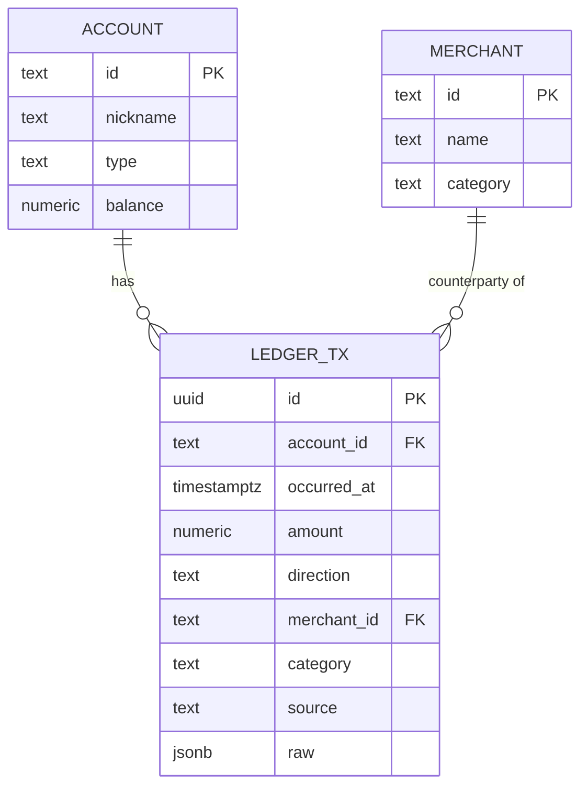

# 08. Data model and synthetic data methodology

Worth 6 points (data foundation) and it is where the "what happens with dirty data" question gets
answered with a test name instead of a promise.

Owner: Patricio (`garzario`). Due M3.

## Entities

TODO(garzario): add the idea-specific entities once ADR-0002 closes. `ledger_tx` is the spine and
does not change.



## Migrations

Two files, applied by `scripts/migrate.ts`. `0001` runs on any Postgres 16 or newer.
`0002` is applied **only when the `timescaledb` extension is available**, which the migrator checks
against `pg_available_extensions`.

```sql
-- packages/db/migrations/0001_init.sql  runs on ANY Postgres 16+
create table if not exists ledger_tx (
  id            uuid primary key,
  account_id    text not null,
  occurred_at   timestamptz not null,
  amount        numeric(14,2) not null,
  direction     text not null check (direction in ('debit','credit')),
  merchant_id   text,
  category      text,
  source        text not null default 'nessie',
  raw           jsonb not null default '{}'::jsonb
);
create index if not exists ledger_tx_account_time on ledger_tx (account_id, occurred_at desc);
```

```sql
-- packages/db/migrations/0002_timescale.sql  applied ONLY when the extension exists.
-- scripts/migrate.ts checks pg_available_extensions and skips this file otherwise.
create extension if not exists timescaledb;
select create_hypertable('ledger_tx', 'occurred_at', if_not_exists => true, migrate_data => true);
create materialized view ledger_daily
  with (timescaledb.continuous) as
  select account_id,
         time_bucket('1 day', occurred_at) as day,
         sum(case when direction='debit' then amount else 0 end) as spend,
         count(*) as n
  from ledger_tx group by account_id, day;
```

**Why two files and not one guarded file.** A continuous aggregate cannot be created inside a `DO`
block or a transaction, so the Timescale DDL has to be a separate statement batch. This split is
also the resilience story: Timescale managed is primary, a local Postgres 18 on 5432 is the offline
fallback, and the demo survives dead conference Wi-Fi at 05:00 with the same SQL and the same
driver. `bun run doctor` reports which path is live. Recorded in
`docs/adr/0003-datastore-and-timeseries.md`.

## Field notes

| Field | Why it is shaped like this |
|---|---|
| `id uuid` | Generated by us. Nessie `_id` values are not a stable shape, so they are never a primary key here |
| `occurred_at timestamptz` | Nessie has dates only, `YYYY-MM-DD`, with no time. Intraday velocity is impossible from Nessie-native fields, so our ledger holds a real timestamp and the seeder supplies the time component |
| `amount numeric(14,2)` | Nessie mixes integers and floats in the same field. Parsed as a number, stored as fixed scale, never compared with strict equality |
| `direction` | A check constraint rather than an enum, so a migration never blocks on a type change at 03:00 |
| `merchant_id`, `category` | Nullable on purpose. Missing categories are one of the dirty-data cases we handle |
| `source` | `nessie`, `seed` or `manual`. Makes every analytic query able to exclude the shared sandbox pool |
| `raw jsonb` | The original payload, kept so that a judge asking "what did the API actually return" gets the answer from the database |
| Index on `(account_id, occurred_at desc)` | Every read path is one account over a time window. This is the only index the demo needs |

## Synthetic data methodology

This section is the data-foundation score. The generator lives in `packages/seed` and is owned by
Fabian (`fabbyyyy`).

**Determinism.** One fixed RNG seed, committed. The same seed produces byte-identical output, which
is asserted in a test. The demo IDs printed by `bun run seed` are therefore stable and can be hard
coded in `docs/10-demo-script.md`.

**Distributions and cadences.**

| Property | Method | Why |
|---|---|---|
| Transaction amounts | Lognormal per category | Real spend is right-skewed. A uniform distribution looks fake at a glance and breaks any percentile logic |
| Income cadence | Mexican payroll reality: quincena on the 15th and the last day of the month, plus monthly salaried deposits | Cash-flow logic that assumes a weekly paycheck is wrong for Mexico, and a judge from a Mexican bank notices immediately |
| Recurring obligations | Fixed day-of-month bills with small amount jitter | Creates the predictable baseline any anomaly or forecast needs |
| Merchant category mix | Weighted catalog in `packages/seed/src/catalogs/` | Never derived from the shared Nessie pool, where 41 of 45 merchants carry the same category |
| Cash-heavy share | An explicit informality parameter, stated as a number | Mexican SMB and consumer ledgers are partly cash. Pretending otherwise makes the product look naive |
| Seasonality | Month-end and payday spikes | Makes a 30-day forecast non-trivial |

TODO(fabbyyyy): record the actual configuration here once the generator lands: number of accounts,
number of months, total transactions, the seed value, and the date range.

**Does it look real.** A short side-by-side table comparing a summary statistic from the generator
against a public benchmark or the Nessie sandbox shape: mean and median amount, transactions per
account per month, debit to credit ratio. TODO(fabbyyyy).

## What we made messy on purpose

Each row has one test. This is why the dirty-data question is the easiest question we get.

| Deliberate defect | Where it appears | How the engine handles it |
|---|---|---|
| Duplicate merchant names with different identifiers | Merchant catalog | Normalized before grouping, test asserts both collapse |
| Missing category | A share of purchases | Treated as its own bucket, never dropped silently |
| Out-of-order dates | Insertion order does not match `occurred_at` | Every query orders explicitly, test asserts the engine is order-independent |
| A refund | A credit against an earlier debit | Netted, not counted as income |
| A chargeback | A reversal arriving in a later period | Applied to the period of the original, with the rule stated |
| Integer and float amounts mixed | Directly from the Nessie shape | Parsed as numbers, compared with a tolerance |

**The engine never throws on bad input.** It returns a result with the affected rows flagged. That
is a test, not a hope.
